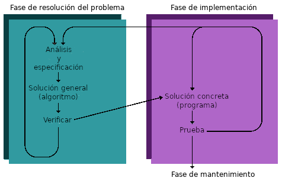
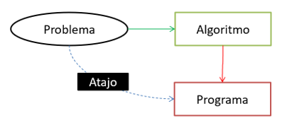
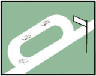
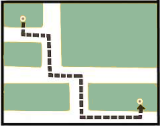
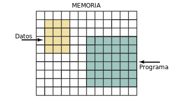
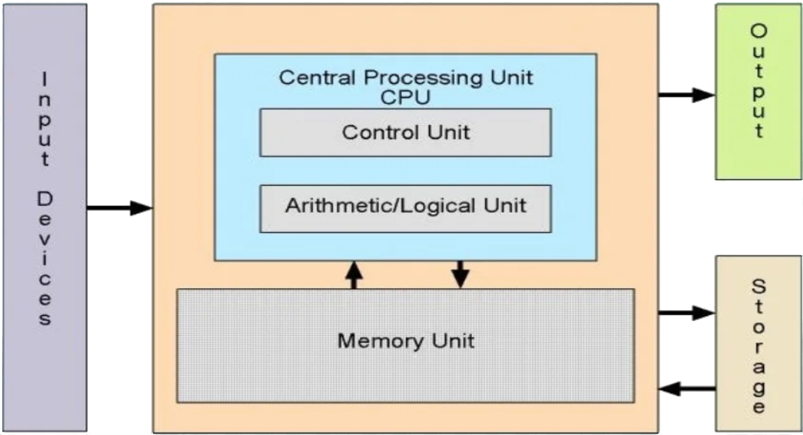

# Lenguajes y técnicas de programación

<a href="../pdf/tema_01.pdf" target="_blank" class="boton-descarga-top">📥 PDF</a>

<nav class="menu-flotante">
<input type="checkbox" id="menu-toggle" class="menu-checkbox">
<label for="menu-toggle" class="menu-boton">☰</label>

<h3>Contenido</h3>
<ul>
<li><a href="#introducción">Introducción</a></li>
<li><a href="#qué-es-la-programación">Qué es la programación</a></li>
<li><a href="#cómo-escribimos-un-programa">Cómo escribimos un programa</a>
<ul>
<li><a href="#fase-de-resolución-del-problema">Fase de resolución del problema</a></li>
<li><a href="#fase-de-implementación">Fase de implementación</a></li>
<li><a href="#fase-de-mantenimiento">Fase de mantenimiento</a></li>
</ul>
</li>
<li><a href="#cómo-se-transforma-el-código-en-algo-que-el-ordenador-puede-usar">Cómo se transforma el código en algo que el ordenador puede usar</a></li>
<li><a href="#en-qué-difieren-la-interpretación-y-la-compilación">En qué difieren la interpretación y la compilación</a></li>
<li><a href="#paradigmas-de-programación">Paradigmas de programación</a>
<ul>
<li><a href="#programación-imperativa">Programación imperativa</a></li>
<li><a href="#programación-funcional">Programación funcional</a></li>
<li><a href="#programación-lógica">Programación lógica</a></li>
<li><a href="#programación-concurrente">Programación concurrente</a></li>
<li><a href="#programación-orientada-a-objetos">Programación orientada a objetos</a></li>
</ul>
</li>
<li><a href="#qué-tipos-de-instrucciones-son-posibles-en-un-lenguaje-de-programación">Qué tipos de instrucciones son posibles en un lenguaje de programación</a></li>
<li><a href="#lenguajes-de-programación-orientados-a-objetos">Lenguajes de programación orientados a objetos</a></li>
<li><a href="#qué-es-un-ordenador">Qué es un ordenador</a></li>
<li><a href="#técnicas-de-resolucion-de-problemas">Técnicas de resolución de problemas</a>
<ul>
<li><a href="#realiza-preguntas">Realiza preguntas</a></li>
<li><a href="#buscar-cosas-familiares">Buscar cosas familiares</a></li>
<li><a href="#resolución-por-analogía">Resolución por analogía</a></li>
<li><a href="#análisis-medios-fines">Análisis medios-fines</a></li>
<li><a href="#divide-y-vencerás">Divide y vencerás</a></li>
<li><a href="#construcción-por-bloques">Construcción por bloques</a></li>
<li><a href="#bloqueo-mental-el-miedo-a-empezar">Bloqueo mental: el miedo a empezar</a></li>
</ul>
</li>
</ul>

</nav>

<section class="objetivos">
<h2>Objetivos</h2>

* Entender qué es un programa de ordenador
* Conocer las fases del ciclo de vida del software
* Comprender qué es un algoritmo
* Aprender qué es un lenguaje de alto nivel
* Entender los procesos de compilación, ejecución e interpretación
* Enumerar algunas técnicas de resolución de problemas
* Conocer algunos paradigmas de programación
* Diferenciar programación estructurada de modular y orientada a objetos
* Comprender el concepto de objeto en el contexto de la resolución de problemas

</section>

<section class="toc">
<h2>Contenido</h2>

* [Introducción](#introducción)
* [Qué es la programación](#qué-es-la-programación)
* [Cómo escribimos un programa](#cómo-escribimos-un-programa)
    * [Fase de resolución del problema](#fase-de-resolución-del-problema)
    * [Fase de implementación](#fase-de-implementación)
    * [Fase de mantenimiento](#fase-de-mantenimiento)
* [Cómo se transforma el código en algo que el ordenador puede usar](#cómo-se-transforma-el-código-en algo-que-el-ordenador-puede-usar)
* [En qué difieren la interpretación y la compilación](#en-qué-difieren-la-interpretación-y-la-compilación)
* [Paradigmas de programación](#paradigmas-de-programación)
    * [Programación imperativa](#programación-imperativa)
    * [Programación funcional](#programación-funcional)
    * [Programación lógica](#programación-lógica)
    * [Programación concurrente](#programación-concurrente)
    * [Programación orientada a objetos](#programación-orientada-a-objetos)
* [Qué tipos de instrucciones son posibles en un lenguaje de programación](#que-tipos-de-instrucciones-son-posibles-en-un-lenguaje-de-programación)
* [Lenguajes de programación orientados a objetos](#lenguajes-de-programación-orientados-a-objetos)
* [Qué es un ordenador](#qué-es-un-ordenador)
* [Técnicas de resolución de problemas](#técnicas-de-resolución-de-problemas)
    * [Realiza preguntas](#realiza-preguntas)
    * [Buscar cosas familiares](#buscar-cosas-familiares)
    * [Resolución por analogía](#resolución-por-analogía)
    * [Análisis medios-fines](#análisis-medios-fines)
    * [Divide y vencerás](#divide-y-vencerás)
    * [Construcción por bloques](#construcción-por-bloques)
    * [Bloqueo mental: el miedo a empezar](#bloqueo-mental-el-miedo-a-empezar)

</section>

## Introducción

¿Qué es un ordenador?

ordenador, ra

Del lat. <em>ordinātor, -ōris.</em>
<ol class="rae-list"><li>adj. Que ordena. U. t. c. s.</li><li>m. Jefe de una ordenación de pagos u oficina de cuenta y razón.</li><li>m. Esp. computadora electrónica.</li></ol>

computador, ra
<ol class="rae-list"><li>adj. Que computa (‖ calcula). U. t. c. s.</li><li>m. calculadora (‖ aparato para cálculos matemáticos).</li><li>m. computadora electrónica.</li><li>f. calculadora (‖ aparato para cálculos matemáticos).</li><li>f. computadora electrónica.</li></ol>

computadora electrónica
<ol class="rae-list" style="margin-bottom: 0;"><li>f. Máquina electrónica que, mediante determinados programas, permite almacenar y tratar información, y resolver problemas de diversa índole.</li></ol>

Breve definición para algo que, en sólo unas décadas, ha cambiado por completo la forma de vida de las sociedades industrializadas. Los ordenadores afectan a todas las áreas de nuestra vida; de hecho, sería más fácil decir en qué aspectos de nuestra vida no los utilizamos.

## Qué es la programación

Aprender a programar un ordenador es una cuestión de entrenamiento para resolver problemas de forma detallada y organizada. Lo habitual es que resolvamos problemas de manera intuitiva, pero ahora vamos a desarrollar la habilidad de escribir soluciones a problemas en términos de objetos y acciones apropiadas para los ordenadores. Empezaremos dando respuesta a algunas de las preguntas más comunes acerca de la programación y veremos algunas técnicas formales de resolución de problemas.

La mayor parte del comportamiento y el pensamiento se caracteriza por secuencias lógicas de acciones que involucran objetos. Desde la infancia, aprendemos cómo actuar, cómo hacer las cosas. Y hemos aprendido también a esperar ciertos comportamientos de todo aquello que nos rodea. Una gran cantidad de lo que hacemos a diario es automático. Afortunadamente, no tenemos que pensar de forma consciente en los pasos necesarios para algo tan sencillo como pasar una página con la mano:

1. Levantar la mano
2. Moverla hasta el lado derecho del libro, revista, etc.
3. Agarrar el lado derecho de la página
4. Mover la mano de derecha a izquierda hasta la página está en la posición en la que puedes leer lo que hay al otro lado
5. Soltar la página

Pensemos ahora en cuántas neuronas deben activarse y cuántos músculos responder, en un cierto orden o secuencia, para mover el brazo y la mano. ¡Y lo hacemos de manera inconsciente! Pero la mayoría de las cosas que hacemos de forma natural, en algún momento, tuvimos que aprenderlas. Observemos la inmensa concentración de los bebés en poner un pie antes que el otro mientras aprenden a andar; y cómo juega un grupo de niños de tres años.

Creamos orden, tanto consciente como inconscientemente, a través de un proceso que denominamos programación. Aquí nos vamos a centrar en la programación de una herramienta en particular: el ordenador.

<aside class="definicion">

**Programación:** Desarrollo de instrucciones para llevar a cabo una tarea que involucra una serie de objetos.

**Ordenador:** Dispositivo programable que permite almacenar, recuperar y tratar datos.

</aside>

Hemos modificado un poco la definición de ordenador que nos proporciona la RAE. En ésta, la palabra clave es datos[^1]. Los ordenadores manipulan datos: cuando escribimos un programa para un ordenador, especificamos las propiedades de los datos y las operaciones que podemos realizar con los mismos. La combinación de datos y operaciones nos sirve para representar objetos. Los objetos que representamos pueden ser físicos, objetos del mundo real como productos de un supermercado, o abstractos, como constructos. Nuestras representaciones de los objetos se programan para interactuar, según sea necesario, para resolver el problema.

Los datos se presentan de muchas formas diferentes: letras, palabras, números enteros, reales, fechas, horas, coordenadas, etc. Sin embargo, carecen de sentido sin operaciones que manipulen esos datos. Por ejemplo, la letra L no tiene significado fuera de contexto; pero en el contexto de una sombrerería se convierte en la talla de sombrero de una persona cuya circunferencia de la cabeza mide 58 ó 59 centímetros. Prácticamente, cualquier tipo de información se puede representar como un objeto.

Del mismo modo que una lista de reproducción enumera los temas que se escucharán, un programa de ordenador enumera los objetos necesarios para resolver un problema y "reproduce" sus interacciones. Cuando hablemos de programación y programa, nos estaremos refiriendo a la programación de ordenadores y a los programas de ordenador.

<aside class="definicion">

**Objeto:** Colección de valores (de datos) y sus operaciones asociadas.

**Programación de ordenadores:** El proceso de especificar objetos y maneras de interactuar entre ellos para resolver un problema con un ordenador.

**Programa de ordenador:** Instrucciones que definen un conjunto de objetos e indica sus interacciones para resolver un problema con un ordenador.

</aside>

El ordenador nos permite realizar tareas de manera más eficiente, rápida y precisa de lo que podríamos hacerlas a mano, si es posible hacerlo a mano. Pero esta máquina, sin embargo, para ser una herramienta útil, debe programarse primero. Es decir, debemos especificar exactamente qué queremos que haga y cómo. Y eso lo hacemos a través de la programación.

## Cómo escribimos un programa

Un ordenador no es inteligente, no puede analizar el problema para llegar a una solución. Debe ser un ser humano, el programador, quien analice el problema, desarrolle los objetos e instrucciones para resolverlo y a continuación, hacer que el ordenador lleve a cabo dichas instrucciones. El ordenador puede repetir la solución de forma rápida y consistente una vez tras otra, liberándonos de tareas repetitivas y aburridas. El motivo por el que mucha gente aprende lenguajes de programación es para poder usar los ordenadores como una herramienta para resolver problemas.

Para escribir un programa que pueda ejecutar un ordenador debemos seguir un proceso que tiene dos fases: resolución del problema e implementación.

### Fase de resolución del problema

1. **Análisis y especificación:** comprender (definir) el problema e identificar la solución a crear.
2. **Solución general (algoritmo):** especificar los objetos e interacciones que resuelven el problema.
3. **Verificar:** seguir exactamente los pasos para comprobar que la solución realmente ha resuelto el problema.

### Fase de implementación

1. **Solución concreta (programa):** escribir las especificaciones de los objetos y los algoritmos (la solución general) en un lenguaje de programación.
2. **Prueba:** permitir que el ordenador ejecute el programa y comprobar los resultados; si se encuentran errores, analizar el programa y la solución general para determinar el origen de los mismos y hacer las correcciones apropiadas.

Una vez el programa ha sido escrito, comienza la tercera fase: mantenimiento.

### Fase de mantenimiento

1. **Utilización:** usar el programa.
2. **Mantenimiento:** modificar el programa para cumplir con cambios en los requerimientos o corregir errores que aparecen durante el uso.

<figure class="img-grande">
    
</figure>

El programador comienza el proceso de programación analizando el problema, identificando los objetos que intervienen en la resolución del problema y ​​desarrollando una especificación para cada tipo de objeto, denominada clase. Los objetos interactúan para crear una aplicación que resuelve el problema original. Entender y analizar un problema lleva más trabajo de lo que pueda parecer: estas tareas forman el corazón del proceso de programación.

Un programa es un algoritmo escrito para un ordenador. Cuando definimos clases y cómo se relacionan para resolver un problema, estamos escribiendo un algoritmo. Más generalmente, un algoritmo es una descripción verbal o escrita de un conjunto lógico de acciones que involucran objetos. Utilizamos algoritmos todos los días: recetas de cocina, instrucciones de uso de cualquier aparato o cruzar la calle, son ejemplos de algoritmos que no son programas.

<aside class="definicion">

**Clase:** Descripción de la representación de un tipo específico de objeto, en función de datos y operaciones

**Algoritmo:** Instrucciones para resolver un problema en un tiempo finito utilizando un conjunto finito de datos[^2]

</aside>

Cuando cruzamos una calle, por ejemplo, seguimos una serie acciones que involucran a varios objetos. El algoritmo podría ser algo parecido a esto:

1. Desplazarse hasta el punto semafórico
2. Situarse ante el paso de cebra
3. Observar el semáforo
4. Si la luz del semáforo es de color rojo y muestra la silueta del peatón detenido o la luz del semáforo es verde pero intermitente, esperar ante el paso de cebra a que la luz sea de color verde y muestre la silueta del peatón en marcha.
5. Empezar a cruzar la calle por el paso de cebra.
6. Comprobar la luz del semáforo mientras se cruza.
7. Si la luz del semáforo cambia a intermitente y se ha recorrido más de la mitad de la distancia, apresurarse para llegar al otro lado.
8. Si la luz del semáforo cambia a intermitente y no se ha recorrido aún la mitad de la distancia, retroceder y repetir los pasos 4 a 6, pero no más de tres veces.
9. Si se no ha conseguido cruzar, buscar otro punto semafórico o solicitar ayuda.

Sin la frase “pero no más de tres veces” del punto 8, podríamos estar intentando cruzar sin éxito eternamente. ¿Por qué? Porque algo falla en la regulación semafórica o nosotros no podemos recorrer la distancia necesaria en el tiempo asignado. Este tipo de situación se denomina bucle infinito. Si eliminamos esa frase, este procedimiento no cumpliría nuestra definición de algoritmo: debe terminar en un tiempo finito cualesquiera que sean las condiciones.

Después de desarrollar una solución general, el programador prueba el algoritmo “trazando” cada paso mentalmente; o manualmente, con lápiz y papel. Si el algoritmo no funciona, el programador repite el proceso de resolución de problemas, analizándolo de nuevo, y desarrolla otro algoritmo. A menudo, el segundo algoritmo es simplemente una variación del primero. Cuando el programador está satisfecho con el algoritmo, lo traduce a un lenguaje de programación. Nosotros vamos a utilizar el lenguaje de programación Java.

<aside class="definicion">

**Lenguaje de programación:** Conjunto de reglas, símbolos y palabras especiales que se utilizan para crear un programa de ordenador

</aside>

Un lenguaje de programación es una forma simplificada del lenguaje natural (generalmente el inglés) y símbolos matemáticos, con un conjunto de reglas gramaticales estricto. El lenguaje natural, incluso el inglés, es un idioma demasiado complejo para que pueda ser interpretado por el ordenador. Los lenguajes de programación, al tener un vocabulario y gramática más limitados, son mucho más simples.

Aunque un lenguaje de programación tiene un formato muy simple, no siempre es fácil de utilizar. Intentemos explicar a alguien cómo llegar a una dirección concreta usando un vocabulario limitado a unas 20 palabras. La programación obliga a escribir de manera muy simple: instrucciones exactas.

Traducir un algoritmo a un lenguaje de programación se llama codificar el algoritmo. El código es el producto de traducir un algoritmo a un lenguaje de programación. El término código puede referirse a un programa completo o a cualquier parte de un programa. Un programa se prueba ejecutándolo en el ordenador. Si el programa no produce los resultados deseados, el programador debe depurarlo, es decir, determinar qué está mal y modificarlo o, incluso, revisar el algoritmo para solucionarlo. El proceso de codificación y prueba del algoritmo tiene lugar durante la fase de implementación.

<aside class="definicion">

**Código:** Instrucciones para un ordenador, escritas en un lenguaje de programación

</aside>

No existe una única forma de implementar un algoritmo. Por ejemplo, un algoritmo puede ser traducido a más de un lenguaje de programación. Cada traducción produce una implementación diferente. Incluso cuando dos personas traducen un algoritmo al mismo lenguaje de programación, a menudo, obtienen dos implementaciones diferentes. ¿Por qué? Porque cada lenguaje de programación permite al programador cierta flexibilidad a la hora de traducir el algoritmo. Dada esta flexibilidad, las personas adoptan sus propios estilos de escritura de programas, al igual que sucede con la forma de hablar o redactar un texto. Cuando se adquiere experiencia en la programación, con el tiempo, se desarrolla un estilo propio. En este texto se ofrecen consejos sobre un buen estilo de programación.

<figure class="img-lateral-der">
    
</figure>

Algunas personas intentan acelerar el proceso de programación pasando directamente de la definición del problema a la codificación. Tomar ese atajo es muy tentador y, a primera vista, parece ahorrar mucho tiempo. Sin embargo, por muchas razones (eso se volverá obvio con la experiencia), este tipo de atajo, en realidad, consume más tiempo y requiere más esfuerzo. Desarrollando una solución general antes de escribir código ayuda a gestionar el problema, mantener orden en los pensamientos y evitar errores. Si no se utiliza tiempo para pensar y pulir el algoritmo al principio, se consumirá después mucho tiempo extra depurando y revisando el código: cuanto antes se empieza a codificar, más tiempo lleva escribir una aplicación que funcione.

Una vez que se ha puesto en uso una aplicación, muy a menudo, se vuelve necesario modificarla posteriormente. La modificación puede implicar la corrección de un error que se descubre durante el uso de la aplicación o a cambiar el código en respuesta a cambios en los requisitos del usuario. Cada vez que se modifica el código, el programador debe repetir las fases de resolución de problemas e implementación para todos aquellos aspectos de la aplicación que cambien.

Esta fase del proceso de la programación, conocido como mantenimiento, en realidad, representa la mayor parte del esfuerzo invertido en la mayoría de las aplicaciones. Por ejemplo, un programa desarrollado en unos pocos meses necesita ser mantenido durante muchos años. Por este motivo, el esfuerzo invertido en desarrollar la solución inicial del problema y la implementación del algoritmo es tan importante. Todo ello junto, las fases de resolución del problema, implementación y mantenimiento, constituyen el ciclo de vida del programa.

Además de lo anterior, la documentación es una parte muy importante del proceso de la programación. Incluye explicaciones escritas del problema y la organización de la solución, comentarios incrustados en el propio código y manuales de usuario que describen cómo utilizar el programa. Muchas personas pueden trabajar en la aplicación a lo largo de su tiempo de vida; todos y cada uno de esos individuos debe ser capaz de leer y comprender el código.

<aside class="definicion">

**Documentación:** El texto y comentarios escritos que facilitan a otros su utilización, comprensión y modificación.

</aside>

## Cómo se transforma el código en algo que el ordenador puede usar

En el ordenador, todos los datos, cualquiera que sea su forma, se almacenan y utilizan en forma de códigos binarios, consistentes en cadenas de unos (1) y ceros (0). Las instrucciones y los datos se almacenan juntos en la memoria del ordenador utilizando estos códigos binarios. Si miramos estos códigos binarios, que representan instrucciones y datos en la memoria, no podríamos notar la diferencia entre ellos; se distinguen sólo por la manera en que el ordenador los usa. Este hecho permite que el ordenador procese sus instrucciones internas como una forma de datos.

Cuando se desarrollaron los ordenadores por primera vez, el único lenguaje de programación disponible era el conjunto de instrucciones primitivo integrado en cada máquina: el lenguaje máquina, también conocido como código máquina.

Aunque la mayoría de los ordenadores realizan el mismo tipo de operaciones, sus diseñadores eligen diferentes conjuntos de códigos binarios para cada instrucción. Como resultado, el código máquina de una familia de ordenadores difiere del de otra.

Cuando los programadores usaban el lenguaje máquina para programar, tenían que introducir los códigos binarios de las distintas instrucciones, proceso tedioso muy propenso a errores. Además, sus programas eran difíciles de leer y modificar. En ese tiempo, se desarrollaron los lenguajes ensambladores para facilitar el trabajo del programador.

<aside class="definicion">

**Lenguaje máquina:** Lenguaje, constituido por instrucciones en código binario, utilizado directamente por el ordenador.

**Lenguaje ensamblador:** Lenguaje de programación de bajo nivel en el que un mnemónico representa a cada instrucción del lenguaje máquina de un ordenador determinado.

</aside>

Las instrucciones en lenguaje ensamblador utilizan mnemónicos, palabras fáciles de recordar, para la representación de las instrucciones. Por ejemplo, típicamente, ADD representa la instrucción de suma, que en el lenguaje máquina del ordenador puede ser el código 10010. Pero, aunque a los humanos nos resulta más fácil trabajar con el lenguaje ensamblador, el ordenador no puede ejecutar estas instrucciones directamente. Dado que el ordenador puede procesar sus instrucciones en forma de datos, resulta posible escribir un programa que traduzca el lenguaje ensamblador en instrucciones de código máquina. Dicho programa se denomina ensamblador.

El lenguaje ensamblador representa un avance en la dirección correcta pero, aún así, fuerza a los programadores a pensar en instrucciones de máquina individuales. Finalmente, se desarrollaron lenguajes de programación de alto nivel. Estos lenguajes son más fáciles de utilizar que el lenguaje ensamblador o el código máquina porque son más cercanos al lenguaje natural.

Un programa denominado compilador traduce los algoritmos escritos en un determinado lenguaje de alto nivel en lenguaje máquina. Si escribimos un programa en un lenguaje de alto nivel, éste podrá ser ejecutado en cualquier ordenador para el que exista el compilador apropiado. La portabilidad es posible porque la mayoría de los lenguajes de alto nivel están estandarizados, lo que significa que existe una descripción oficial del lenguaje.

El texto de un algoritmo escrito en un lenguaje de alto nivel se denomina código fuente. Para el compilador, el código fuente es únicamente sus datos de entrada: letras y números. Traduce el código fuente al formato de código máquina, denominado código objeto.

<aside class="definicion">

**Ensamblador:** Programa que traduce un programa en lenguaje ensamblador a código máquina.

**Compilador:** Programa que traduce un programa escrito en un lenguaje de alto nivel a código máquina.

**Código fuente:** Instrucciones escritas en un lenguaje de programación de alto nivel.

**Código objeto:** Versión en lenguaje máquina del código fuente.

</aside>

Como hemos indicado, la estandarización de los lenguajes de alto nivel permite escribir código portable (o independiente de la máquina). Java utiliza un enfoque un poco diferente para una mayor portabilidad. El código fuente de Java se traduce a un código máquina estándar denominado Bytecode.

<aside class="definicion">

**Bytecode:** Lenguaje máquina estándar en el que se compila el código fuente Java.

</aside>

No existen máquinas[^3] que utilicen Bytecode como su lenguaje máquina. En su lugar, para que el ordenador pueda ejecutar programas en formato Bytecode debe hacer uso de otro programa denominado Máquina Virtual de Java (JVM)[^4] que sirve de intérprete para el Bytecode. Del mismo modo que un intérprete humano escucha palabras en un lenguaje y a continuación pronuncia una traducción en un lenguaje que otra persona pueda entender, la JVM lee las instrucciones Bytecode y las traduce a las operaciones del lenguaje máquina del ordenador particular en que se ejecuta. La interpretación tiene lugar porque se traduce cada instrucción Bytecode, una por una. Este proceso es diferente al de la compilación, que traduce todas las instrucciones del código fuente de una vez en las instrucciones del programa, previo a la ejecución.

El código Java compilado puede ejecutarse en cualquier máquina que disponga de una JVM para interpretarlo, lo que significa que un programa en Java no tiene que ser compilado para cada tipo de ordenador. Este nivel de portabilidad adquirió importancia conforme la Web se desarrollaba, al posibilitar escribir un programa en Java y hacer público el Bytecode, sin necesidad de recompilarlo para los diferentes tipos de ordenadores en que deba ejecutarse.

## En qué difieren la interpretación y la compilación

Un intérprete es un programa traductor al que se le pasa como datos de entrada el fichero de texto con el programa escrito en lenguaje de alto nivel: lee las instrucciones del programa una a una, las analiza y traduce para su ejecución; si contiene errores, detiene el proceso y lo notifica (normalmente, para corregir esa instrucción en el código fuente). La traducción a código máquina se realiza en la memoria, sin guardarla en ningún sitio, y se ejecuta. Dado que cada instrucción debe ser interpretada, el intérprete no puede ejecutarlas tan rápido como lo hace el código máquina, haciendo que esta ejecución sea más lenta; y si queremos volver a ejecutar de nuevo el programa, el intérprete volverá a traducir, una a una, cada instrucción, antes de ejecutarla.

En el caso de la JVM, programa que se ejecuta directamente en la máquina, como intérprete que es, no se genera código máquina: analiza y traduce cada instrucción Bytecode en una serie de operaciones que la máquina debe realizar. En este caso, una ejecución más lenta se compensa con una mayor portabilidad. En realidad, la JVM puede utilizar diferentes estrategias de traducción, aunque la más habitual es el uso de los compiladores denominados Just In Time (JIT)[^5], que traducen el código conforme lo ejecutan pero lo guardan en un buffer para acelerar la traducción en algunos casos.

## Paradigmas de programación

Un paradigma representa un enfoque particular o una filosofía para diseñar soluciones a los problemas planteados. La diferencia entre los mismos la encontramos en los conceptos y la forma en que cada uno de ellos abstrae los elementos involucrados en el problema y la forma de resolverlo.

### Programación imperativa
Describe el programa en función de una serie de estados y las operaciones que modifican dicho estado. Los programas imperativos son un conjunto de instrucciones que le indican al ordenador cómo hacer una tarea.

Los primeros lenguajes imperativos son los lenguajes máquina. Desde la perspectiva de las máquinas, el programa, contenido en la memoria, es una serie de instrucciones que modifica áreas de la memoria.

### Programación funcional
Se basa en el uso de funciones matemáticas, de manera que no sea necesario describir el proceso de cómputo y evitar el concepto de estado, propio de la programación imperativa.

Entre sus características destaca la no existencia de variables y construcciones estructuradas, aunque algunos lenguajes híbridos admiten el uso de estos conceptos.

### Programación lógica
Se basa en el concepto de predicado o de relación entre elementos, utilizando la teoría lógica de primer orden. En general, toma en consideración una serie de hechos de manera que, cuando formula una hipótesis se apoya en dichos hechos. Si todos los hechos en los que se apoya la hipótesis son ciertos, entonces también la hipótesis es cierta; si alguno de los hechos no es cierto, no se puede inferir que la hipótesis sea cierta, aunque eso no implica que la hipótesis sea falsa.

Se utiliza ampliamente en aplicaciones de inteligencia artificial como los sistemas expertos, la demostración automática o el reconocimiento del lenguaje.

### Programación concurrente
Consiste en la simultaneidad en la ejecución de dos o más tareas interrelacionadas. Por ello, se centra en el estudio de las interacciones entre las diferentes tareas, de la comunicación entre las mismas y el acceso coordinado a los recursos que comparten.

Normalmente, los lenguajes que siguen este paradigma también están basados en otro, como la programación imperativa o la programación orientada a objetos.

### Programación orientada a objetos
Los elementos fundamentales de construcción de programas son objetos, abstracciones de algún ente del mundo real con sus propias características y comportamiento. De este modo, los objetos –cada uno con su propia funcionalidad- manipulan los datos de entrada para obtener los datos de salida deseados.

Aunque surge a finales de los 60, es a mediados de los 80 cuando se populariza hasta ser el paradigma dominante a partir de los 90 consolidado, en gran parte, por el auge de las interfaces gráficas de usuario. Tanto es así que la mayoría de lenguajes clásicos han incorporado las características de la POO o bien han surgido versiones del lenguaje que las incorporan.

## Qué tipos de instrucciones son posibles en un lenguaje de programación

Las instrucciones de un lenguaje de programación son un reflejo de las operaciones que puede realizar el ordenador:

* Transferir datos.
* Recibir datos de un dispositivo de entrada (ratón, teclado…) y sacar datos por un dispositivo de salida (pantalla, impresora…).
* Almacenar datos y recuperarlos de la memoria y otros sistemas de almacenamiento.
* Comparar datos y tomar decisiones en función del resultado.
* Realizar operaciones aritméticas muy rápidamente.

Además, un lenguaje de programación contiene instrucciones, denominadas declaraciones, que se utilizan para especificar datos e instrucciones en las clases. Los lenguajes de programación nos obligan a utilizar ciertas estructuras de control para organizar las instrucciones, que especifican el comportamiento de los objetos. Estas instrucciones, en la mayoría de los lenguajes, se organizan en cuatro tipos: secuencia, condición, repetición y subprograma:

* Una secuencia es una serie de operaciones que se ejecutan una tras otra.
* La selección, la estructura de control condicional, ejecuta operaciones diferentes en función de determinadas condiciones.
* La estructura de control repetitiva, el bucle, repite operaciones mientras se cumples ciertas condiciones.
* Los subprogramas nos ayudan a organizar el código en unidades que se corresponden con comportamientos específicos de los objetos; estas unidades, en Java, se denominan métodos.

Cada una de estas formas de estructurar operaciones controla el orden en que el ordenador ejecuta las operaciones, por lo que se denominan estructuras de control.

Supongamos que conducimos un vehículo. Ir por un tramo recto de carretera es como seguir una secuencia de instrucciones. Cuando llegamos a una bifurcación en el camino, debemos decidir qué camino tomar y después, tomar uno de los dos caminos de la bifurcación. El ordenador hace algo similar cuando encuentra una estructura de control de selección (a veces llamada condición) en un programa. Otras veces hay que dar varias vueltas a la manzana hasta encontrar un sitio para aparcar. El ordenador hace lo mismo cuando encuentra un bucle.

<figure class="img-grande">
    
    
    
    
</figure>

Un subprograma es una secuencia de instrucciones escritas como una unidad separada, a la que damos un nombre. Cuando el ordenador ejecuta una instrucción que se refiere al nombre del subprograma, el código del subprograma se ejecuta. Cuando finaliza el subprograma, la ejecución se reanuda en la instrucción siguiente a la que se refería al subprograma. Supongamos, por ejemplo, que todos los días vamos al IES. Las direcciones para llegar de casa al instituto forman un método llamado "Ir al insti". Entonces, podrían tener sentido unas instrucciones del tipo: "Ir al insti, subir al aula", sin enumerar todos los pasos necesarios para llegar al instituto.

## Lenguajes de programación orientados a objetos

Los primeros lenguajes de programación centraban su atención en las operaciones y las estructuras de control de programación. Estos lenguajes procedimentales prestaron poca atención explícita a las relaciones entre las operaciones y los datos. En ese momento, un programa de ordenador típico usaba solo tipos de datos simples, como números enteros y reales, que tienen conjuntos de operaciones definidos por las matemáticas. Esas operaciones se incorporaron directamente en los primeros lenguajes de programación. Cada tipo de datos definido en el ordenador tenía un tipo de datos específico. Por ejemplo, si decimos que dos elementos de datos son del tipo int (un nombre que usa Java para los números enteros), sabemos cómo se representan en la memoria y que podemos aplicarles operaciones aritméticas.

A medida que se ganaba experiencia con el proceso de programación, se dieron cuenta de que en la resolución de problemas complejos es útil definir nuevos tipos de datos, como fechas, que no son una parte estándar de un lenguaje de programación. Cada nuevo tipo de datos, normalmente, tiene un conjunto asociado de operaciones, como determinar el número de días entre dos fechas.

Así, los lenguajes procedimentales evolucionaron para incluir la característica de la extensibilidad: la capacidad para definir nuevos tipos de datos. No obstante, continuaron tratando los datos y operaciones como partes separadas del programa. Un programador podría definir un tipo de datos para representar los valores que componen la hora del día y escribir un subprograma para calcular el número de minutos entre dos horas, pero no podía indicar explícitamente que los dos estaban relacionados.

Los lenguajes de programación modernos nos permiten recopilar los datos y sus operaciones asociadas en objetos. Por este motivo, se denominan lenguajes de programación orientados a objetos. La ventaja de un objeto es que hace explícitas las relaciones entre los datos y sus operaciones. Cada objeto es una unidad completa e independiente que se puede reutilizar en otras aplicaciones. Esta reutilización nos permite escribir una parte significativa de nuestro código usando objetos existentes, ahorrando así una cantidad considerable de tiempo y esfuerzo.

La mayoría de los lenguajes de programación modernos, incluido Java, conservan vestigios de sus ancestros procedimentales, incorporando un pequeño conjunto de tipos de datos primitivos. Estos, generalmente, incluyen números enteros y reales, caracteres y un tipo que representa los valores verdadero y falso. Java define también el objeto como uno de sus tipos de datos primitivos. En Java, se dice que todos los objetos son del mismo tipo de datos: el tipo que nos permite representar cualquier objeto. Distinguimos entre diferentes tipos de objetos refiriéndonos a las clases que los definen. Por ejemplo, podemos referirnos a un objeto de la clase String. A veces, podemos referirnos a los objetos como si fueran de diferentes tipos, lo cual es terminología común en la industria informática. En tal caso, en realidad nos referimos a objetos de diferentes clases, ya que en Java hay, estrictamente, un solo tipo de objeto.

Como ya se indicó, una clase es una descripción de un objeto. Cuando necesitamos un objeto en un programa, debemos crear uno a partir de dicha descripción. Java nos proporciona una operación que permite hacerlo y decimos que la operación instancia la clase. Es decir, escribimos una instrucción en Java que nos proporciona una instancia del objeto descrito por la clase especificada.

Una característica de un lenguaje de programación orientado a objetos es la presencia de una gran biblioteca[^6] de clases. Dentro de la biblioteca, las clases se agrupan generalmente en colecciones llamadas paquetes.

Vamos a conocer sólo un pequeño subconjunto de las muchas clases que están disponibles en la biblioteca de Java. Es fácil asustarse por el tamaño de la biblioteca, pero muchos de esos miles de objetos son altamente especializados e innecesarios para aprender los conceptos de la programación.

## Qué es un ordenador

No necesitamos saber mucho sobre los ordenadores para utilizarlos como una herramienta efectiva. Podemos aprender un lenguaje de programación, escribir programas y aprender a ejecutarlos. Sin embargo, si sabemos algo sobre las partes del ordenador, podremos comprender mejor el efecto de cada instrucción en el lenguaje de programación.

<figure class="img-lateral-izq">
    
</figure>

La mayoría de los ordenadores tienen seis componentes básicos: la unidad de memoria, la unidad aritmética/lógica, la unidad de control, los dispositivos de entrada, los dispositivos de salida y los dispositivos auxiliares de almacenamiento.

La unidad de memoria es una secuencia ordenada de celdas de almacenamiento, cada una conteniendo un fragmento de información. Cada celda de memoria tiene una dirección distinta, referiéndonos a la misma para almacenar datos o recuperarlos. Estas celdas de almacenamiento se conocen como celdas de memoria o posiciones de memoria. La memoria almacena datos (datos de entrada o los resultados de un cálculo) e instrucciones (programas).

La parte del ordenador que ejecuta las instrucciones se llama Unidad Central de Procesamiento (CPU). La CPU, generalmente, tiene dos componentes. La Unidad Aritmético/Lógica (ALU) realiza operaciones aritméticas (suma, resta, multiplicación y división) y lógicas (comparando dos valores). La Unidad de Control gestiona las acciones de los otros componentes para que las instrucciones del programa se ejecuten en el orden correcto.

<figure class="img-grande">
    
</figure>

Para usar ordenadores, tenemos que tener alguna forma de introducir y extraer datos. Los Dispositivos de entrada/salida (E/S) aceptan datos para ser procesados (entrada) o presentan los resultados del procesamiento (salida). Un teclado es un dispositivo de entrada común, como puede serlo un ratón, que es un dispositivo "señalador". La pantalla es un dispositivo de salida común, al igual que las impresoras.

En gran parte, los ordenadores simplemente mueven y combinan datos en memoria. Las diferencias se refieren al tamaño y velocidad de la memoria, la eficiencia en el tratamiento de los datos y las limitaciones en los dispositivos de E/S.

Cuando se ejecuta un programa (se están siguiendo las instrucciones), el ordenador procede paso a paso mediante el ciclo de búsqueda y ejecución de una instrucción:

1. La unidad de control coge (busca) la siguiente instrucción codificada de memoria.
2. La instrucción es decodificada en señales de control.
3. Las señales de control determinan la unidad apropiada (aritmética/lógica, memoria o dispositivo de E/S) que debe ejecutar la instrucción.
4. La secuencia se repite desde el paso 1.

Los ordenadores pueden tener una amplia variedad de dispositivos periféricos. Un dispositivo de almacenamiento auxiliar, o dispositivo de almacenamiento secundario, se utiliza para almacenar datos codificados, preparado para ser usados por el ordenador, siempre que queramos utilizar los datos. En lugar de introducir datos cada vez que queramos usarlos, podemos introducir los datos una vez y tenerlos almacenados en un dispositivo de almacenamiento auxiliar. A partir de entonces, siempre que se necesite usar los datos, simplemente le decimos al ordenador que transfiera los datos del dispositivo de almacenamiento auxiliar a su memoria. Por lo tanto, un dispositivo de almacenamiento auxiliar sirve como dispositivo de entrada y como dispositivo de salida. Los dispositivos de almacenamiento auxiliar típicos incluyen unidades de disco y de memoria flash.

Juntos, todos estos componentes físicos son conocidos como hardware. Los programas que permiten el funcionamiento del hardware se denominan software. El hardware queda normalmente fijado en el diseño, pero el software puede modificarse fácilmente. La facilidad de manipulación del software es lo que hace que los ordenadores sean unas herramientas tan versátiles y poderosas.

Además del software que escribimos o compramos, existen programas diseñados para simplificar la interfaz usuario-máquina, haciéndonos más fácil la utilización de la máquina. La interfaz entre el usuario y el ordenador consiste en un conjunto de dispositivos de E/S, por ejemplo, teclado, ratón y la pantalla, que permite al usuario comunicarse con el ordenador. Trabajamos con el teclado, el ratón y la pantalla en nuestro lado de la interfaz; los cables conectados al teclado y la pantalla llevan los pulsos electrónicos que el ordenador manipula desde su lado de la interfaz. En el límite mismo hay un mecanismo que traduce la información para los dos lados.

Cuando nos comunicamos directamente con el ordenador a través de una interfaz, utilizamos un sistema interactivo. Los sistemas interactivos permiten la entrada directa del código fuente y los datos, proveyendo realimentación inmediata al usuario. Por el contrario, los sistemas por lotes requieren que todos los datos se introduzcan antes de que se ejecute la aplicación y proporcione comentarios solo después de que se ha ejecutado.

El conjunto de programas que simplifica la interfaz usuario/ordenador y mejora la eficiencia de procesamiento se llama software del sistema. Incluye la JVM y el compilador de Java, así como el sistema operativo y el editor. El sistema operativo gestiona todos los recursos del ordenador. Puede almacenar y recuperar programas, llamar al compilador, ejecutar código objeto y llevar a cabo cualquier otro comando del sistema. El editor es un programa interactivo que se utiliza para crear y modificar programas o datos fuente; los entornos de programación modernos lo incluyen en un IDE (Integrated Development Environment), una aplicación informática que proporciona servicios integrales para facilitarle al programador el desarrollo de software.

## Técnicas de resolución de problemas

Resolvemos problemas todos los días, pero normalmente ignoramos el proceso que seguimos para hacerlo. En un entorno de aprendizaje, por lo general, nos dan más información de la que necesitamos: una definición clara del problema, la información necesaria y la salida requerida. En la vida real, por supuesto, el proceso no es siempre tan simple: en general, tenemos que definir el problema por nosotros mismos y después decidir con que información tenemos que trabajar y cuáles deben ser los resultados.

Después de comprender y analizar un problema, hay que llegar a una solución potencial, un algoritmo. Anteriormente, hemos definido un algoritmo como un conjunto ordenado y finito de operaciones que permiten la resolución de un problema dado, esto es, el procedimiento paso a paso para resolver el problema en una cantidad finita de tiempo usando una cantidad finita de datos. Aunque trabajamos con algoritmos todo el tiempo, la mayor parte de nuestra experiencia con ellos consiste en seguirlos: seguir una receta, practicar un juego, etc.

En la fase de resolución de problemas, sin embargo, diseñamos algoritmos, no los seguimos. Para un problema dado se nos pedirá obtener el algoritmo, diseñar el conjunto de pasos que hay que realizar en orden a resolver el problema. Realmente, hacemos este tipo de resolución de problema siempre a un nivel inconsciente. Sin embargo, no escribimos nuestras soluciones, las ejecutamos.

Para aprender a programar tendremos que hacer conscientemente algunas de las estrategias subyacentes a la resolución de problemas, en orden a aplicarlos a los problemas de programación. Veamos algunas de las estrategias que usamos diariamente.

### Realiza preguntas

Si alguien nos propone verbalmente alguna tarea, lo primero que hacemos es preguntar cómo, dónde, cuándo, por qué, etc., hasta comprender exactamente qué hacer. Si ésta está escrita, haremos anotaciones al margen, subrayaremos o indicaremos de alguna manera aquellas partes del texto que no tengamos claras. Quizá las cuestiones se respondan en algún párrafo posterior o tengan que ser discutidas con quien propone la tarea.

En el contexto de la programación, algunas de las preguntas más comunes que podemos hacernos son:

* Qué me han dado para trabajar, es decir, cuáles son mis objetos
* Qué tareas realizan
* Qué información se introduce
* Cómo sé que ha introducido toda la información
* Cómo debe ser la salida
* Cuántas veces debo repetir el proceso
* Qué errores se pueden producir

### Buscar cosas familiares

Nunca debemos reinventar la rueda: si ya existe una solución, usémosla. Las personas reconocemos fácilmente situaciones similares. No necesitamos aprender cómo ir a comprar pan, después a comprar leche o huevos; sabemos que “ir a comprar” es siempre lo mismo y sólo cambia qué compramos. Por ello, si hemos resuelto antes el mismo problema o uno parecido, solamente repetimos la solución.

En informática, muchos problemas se producen una y otra vez en diferentes formas. Un buen programador enseguida reconoce algo que ya ha resuelto con anterioridad y aplica la solución. Por ejemplo, encontrar las temperaturas máxima y mínima diaria es exactamente el mismo problema que encontrar las notas más alta y más baja de un examen. Lo que se quiere es obtener los valores mayor y menor en un conjunto de números.

### Resolución por analogía

A menudo, un problema puede recordar a otro que se ha visto antes. Es posible encontrar la solución del problema más fácilmente si se recuerda cómo se resolvió el anterior. En otras palabras, se puede trazar una analogía entre los dos problemas a medida que se resuelve el nuevo.

La analogía puede ser una forma muy poderosa de atacar un problema. Puede inspirar un plan de acción cuando se están buscando ideas. Cuando se trabaja en un nuevo problema, se irán descubriendo cosas que son diferentes pero éstas suelen ser detalles de menor importancia fácilmente tratables uno a uno. En el momento de tratar con esas pequeñas diferencias, nos daremos cuenta de que la solución que se ha alcanzado no se parece mucho a la solución con la que empezamos a trabajar. No debemos preocuparnos si la analogía no coincide perfectamente: la única razón para utilizar una analogía es que proporciona un punto de comienzo necesario.

Los mejores programadores son personas que tienen una amplia experiencia en la resolución de todo tipo de problemas.

### Análisis medios-fines

Muchos problemas pueden caracterizarse teniendo un estado inicial y uno final deseado, con un conjunto de acciones que pueden ser usadas para ir de un estado a otro. Supongamos que queremos ir de Zaragoza a Huelva. Sabemos el estado inicial (Zaragoza) y el estado final (Huelva): el problema es cómo llegar de un lugar a otro.

En este ejemplo, tenemos un montón de opciones. Podemos coger un avión, caminar, hacer dedo, ir en bici… El método que elijamos dependerá de las circunstancias asociadas al problema. Si tenemos prisa, probablemente, iríamos volando; si no tenemos dinero, consideraríamos hacer dedo. Supongamos que queremos ir en tren pero que no existe un tren directo de Zaragoza a Huelva.

Una vez que hayamos identificado los objetos esenciales y sus características (viaje por tren, con transbordo), aún tendremos que determinar más detalles: establecer objetivos intermedios que son más fáciles de cumplir que el objetivo general. Suponemos que sí existen trenes de Zaragoza a Madrid, Madrid a Sevilla y Sevilla a Huelva, que podemos utilizar.

La estrategia global del análisis de medios-fines consiste en poner los fines que han de conseguirse y luego analizar qué medios se tienen para llegar a ellos. Este proceso se traduce fácilmente a un programa de ordenador. Esto es, comenzamos escribiendo lo que es la entrada y cómo será la salida deseada. Después, consideraremos los objetos disponibles y las acciones que pueden realizar y elegiremos una secuencia de acciones que puedan transformar la entrada en los resultados deseados.

### Divide y vencerás

Normalmente separamos un problema de grandes dimensiones en unidades más pequeñas que son más fáciles de gestionar. Limpiar toda la casa puede parecer abrumador; sin embargo, la limpieza de cada habitación por separado parece algo más llevadero. El mismo principio se aplica a la programación: romper un gran problema en trozos más pequeños que podemos resolver individualmente. Este método es diferente del análisis medios-fines antes visto, siendo éste el principio en que se basa el método que utilizaremos para aprender a diseñar algoritmos.

### Construcción por bloques

Otra manera de atacar a un gran problema es ver si existen soluciones para problemas más pequeños. Resulta posible combinar estas soluciones para resolver la mayor parte de los grandes problemas. Esto es sólo una combinación de las técnicas buscar cosas familiares y de divide y vencerás. Observas el problema y buscas como dividirlo en problemas más pequeños para los cuales ya existe solución. La solución al problema consiste en unir las soluciones ya existentes, como cuando construyes una pared utilizando ladrillos y mortero.

### Bloqueo mental: el miedo a empezar

Aunque nosotros no lo asociemos con la informática, seguro que resulta familiar la expresión “síndrome del folio en blanco”. También los programadores se encuentran con esa dificultad la primera vez que afrontan un nuevo problema. Cuando se examina un problema difícil parece que nos superará.

<figure class="img-sergio-ceron">
    
    <figcaption>
        ©Sergio Cerón 
        <a href="https://www.sergioceron.es/" target="_blank">https://www.sergioceron.es/</a>
    </figcaption>
</figure>

Pero siempre existe una manera de comenzar a resolver cualquier problema: escribir en un papel, con nuestras propias palabras, cuál es el problema de forma que se comprenda bien. Una vez que has descrito el problema puedes fijar tu atención en cada una de sus partes en lugar de tratar de resolverlo entero de una vez. En este proceso comenzaremos a organizar las subpartes lo que nos proporciona una visión más clara del problema global. Esto nos facilita encontrar partes que resultan familiares o que son análogas a otros problemas que ya hemos resuelto. Además, observaremos partes que no están claras y tendremos que hacer más preguntas a quienes plantearan el problema.

La mayoría de los bloqueos mentales son debidos a que no hay una comprensión real del problema. Describir el mismo con nuestras propias palabras ayuda a reconocer los estados inicial y final, así como las operaciones que hay que realizar, sus subpartes, comprendiendo cuáles son los requisitos para solucionarlo.

### Prueba y depuración

Incluso los mejores planes pueden salir mal en ocasiones. Veremos qué hacer cuando las cosas no funcionan como se esperaba y cómo evitar problemas (errores de programación) en primer lugar.

En general siempre va a ser apropiado:

1. Asegurarse de comprender el problema antes de empezar a intentar resolverlo.
2. Tomar nota de cualquier cosa que no quede clara y preguntar para aclararlo.
3. Volver a escribir el enunciado del problema con nuestras propias palabras.
4. Identificar los objetos requeridos y sus capacidades.
5. Tener en cuenta qué acciones puede realizar el ordenador al desarrollar soluciones.

[Anterior](#) | [Inicio](#) | [Siguiente](tema_02.html)

[^1]: A pesar de que, generalmente, los términos datos e información se usan para describir lo mismo, por datos nos referimos a hechos, etc. que han sido registrados, mientras que información se refiere a los datos que han sido procesados de manera que pueden ser entendidos e interpretados, conocimiento que puede ser comunicado.
[^2]: Conjunto ordenado y finito de operaciones que permite hallar la solución de un problema (Definición del diccionario de la RAE).
[^3]: Aunque sí cosas como [picoJava](https://en.wikipedia.org/wiki/PicoJava) o [Jazelle](https://en.wikipedia.org/wiki/Jazelle), en Wikipedia (en inglés).
[^4]: Conceptos de [Máquina virtual](https://es.wikipedia.org/wiki/M%C3%A1quina_virtual_Java) y [JVM](https://es.wikipedia.org/wiki/M%C3%A1quina_virtual_Java) en Wikipedia.
[^5]: Explicación de [Compilación en tiempo de ejecución](https://es.wikipedia.org/wiki/Compilaci%C3%B3n_en_tiempo_de_ejecuci%C3%B3n) en Wikipedia.
[^6]: Es común referirse a las bibliotecas de programación como librerías (por Library) pero, en este texto, no haremos uso de ese falso amigo.