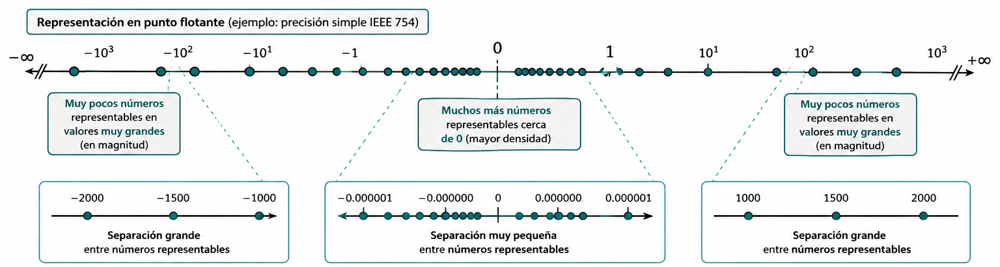
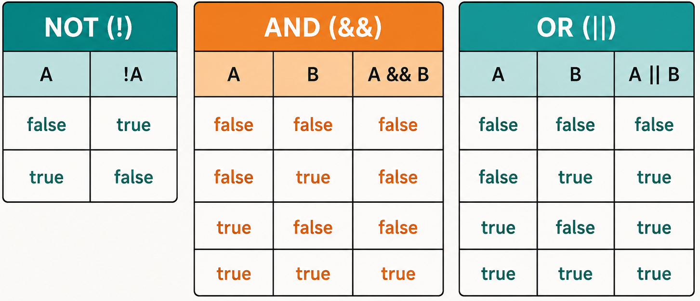

# Estructuras de programación

<a href="../pdf/tema_03.pdf" target="_blank" class="boton-descarga-top">📥 PDF</a>

<nav class="menu-flotante">
<input type="checkbox" id="menu-toggle" class="menu-checkbox">
<label for="menu-toggle" class="menu-boton">☰</label>

<h3>Contenido</h3>
<ul>
<li><a href="#introducción">Introducción</a></li>
<li><a href="#análisis-léxico-y-componentes-del-lenguaje">Análisis léxico y componentes del lenguaje</a>
<ul>
<li><a href="#concepto-de-token-y-separador">Concepto de Token y separador</a></li>
<li><a href="#palabras-reservadas">Palabras reservadas</a></li>
</ul>
</li>
<li><a href="#expresiones-y-operadores">Expresiones y Operadores</a>
<ul>
<li><a href="#operadores">Operadores</a></li>
<li><a href="#evaluación-en-cortocircuito">Evaluación en cortocircuito</a></li>
<li><a href="#precedencia-y-asociatividad">Precedencia y asociatividad</a></li>
</ul>
</li>
<li><a href="#conversión-de-tipos">Conversión de tipos</a>
<ul>
<li><a href="#reglas-de-promoción">Reglas de promoción</a></li>
<li><a href="#conversión-explícita">Conversión explícita</a></li>
<li><a href="#clases-envolventes">Clases envolventes</a></li>
</ul>
</li>
<li><a href="#uso-de-la-biblioteca-estándar">Uso de la biblioteca estándar</a>
<ul>
<li><a href="#la-clase-math">La clase Math</a></li>
</ul>
</li>
<li><a href="#instrucciones">Instrucciones</a>
<ul>
<li><a href="#sentencias">Sentencias</a></li>
<li><a href="#bloques-y-ámbito">Bloques y ámbito</a></li>
</ul>
</li>
<li><a href="#el-flujo-de-ejecución">El flujo de ejecución</a>
<ul>
<li><a href="#concepto-de-flujo-de-control">Concepto de flujo de control</a></li>
<li><a href="#estructuras-secuenciales">Estructuras secuenciales</a></li>
</ul>
</li>
<li><a href="#selección">Selección</a>
<ul>
<li><a href="#selección-simple">Selección simple</a></li>
<li><a href="#selección-compuesta">Selección compuesta</a></li>
<li><a href="#selección-múltiple">Selección múltiple</a></li>
<li><a href="#lógica-de-anidamiento">Lógica de anidamiento</a></li>
</ul>
</li>
<li><a href="#repetición">Repetición</a>
<ul>
<li><a href="#sentencia-while">Sentencia while</a></li>
<li><a href="#bucles-controlados-por-condición">Bucles controlados por condición</a></li>
<li><a href="#bucles-controlados-por-contador">Bucles controlados por contador</a></li>
<li><a href="#diseño-de-bucles">Diseño de bucles</a></li>
</ul>
</li>
<li><a href="#depuración-y-verificación">Depuración y verificación</a>
<ul>
<li><a href="#trazas-de-ejecución">Trazas de ejecución</a></li>
<li><a href="#errores-comunes">Errores comunes</a></li>
</ul>
</li>
</ul>

</nav>

<section class="objetivos">
<h2>Objetivos</h2>

* Comprender la diferencia entre análisis léxico, sintaxis y semántica.
* Identificar los componentes léxicos de Java.
* Construir y evaluar expresiones matemáticas y lógicas.
* Utilizar métodos de la biblioteca estándar de Java.
* Reconocer los distintos tipos de sentencias.
* Entender el concepto de flujo de control.
* Desarrollar algoritmos iterativos.
* Realizar trazas de ejecución.

</section>

<section class="toc">
<h2>Contenido</h2>

* [Introducción](#introducción)
* [Análisis léxico y componentes del lenguaje](#análisis-léxico-y-componentes-del-lenguaje)
    * [Concepto de Token y separador](#concepto-de-token-y-separador)
    * [Palabras reservadas](#palabras-reservadas)
* [Expresiones y Operadores](#expresiones-y-operadores)
    * [Operadores](#operadores)
    * [Evaluación en cortocircuito](#evaluación-en-cortocircuito)
    * [Precedencia y asociatividad](#precedencia-y-asociatividad)
* [Conversión de tipos](#conversión-de-tipos)
    * [Reglas de promoción](#reglas-de-promoción)
    * [Conversión explícita](#conversión-explícita)
    * [Clases envolventes](#clases-envolventes)
* [Uso de la biblioteca estándar](#uso-de-la-biblioteca-estándar)
    * [La clase Math](#la-clase-math)
* [Instrucciones](#instrucciones)
    * [Sentencias](#sentencias)
    * [Bloques y ámbito](#bloques-y-ámbito)
* [El flujo de ejecución](#el-flujo-de-ejecución)
    * [Concepto de flujo de control](#concepto-de-flujo-de-control)
    * [Estructuras secuenciales](#estructuras-secuenciales)
* [Selección](#selección)
    * [Selección simple](#selección-simple)
    * [Selección compuesta](#selección-compuesta)
    * [Selección múltiple](#selección-múltiple)
    * [Lógica de anidamiento](#lógica-de-anidamiento)
* [Repetición](#repetición)
    * [Sentencia while](#sentencia-while)
    * [Bucles controlados por condición](#bucles-controlados-por-condición)
    * [Bucles controlados por contador](#bucles-controlados-por-contador)
    * [Diseño de bucles](#diseño-de-bucles)
* [Depuración y verificación](#depuración-y-verificación)
    * [Trazas de ejecución](#trazas-de-ejecución)
    * [Errores comunes](#errores-comunes)

</section>

## Introducción

Hasta este punto de nuestro aprendizaje, hemos comprendido que un programa de ordenador es, en esencia, un algoritmo escrito para ser ejecutado por una máquina. En el tema anterior, exploramos los cimientos: aprendimos a declarar variables, a reconocer tipos de datos primitivos y a utilizar la biblioteca estándar de Java para realizar operaciones de entrada/salida básicas. Sin embargo, si analizamos los programas que hemos construido, observaremos que todos comparten una característica común: son puramente lineales. El ordenador se limita a ejecutar una instrucción tras otra, en el estricto orden físico en que fueron escritas.

No obstante, la programación en el «mundo real» y la resolución de problemas técnicos complejos en entornos productivos requieren una sofisticación mucho mayor. El pensamiento computacional no es una simple sucesión de pasos, sino un tejido o «urdimbre» donde cada hebra lógica debe entrelazarse con precisión. Para lograr esto, un lenguaje de programación debe ser entendido como un conjunto de reglas, símbolos y palabras que nos permiten modelar la realidad.

El proceso por el cual el ordenador interpreta nuestras intenciones comienza con el análisis léxico. Cuando el compilador recibe nuestro código fuente, su primera tarea es identificar elementos con significado propio. Como sucede en el lenguaje natural, no podemos formar una oración coherente amontonando palabras: en los lenguajes de programación combinamos estos componentes léxicos para formar expresiones. Algo como n + 1, por sí solo, es solo un valor latente; para que sea algo capaz de realizar una tarea, debe integrarse en una estructura que le dé sentido.

La verdadera potencia del software reside en la capacidad de romper la linealidadd el código para establecer un flujo de control. Este define el orden en que las sentencias se ejecutan realmente durante la actividad de la aplicación. Para ilustrarlo, podemos usar la analogía de los músicos: ir tocando las notas según indica el director equivale a una estructura secuencial; sin embargo, podremos tomar una decisión basada en una condición o, quizás, que una serie de acordes se repitan.

Profundizaremos aquí en cómo construir expresiones y conoceremos la selección y la iteración, herramientas que nos permitirán empezar a desarrollar algoritmos inteligentes, capaces de tomar decisiones autónomas y procesar información de forma eficiente, sentando así las bases necesarias antes de adentrarnos en los fundamentos de la programación orientada a objetos.

## Análisis léxico y componentes del lenguaje

Como hemos señalado, la construcción de un programa comienza con la escritura de **código fuente**, una tarea que realizamos utilizando un editor y siguiendo las reglas gramaticales del lenguaje. Sin embargo, para que este texto cobre vida y se convierta en una serie de acciones ejecutables, debe pasar por un proceso de transformación riguroso. El primer paso de este viaje técnico es el **análisis léxico**, una fase en la que el compilador actúa como un lector meticuloso que descompone la secuencia ininterrumpida de caracteres que le entregamos en piezas individuales dotadas de significado.

En el lenguaje natural, cuando leemos una frase, nuestro cerebro identifica automáticamente dónde termina una palabra y comienza la siguiente, reconociendo sustantivos, verbos y adjetivos. En el ámbito de la programación, el ordenador realiza una operación análoga. No percibe el código como un conjunto de instrucciones complejas de un solo vistazo, sino como un flujo de símbolos pertenecientes al alfabeto; en el caso de Java, *Unicode*. La labor del analizador léxico consiste en agrupar estos símbolos en unidades atómicas, que son los componentes básicos que conforman la estructura del lenguaje.

Esta etapa es fundamental porque establece los cimientos sobre los que se construirá la lógica del programa, permitiendo ensamblar estos bloques en estructuras sintácticamente correctas. Si el analizador léxico encuentra un símbolo inesperado o una combinación de caracteres que no encaja en las categorías permitidas, el proceso se detendrá antes incluso de intentar comprender la intención del algoritmo. Por lo tanto, antes de profundizar en cómo tomar decisiones o repetir procesos, es esencial comprender la naturaleza de estos elementos mínimos y los mecanismos que permiten al compilador distinguirlos unos de otros.

<aside class="definicion">

**Analizador léxico:** Fase del compilador que descompone el flujo continuo de caracteres del código fuente en unidades atómicas con significado (*tokens*).

</aside>

### Concepto de Token y separador

Dentro del proceso de análisis léxico, el compilador debe ser capaz de reconocer los componentes básicos que integran el código fuente para poder interpretarlos adecuadamente. Estos componentes mínimos, que no pueden ser descompuestos en partes más pequeñas sin perder su sentido, reciben el nombre de ***tokens*** o elementos atómicos. En la gramática de un lenguaje de programación como Java, los *tokens* son el equivalente a las palabras en una oración del lenguaje natural; cada uno de ellos cumple una función específica, ya sea representar un valor constante, nombrar una variable o indicar una operación matemática.

Para que el analizador léxico pueda distinguir estos elementos dentro de la secuencia ininterrumpida de caracteres que escribimos, el lenguaje emplea unos símbolos especiales denominados **separadores**. Un separador es cualquier carácter o marca que indica de manera inequívoca dónde termina un *token* con significado propio y dónde comienza el siguiente. En este sentido, la programación vuelve a imitar a la lengua: así como usamos espacios para separar palabras en un texto escrito para que no se conviertan en una masa de letras incomprensible, Java utiliza los separadores para evitar que los *tokens* se fusionen.

<aside class="definicion">

**Token:** Unidad mínima o componente atómico que posee significado propio dentro de la gramática del lenguaje de programación.

**Separador:** Carácter o marca que delimita inequívocamente el fin de un *token* y el inicio del siguiente.

</aside>

Los elementos que actúan como separadores en Java son los siguientes:

* **Espacio en blanco:** es el separador más común y sencillo, utilizado de la misma forma que en la escritura convencional.
* **Tabulador:** actúa de forma equivalente al espacio en blanco desde el punto de vista del compilador.
* **Retorno de carro o salto de línea:** indica el fin de una línea física, pero léxicamente tiene el mismo valor que un espacio. El compilador es capaz de tratar un programa completo escrito en una sola línea o con cada palabra en una línea distinta con el mismo resultado técnico, ya que sustituye cualquier secuencia de estos separadores por un único espacio en blanco[^1].

Una vez que el analizador léxico ha hecho uso de estos separadores para aislar los *tokens*, estos se clasifican en diferentes categorías según su naturaleza, como los literales, los identificadores, los operadores y las palabras reservadas. Solo si el ensamblaje de estos bloques atómicos sigue las reglas de la sintaxis, el compilador podrá avanzar hacia la fase de traducción y ejecución del programa.

### Literales

Un **literal** —o valor literal—, como ya vimos en el capítulo anterior, es la representación explícita y constante de un valor concreto directamente escrito en el código fuente de un programa. A través de los literales, el programador especifica valores fijos para los tipos de datos primitivos, el tipo de datos String y la referencia especial null.

Desde el punto de vista del análisis léxico, los literales son identificados por el compilador como *tokens* atómicos. Esto significa que constituyen unidades de información indivisibles con significado propio dentro de la gramática del lenguaje. A diferencia de lo que ocurre con un identificador o una variable, cuyo contenido o estado puede fluctuar dinámicamente durante el ciclo de vida de la ejecución, el valor representado por un literal queda prefijado de manera inmutable desde la fase de compilación.

<aside class="definicion">

**Literal:** *Token* que representa la expresión inalterable de un valor constante de un tipo de datos primitivo, de un objeto String o de la referencia nula null dentro del código fuente.

</aside>

Dentro de la especificación sintáctica de Java, los literales se clasifican rigurosamente según la categoría de datos a la que corresponden, obedeciendo a un conjunto estricto de convenciones léxicas para su escritura. Plantilla sintáctica de declaración de literal:

Literal:

IntegerLiteral 
FloatingPointLiteral 
BooleanLiteral 
CharacterLiteral 
StringLiteral 
NullLiteral

#### Literales enteros

De forma predeterminada, cuando el analizador léxico procesa un literal numérico compuesto únicamente por dígitos (sin coma ni punto fraccionario), el compilador deduce que se trata de un valor de tipo int codificado en 32 bits. La representación convencional se realiza en decimal, mediante una secuencia de dígitos del 0 al 9. Un literal decimal no debe comenzar con el dígito 0 (salvo el propio número cero).

IntegerLiteral:

DecimalNumeral

DecimalNumeral:

0 
NonZeroDigit [Digits]

NonZeroDigit:

(one of) 
1 2 3 4 5 6 7 8 9

Digits:

Digit 
Digit Digits

Digit:

0 
NonZeroDigit

Esta sucesión de reglas merece una pequeña explicación. Un literal de tipo entero, IntegerLiteral, es bien el número cero o un dígito distinto de cero, NonZeroDigit, seguido, opcionalmente, de dígitos, Digits. Estos dígito, a su vez, pueden ser un dígito Digit o un dígito seguido de dígitos. Por último, un dígito es el número cero o un número distinto de cero. La especificación lo que nos dice es que un número entero puede tener un número indeterminado de dígitos pero que no puede comenzar por cero, salvo que sea el cero.

A partir de Java 7, se permite intercalar el carácter de subrayado (_) entre los dígitos de cualquier literal numérico para mejorar la legibilidad del código fuente (por ejemplo, 1_000_000). Estos caracteres son ignorados por el analizador léxico durante la fase de compilación y no afectan al valor asignado.

Digits:

Digit 
Digit [DigitsAndUnderscores] Digit

DigitsAndUnderscores:

DigitOrUnderscore {DigitOrUnderscore} 

DigitOrUnderscore:

Digit 
_

Además del formato convencional, en decimal, Java permite representar literales enteros mediante otros tres sistemas de numeración:

* **Hexadecimal (base 16):** se denota mediante el prefijo 0x o 0X, aceptando dígitos del 0 al 9 y letras de la a a la f (tanto en mayúsculas como en minúsculas). Un ejemplo es el número 26: 0X1A.
* **Octal (base 8):** se especifica anteponiendo un cero (0) como prefijo al número, seguido exclusivamente por dígitos comprendidos entre el 0 y el 7 (por ejemplo, 012, que es el número 10).
* **Binario (base 2):** permite la notación explícita mediante el prefijo 0b o 0B, empleando únicamente los dígitos 0 y 1 (por ejemplo, el número 10 se representa como 0b1010[^2]).

IntegerLiteral:

DecimalNumeral 
HexNumeral 
OctalNumeral 
BinaryNumeral 

HexNumeral:

0 x HexDigits 
0 X HexDigits

HexDigits:

HexDigit 
HexDigit [HexDigitsAndUnderscores] HexDigit

HexDigit:

(one of) 
0 1 2 3 4 5 6 7 8 9 a b c d e f A B C D E F

HexDigitsAndUnderscores:

HexDigitOrUnderscore {HexDigitOrUnderscore} 

HexDigitOrUnderscore:

HexDigit 
_

OctalNumeral:

0 OctalDigits 
0 OctalDigits

OctalDigits:

OctalDigit 
OctalDigit [OctalDigitsAndUnderscores] OctalDigit

OctaDigit:

(one of) 
0 1 2 3 4 5 6 7

OctalDigitsAndUnderscores:

OctalDigitOrUnderscore {OctalDigitOrUnderscore} 

OctalDigitOrUnderscore:

OctalDigit 
_

BinaryNumeral:

0 b BinaryDigits 
0 B BinaryDigits

BinaryDigits:

BinaryDigit 
BinaryDigit [BinaryDigitsAndUnderscores] BinaryDigit

BinaryDigit:

(one of) 
0 1

BinaryDigitsAndUnderscores:

BinaryDigitOrUnderscore {BinaryDigitOrUnderscore} 

BinaryDigitOrUnderscore:

BinaryDigit 
_

Si se requiere que el literal sea interpretado por el compilador como un entero de precisión extendida de 64 bits (long), es obligatorio añadir el sufijo **L** o **l** al final de la secuencia de dígitos[^3].

IntegerLiteral:

DecimalNumeral [IntegerTypeSuffix] 
HexNumeral [IntegerTypeSuffix] 
OctalNumeral [IntegerTypeSuffix] 
BinaryNumeral [IntegerTypeSuffix] 

IntegerTypeSuffix:

(one of) 
l L 

Internamente, la máquina virtual Java (JVM) almacena todos los valores enteros utilizando la representación binaria en **complemento a dos con signo**[^4]. Este formato fija los límites inferior y superior de los rangos numéricos que cada tipo de entero puede albergar en memoria (por ejemplo, entre $-2^{31}$ y $2^{31}-1$ para el tipo int).

<pre class="codigo-java">
int contador = 100;           // Decimal
int mascaraHex = 0xFF;        // Hexadecimal (255)
int patronBits = 0b1100;      // Binario (12)
long poblacion = 8000000000L; // Literal de 64b
</pre>

#### Literales de punto flotante

Los literales de punto flotante se emplean para expresar números reales. Por defecto, la gramática de Java interpreta cualquier literal con punto decimal o notación exponencial como un valor de tipo double (64 bits), garantizando un grado elevado de precisión matemática.

Existen dos formas estándar de escribir literales de punto flotante:

* **Notación decimal:** utiliza el carácter punto (.) para separar explícitamente la parte entera de la fraccionaria (por ejemplo, 3.14159 o 5).
* **Notación científica o exponencial:** añade la letra e o E seguida de un número entero (positivo o negativo) que representa un exponente o potencia de diez (por ejemplo, 1.5e3 para representar $1.5 \times 10^3$, es decir, 1500.0, o 2.5E-4 para $2.5 \times 10^{-4}$).

FloatingPointLiteral:

DecimalFloatingPointLiteral [FloatTypeSuffix]

DecimalFloatingPointLiteral:

Digits . [Digits] [ExponentPart] 
. Digits [ExponentPart] 
Digits ExponentPart 
Digits [ExponentPart]  

ExponentPart:

ExponentIndicator SignedInteger 

ExponentIndicator:

(one of) 
e E

SignedInteger:

[Sign] Digits

Sign:

(one of) 
+ -

FloatTypeSuffix:

(one of) 
f F e E

A partir de las reglas anteriores podemos ver que un número en punto flotante puede empezar por punto cuando la parte entera sea cero. Cuando sea preciso declarar un literal de precisión simple de 32 bits (float) —para cumplir con los requerimientos de un método, por ejemplo—, se debe añadir el sufijo **f** o **F** al final del número.

<pre class="codigo-java">
double pi = 3.1415926535;   // Tipo double por defecto
double masa = 5.972e24;     // Notación científica (double)
float gravedad = 9.81f;     // Sufijo f para forzar el tipo float
</pre>

Supongamos que nuestra máquina, en la que cada ubicación de memoria tiene el mismo tamaño, permite representar los números mediante seis dígitos y un signo. Cuando definimos una variable o constante, la ubicación asignada consta de seis dígitos y un signo; si el valor es entero, la interpretación del número almacenado en esa ubicación es sencilla: puedo almacenar valores desde el -999999 hasta el +999999; el cero tiene dos representaciones. Nuestra precisión es seis dígitos y los números en ese rango pueden ser representados de forma exacta.

Supongamos que los dos dígitos de más a la izquierda nos permiten representar un exponente. La representación +561234, por ejemplo, es en realidad el número $1234 \times 10^56$. De hecho, el rango de números que ahora podemos representar es mucho mayor: desde $-9999 \times 10^99$ hasta $+9999 \times 10^99$. Sin embargo, la precisión ahora es de solo cuatro dígitos; es decir, solo los números de cuatro dígitos pueden representarse con exactitud en nuestro sistema. ¿Qué sucede con los números con más dígitos? Los cuatro dígitos de la izquierda se representan correctamente, y los dígitos de la derecha, o dígitos menos significativos, se pierden (se asume que son 0). Por ejemplo, 1000000 puede representarse con exactitud, pero 4932416 no, porque nuestro esquema de codificación nos limita a cuatro dígitos significativos.

<aside class="definicion">

**Precisión:** El máximo número de dígitos significativos.

**Dígitos significativos:** Desde el primer dígito distinto de cero a la izquierda hasta el último dígito distinto de cero a la derecha (más cualquier dígito cero que sea exacto).

</aside>

Para extender nuestro esquema de codificación y representar números de punto flotante, debemos poder representar exponentes negativos. Dado que nuestro esquema no incluye un signo para el exponente, vamos a modificarlo ligeramente: el signo existente se convierte en el signo del exponente y añadimos un signo a la izquierda para representar el signo del número.

Ahora podemos representar con precisión, con cuatro dígitos, todos los números entre $-9999 \times 10^99$ y $+9999 \times 10^99$. Añadir exponentes negativos a nuestro esquema nos permite representar fracciones tan pequeñas como $1 \times 10^-99$. Nuestra precisión sigue siendo de cuatro dígitos. Los números 0.1032, 5.406 y 1000000 se pueden representar con exactitud. El número 476.0321, sin embargo, tiene siete cifras significativas, pero se representa como 476.0; ese 0.0321 no se puede representar en nuestro sistema[^5].

La codificación interna sigue la norma **IEEE 754** (formato binario de punto flotante para ordenadores), estructurando el valor en tres campos binarios diferenciados: bit de signo, mantisa y exponente. En el caso de los vaores de tipo float, el bit de signo es +1 o -1, la mantisa es un número entero positivo menor que $2^24$ y el exponente en un número entre -126 y 127, incluidos. En el caso de los valores de tipo double, la mantisa en un número entero positivo menor que $2^53$ y el exponente en un número entre -1022 y 1023, incluidos.

El nombre *punto flotante* hace referencia a que el *punto decimal* puede moverse. En nuestro modelo, cada número se almacena en cuatro dígitos; si el dígito que no es cero se almacena en la posición de más a la izquierda, el exponente se ajusta de la manera correspondiente: por ejemplo, 1000000 podríamos almacenarlo como +060001 pero lo almacenamos como +031000. Este formato proporciona la máxima precisión posible, denominándose formato normalizado. En el modelo que usa la JVM, además, solo puede haber un único dígito distinto de cero a la izquierda del punto decimal, lo que nos permite aumentar el número de dígitos de la mantisa en uno, por lo que la preción no es de 24 o 53 bits: pasa a ser 25 y 54. Esto es debido a que sabemos con certeza que el primer dígito siempre es 1 -al representarlo en base 2- y la máquina no lo almacena.

Es evidente que podemos representar valores extremadamente amplios o infinitesimales, asumiendo las limitaciones de redondeo y precisión propias de la aritmética de punto flotante. Sin embargo, con la explicación anterior, podríamos pensar que el cero no puede representarse. La realidad es que existen patrones para designar números específicos.

Y aunque pueda parecer otra cosa, hay que tener en cuenta que el número máximo de valores diferentes que la notación en punto flotante puede representar es $2^32$ o $2^64$ números: lo que hemos hecho es expandir esos números en un rango mayor. Además, los números que podemos representar no están espaciados de la misma manera entre ellos, como los números en punto fijo. Los posibles valores están más próximos cerca del origen y más separados cuanto más alejados.

<figure class="img-grande">
    
</figure>

#### Otros literales

Para la representación explícita de valores no numéricos o de estructuras complejas, el lenguaje provee la siguiente gama de literales:

* **Literales booleanos:** representan los valores de la lógica booleana y están constituidos únicamente por las dos palabras reservadas true (verdadero) y false (falso). A diferencia de otros lenguajes, en Java no existe una equivalencia numérica directa entre el valor 0 o 1 y los valores booleanos.
* **Literales de carácter:** representan un único símbolo del juego de caracteres Unicode. Se delimitan mediante comillas simples e incluyen soporte para secuencias de escape.
* **Literales de cadena:** consisten en una secuencia de cero o más caracteres delimitados por comillas dobles. Aunque String no es un tipo de datos primitivo, Java proporciona este soporte sintáctico especial, convirtiendo automáticamente cualquier literal de este tipo en una instancia inmutable de la clase.
* **Literal nulo:** la palabra null, representa la ausencia explícita de referencia a un objeto dentro de una variable de tipo objeto o referencia, como String.

BooleanLiteral:

(one of) 
true false

CharacterLiteral:

\' SingleCharacter \' 
\' EscapeSequence \'

SingleCharacter:

JavaLetterOrDigit but not \' or \\ 

EscapeSecuence:

\\ t (horizontal tab HT, Unicode \\u0009) 
\\ n (linefeed LF, Unicode \\u000a) 
\\ r (carriage return CR, Unicode \\u000d) 
\\ LineTerminator (line continuation, no Unicode representation) 
\\ " (double quote \", Unicode \\u0022) 
\\ ' (single quote \', Unicode \\u0027) 
\\ \\ (backslash \\, Unicode \\u005c)

LineTerminator:

the ASCII LF character, also known as \"newline\" 
the ASCII CR character, also known as \"return\" 
the ASCII CR character followed by the ASCII LF character

StringLiteral:

\" {StringCharacter} \"

StringCharacter:

JavaLetterOrDigit but not \' or \\
EscapeSequence

NullLiteral:

null

<pre class="codigo-java">
boolean activo = true;
char inicial = 'J';
char salto = '\n';
char unicodeA = '\u0041';
String saludo = "Bienvenido a Java";
Object objetoVacio = null;
</pre>

### Palabras reservadas

Como ya comentamos en el capítulo anterior, son aquellos *tokens* que tienen asignada una función específica dentro del lenguaje: los programadores tienen prohibido utilizarlas para cualquier otro propósito; por ello, no es posible nombrar una variable, un campo o una clase utilizando uno de estos términos. Al igual que en el lenguaje natural existen palabras con funciones gramaticales fijas, como las preposiciones, las palabras reservadas constituyen el vocabulario fundamental que el compilador reconoce para estructurar la lógica del programa.

Gran parte del proceso de aprendizaje de un lenguaje de programación consiste en familiarizarse con el significado y la utilidad de estos términos. En el caso de Java, el conjunto de estas palabras ha ido evolucionando con las diferentes versiones del lenguaje para adaptarse a nuevas necesidades. En la actualidad, el núcleo está compuesto por cincuenta y una palabras, a las que se suman dieciséis términos adicionales cuyo significado especial solo se activa dependiendo del contexto específico en el que se utilicen.

Es importante destacar que Java es un lenguaje extremadamente estricto con la forma en que se escriben estos elementos, siendo sensible a la diferencia entre mayúsculas y minúsculas. Todas las palabras reservadas se componen exclusivamente de letras minúsculas. Por esta razón, un término como int es reconocido como una palabra reservada para definir tipos enteros, mientras que Int o INT serían tratados como identificadores diferentes definidos por el usuario, aunque su uso se desaconseja para evitar ambigüedades en la lectura del código.

Dentro de este grupo, existen casos particulares como las palabras goto o const. Aunque figuran en la lista oficial y el programador no puede emplearlas como nombres de variables, actualmente no tienen ninguna función operativa dentro del lenguaje Java. Su reserva responde principalmente a razones históricas y al deseo de los diseñadores del lenguaje de evitar que programadores provenientes de otros entornos, como C o C++, intenten aplicar estructuras de programación que son incompatibles con la seguridad y la filosofía de Java.

A continuación, se presenta la relación de palabras reservadas en Java, estructurada conforme a la [Especificación del Lenguaje Java](https://docs.oracle.com/en/java/javase/26/docs/specs/jls/jls-3.html#jls-3.9)[^6]:

  

    Palabras reservadas (*Keywords*)
  

  <table class="tabla-jls-keywords">
    <tbody>
      <tr>
        <td>abstract</td><td>assert</td><td>boolean</td><td>break</td><td>byte</td>
      </tr>
      <tr>
        <td>case</td><td>catch</td><td>char</td><td>class</td><td>const</td>
      </tr>
      <tr>
        <td>continue</td><td>default</td><td>do</td><td>double</td><td>else</td>
      </tr>
      <tr>
        <td>enum</td><td>extends</td><td>final</td><td>finally</td><td>float</td>
      </tr>
      <tr>
        <td>for</td><td>goto</td><td>if</td><td>implements</td><td>import</td>
      </tr>
      <tr>
        <td>instanceof</td><td>int</td><td>interface</td><td>long</td><td>native</td>
      </tr>
      <tr>
        <td>new</td><td>package</td><td>private</td><td>protected</td><td>public</td>
      </tr>
      <tr>
        <td>return</td><td>short</td><td>static</td><td>strictfp[^7]</td><td>super</td>
      </tr>
      <tr>
        <td>switch</td><td>synchronized</td><td>this</td><td>throw</td><td>throws</td>
      </tr>
      <tr>
        <td>transient</td><td>try</td><td>void</td><td>volatile</td><td>while</td>
      </tr>
      <tr>
        <td>_ (caracter de subrayado)</td>
      </tr>
    </tbody>
  </table>

Asimismo, existen los siguientes términos que funcionan como palabras reservadas dependiendo del contexto en el que se utilicen:

  

    Palabras reservadas dependientes del contexto (*Contextual Keywords*)
  

  <table class="tabla-jls-keywords">
    <tbody>
      <tr>
        <td>exports</td><td>module</td><td>non-sealed</td><td>open</td><td>opens</td>
      </tr>
      <tr>
        <td>permits</td><td>provides</td><td>record</td><td>requires</td><td>sealed</td>
      </tr>
      <tr>
        <td>to</td><td>transitive</td><td>uses</td><td>var</td><td>when</td>
      </tr>
      <tr>
        <td>with</td><td>yield</td>
      </tr>
    </tbody>
  </table>

Finalmente, conviene recordar que el carácter de subrayado (_) por sí solo también se considera un elemento reservado para usos futuros[^8], lo que prohíbe su empleo como un identificador de una sola letra en las declaraciones del programa.

Ahora que conocemos los literales y las palabras reservadas, vamos a modificar ligeramente una de las producciones sintácticas que veíamos en el tema anterior:

Identificador:

IdentifierChars but not a Keyword or BooleanLiteral or NullLiteral

Es decir, un *identificador* es una secuencia ilimitada de letras y dígitos, comenzando por una letra, que no es una palabra reservada, un literal booleano o un literal nulo.

## Expresiones y operadores

Una vez que el compilador ha concluido la fase de análisis léxico e identificado los *tokens* que componen nuestro código, el siguiente nivel de abstracción consiste en ensamblar estas piezas atómicas para formar unidades de significado superior. En la gramática de Java, estas construcciones se denominan **expresiones**.

Una expresión, como ya vimos en el tema 2, no es otra cosa que un conjunto organizado de identificadores, literales y operadores que, al combinarse siguiendo las reglas sintácticas del lenguaje, pueden ser evaluados para obtener un valor concreto.

El concepto de evaluación es central en esta etapa: evaluar una expresión implica que el ordenador realiza las operaciones especificadas para producir un nuevo valor. Es importante destacar que toda expresión en Java tiene asociado un tipo de dato inamovible, el cual corresponde al tipo del resultado final obtenido tras su evaluación. Así, el resultado de una expresión que sume dos números enteros será un valor de tipo entero, mientras que el de una que compare dos valores será de tipo booleano.

Podemos entender las expresiones como los bloques de construcción lógicos de un programa. No obstante, existe una distinción técnica crucial entre una expresión y una instrucción o sentencia. Mientras que la expresión representa un valor potencial o un cálculo, la **sentencia** representa una acción completa que el ordenador debe llevar a cabo. Por ejemplo, la expresión matemática $n + 1$ por sí sola no constituye una orden operativa para la máquina; necesita ser integrada en una estructura que le dé un propósito funcional, como una sentencia de asignación que guarde dicho resultado en una variable. De esta forma, las expresiones actúan como la «materia prima» con la que alimentamos las instrucciones de nuestro código para dirigir el flujo de control y resolver problemas complejos.

### Operadores

Los **operadores** son los elementos funcionales que permiten llevar a cabo operaciones sobre un conjunto de datos u operandos, representados habitualmente por literales o identificadores. Los operadores permitidos en una operación dependen de los tipos de datos de los operandos y producen, tras su evaluación, un resultado que posee un tipo de dato determinado.

#### Operadores aritméticos

Son operadores que afectan a los números enteros y en punto flotante; devuelven un valor del mismo tipo que los operandos: si son enteros, por ejemplo, el resultado es entero. Los **operadores unarios** permiten mantener o cambiar el signo de una expresión numérica mediante el uso del más (+) y el menos (-). Junto a éstos, los **operadores binarios tradicionales**, que incluyen la suma (+), la resta (-), la multiplicación (*) y la división (/). Además, los lenguajes de programación suelen añadir la operación módulo o resto de la división (%).

<aside class="definicion">

**Operador unario:** Un operador que solo tiene un operando.

**Operador binario:** Un operador que tiene dos operandos.

</aside>

En programación no es habitual usar el más unario y, cuando se trata de un literal, se asume que, si no hay signo, siempre es positivo.

Las operaciones de la suma, resta, producto y división, funcionan de la misma manera que te enseñaron cuando aprendiste a utilizarlas. La división en punto flotante, por ejemplo, genera un resultado en punto flotante:

<pre class="codigo">
7.2 / 2.0 produce 3.6
</pre>

No obstante, es menos probable estar familiarizado con la división entera y el módulo, por lo que podemos estudiarlos un poco más en profundidad. Cuando dividimos dos enteros entre sí, obtemos de la división un cociente y un resto. Por ejemplo, la división de 6 entre 2 produce 3 como cociente y 0 como resto; pero la de 7 entre 3, produce también 3 como cociente pero 1 como resto. Y ese resto, 0 ó 1, es el resultado que obtenemos con la operación módulo:

<pre class="codigo">
6 / 2 produce 3     6 % 2 produce 0
7 / 2 produce 3     7 % 2 produce 1
</pre>

Aunque existen lenguajes para los que el operador módulo solo es aplicable a la división entera, puede aplicarse en Java, y otros lenguajes modernos, con números en punto flotante. La forma de obtenerlo[^9] en Java[^10] consiste en obtener la división en punto flotante; multiplicar dicho valor sin decimales (sin redondeo) por el divisor; restar del dividendo el resultado de la multiplicación. Ejemplo:

<pre class="codigo">
Calculamos 7.8 % 3.0 en Java:
**Dividimos:** 7.8 / 3.0 produce 2.6
**Multiplicamos:** 3.0 * 2.0 produce 6.0
**Restamos:** 7.8 - 6.0 produce **1.8**
</pre>

Expression:

Literal 
ArithmeticExpression 
AssignmentExpression

ArithmeticExpression:

AdditiveExpression

AdditiveExpression:

MultiplicativeExpression 
AdditiveExpression + MultiplicativeExpression 
AdditiveExpression - MultiplicativeExpression

MultiplicativeExpression:

UnaryExpression 
MultiplicativeExpression * UnaryExpression 
MultiplicativeExpression \\ UnaryExpression 
MultiplicativeExpression % UnaryExpression 

UnaryExpression:

+ Expression 
- Expression

#### Operadores relacionales

Los operadores relacionales son binarios, por lo que tienen dos operandos. Se utilizan para comparar datos de tipo primitivo ya sean numéricos, caracteres o booleanos, estableciendo relaciones de orden o igualdad entre ellos. El resultado de evaluar una expresión con estos operadores es siempre un valor de tipo booleano[^11]: true o false.

Java proporciona operadores para verificar:

* La igualdad (==)
* La desigualdad o diferencia (!=)
* Relaciones de magnitud: mayor que (>), menor que (<), mayor o igual que (>=) y menor o igual que (<=).

Expression:

Literal 
ArithmeticExpression 
EqualityExpression 
AssignmentExpression

EqualityExpression:

RelationalExpression 
EqualityExpression == RelationalExpression 
EqualityExpression != RelationalExpression

RelationalExpression:

AdditiveExpression 
RelationalExpression &lt; AdditiveExpression 
RelationalExpression &gt; AdditiveExpression 
RelationalExpression &lt;= AdditiveExpression 
RelationalExpression &gt;= AdditiveExpression

**Cuidado con la asignación:** Un error de lógica muy frecuente en etapas iniciales de aprendizaje consiste en confundir el operador de asignación (=) con el de igualdad (==), siendo el primero una instrucción de almacenamiento de un valor en memoria y el segundo una comparación.

#### Operadores lógicos

Los operadores lógicos son binarios, por lo que tienen dos operandos, salvo la negación. Permiten combinar valores booleanos o resultados de expresiones relacionales para construir afirmaciones lógicas. Los operadores fundamentales son:

* La negación lógica (NOT) o NO-lógico (!).
* La conjunción (AND) o Y-lógico (&&).
* La disyunción (OR) u O-lógico (||).

Hay que entender desde el principio que true y false, como hemos visto al declarar BooleanLiteral, no son nombres de variable ni palabras reservadas: son dos constantes especiales pero, en la práctica, se comportan como dos palabras reservadas.

<figure class="img-lateral-dch">
    
</figure>

El operador NO-lógico precede a cualquier expresión lógica (booleana) y nos proporciona el valor opuesto al de la expresión. Por ejemplo, si miCaracter = `'`B`'` es verdadero, !(miCaracter = `'`B`'`) es falso. Proporciona un método simple de cambiar el valor de un aserto. Por ejemplo, si !(años &gt; 50), es equivalente escribir: años &le; 50.

La operación Y-lógico requiere que ambos operandos sean verdaderos para que el resultado de la expresión sea verdadero; si uno cualquiera de ellos es falso, el valor de la expresión es falso.

La operación O-lógico proporciona un resultado verdadero si cualquiera de sus operandos, que pueden serlo los dos, es verdadero. Solo cuando ambos operandos son falsos el resultado de la operación es también falso.

Expression:

Literal 
ArithmeticExpression 
EqualityExpression 
ConditionalExpression 
AssignmentExpression

ConditionalExpression:

ConditionalOrExpression

ConditionalOrExpression:

ConditionalAndExpression 
ConditionalOrExpression || ConditionalAndExpression

ConditionalAndExpression:

Expression 
ConditionalAndExpression &amp;&amp; Expression

Java implementa para estos dos últimos una semántica de **evaluación en cortocircuito**, lo que significa que el ordenador detiene el proceso de evaluación tan pronto como el resultado final de la expresión booleana es inequívoco y que explicaremos en breve.

#### Operador de asignación

Aunque en muchos lenguajes la asignación se considera una sentencia o instrucción, en Java, el símbolo igual (=) es un operador, el operador de asignación, cuya misión es proporcionar valor a una variable, el de una expresión a su derecha, como ya vimos en el tema anterior.

### Evaluación en cortocircuito

Al procesar expresiones lógicas, la mayoría de los lenguajes de programación no garantizan el orden en que se evaluarán dichas expresiones: esto quiere decir que si una operación lógica incluye operaciones relacionales, por ejemplo, no sabemos el orden en que se evaluarán dichas operaciones. Además, en general, la operación lógica no se evaluará hasta que todos los operandos de la misma obtengan un valor booleano.

Java aplica una técnica de optimización denominada **evaluación en cortocircuito** o evaluación condicional. Bajo esta semántica, el ordenador no evalúa todos los componentes de una expresión lógica, sino que procesa los operandos de izquierda a derecha y detiene el procedimiento de evaluación tan pronto como el valor booleano final de la expresión completa es inequívoco.

Para comprender cómo el ordenador puede conocer el resultado sin examinar la expresión entera, debemos analizar el comportamiento de los operadores fundamentales:

* **Conjunción lógica (&&):** Una operación Y-lógico solo devuelve true si *ambos* operandos son verdaderos. Por tanto, si al evaluar el primer operando el resultado es false, es imposible que la expresión completa sea verdadera, independientemente del valor que tenga el segundo operando. En este caso, Java «hace un cortocircuito», detiene la evaluación y produce un resultado final de false.
* **Disyunción lógica (||):** Una operación O-lógico devuelve true si *al menos uno* de sus operandos es verdadero. Siguiendo la lógica anterior, si el primer operando evaluado resulta ser true, el resultado final de la expresión será necesariamente true sin importar el valor del segundo. En consecuencia, el ordenador no pierde tiempo procesando la segunda subexpresión.

Esta característica no es solo una cuestión de eficiencia técnica para ahorrar tiempo de ejecución; tiene implicaciones críticas en la robustez y seguridad del código. La evaluación en cortocircuito permite al programador escribir expresiones donde el primer operando actúa como una salvaguarda del segundo.

### Precedencia y asociatividad

## Conversión de tipos

### Reglas de promoción

### Conversión explícita

### Clases envolventes

## Uso de la biblioteca estándar

### La clase Math

## Instrucciones

### Sentencias

### Bloques y ámbito

## El flujo de ejecución

### Concepto de flujo de control

### Estructuras secuenciales

## Selección

### Selección simple

### Selección compuesta

### Selección múltiple

### Lógica de anidamiento

## Repetición

### Sentencia while

### Bucles controlados por condición

### Bucles controlados por contador

### Diseño de bucles

## Depuración y verificación

### Trazas de ejecución

### Errores comunes

<footer class="pie">

<a href="tema_02.html" class="anterior">Anterior</a> | 
<a href="../index.html" class="inicio">Inicio</a> | 
<a href="tema_04.html" class="siguiente">Siguiente</a>

  

<!-- Renderizar solo si existen en el tema -->
<a href="ejercicios.html">Ejercicios</a>
<!--a href="problemas.html">Problemas</a-->

</footer>

[^1]: Como vimos en el capítulo anterior, esto no es exactamente así cuando se trata de una cadena, por ejemplo.
[^2]: La capacidad de escribir literales en notación binaria directa mediante el prefijo 0b o 0B fue introducida formalmente en la versión Java SE 7 mediante la propuesta JEP 100.
[^3]: Se recomienda enfáticamente el uso de la letra **L** mayúscula para evitar confusiones visuales con el número uno (1).
[^4]: En la representación en complemento a dos, el bit más significativo, el primero, es 1 cuando el número es negativo. Los números negativos se calculan cambiando los unos por ceros y los ceros por unos, sumando uno al resultante.
[^5]: La JVM realiza redondeo en lugar de truncamiento al descartar los dígitos sobrantes. Si asumimos que tiene cuatro cifras significativas, el redondeo almacenaría 476.0321 como 476.0, pero almacenaría 476.0823 como 476.1.
[^6]: La documentación y especificación oficial actualizada de Java puede consultarse en la plataforma [Oracle Java Specification](https://docs.oracle.com/javase/specs/jls/).
[^7]: La palabra `strictfp` fue introducida para restringir los cálculos de punto flotante a la norma IEEE 754; su uso es obsoleto.
[^8]: A partir de Java 9 (JEP 213), el carácter de subrayado `_` dejó de ser un identificador válido y pasó a ser un término reservado.
[^9]:  El método estándar IEEE 754 puede obtenerse usando el método Math.IEEEremainder.
[^10]: Disponible en la [especificación](https://docs.oracle.com/javase/specs/jls/se21/html/jls-15.html#jls-15.17.3).
[^11]: Los booleanos corresponden a un tipo de datos lógico que solo pueden contener uno de dos valores: verdadero (true) y falso (false).