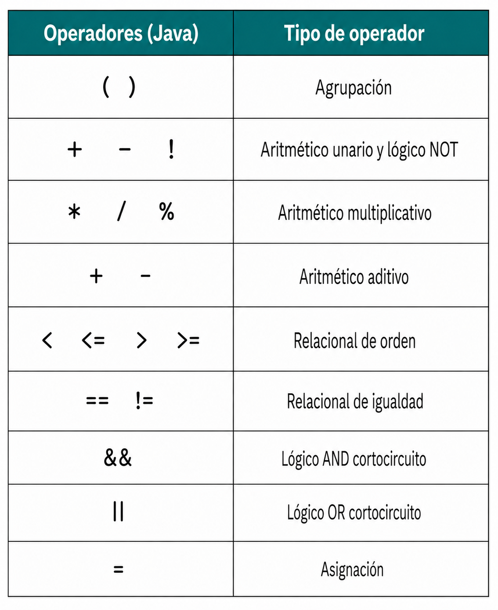
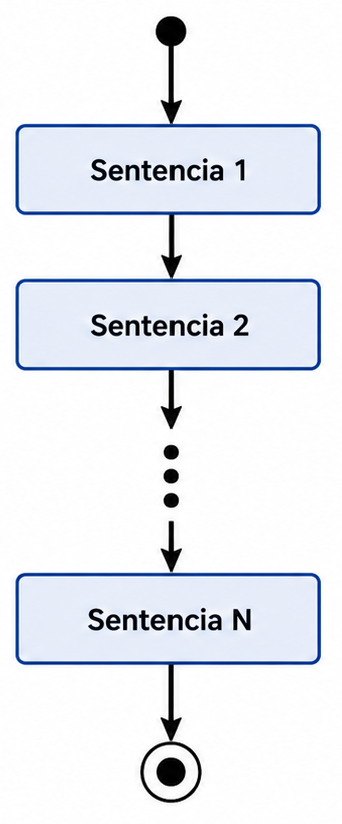
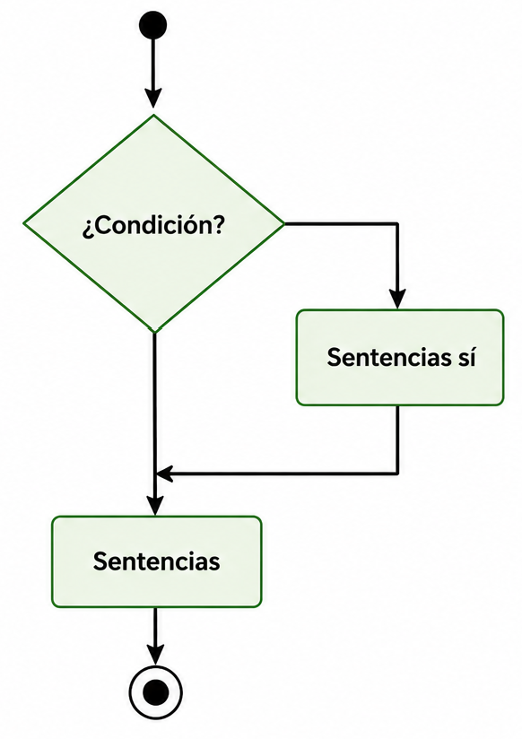
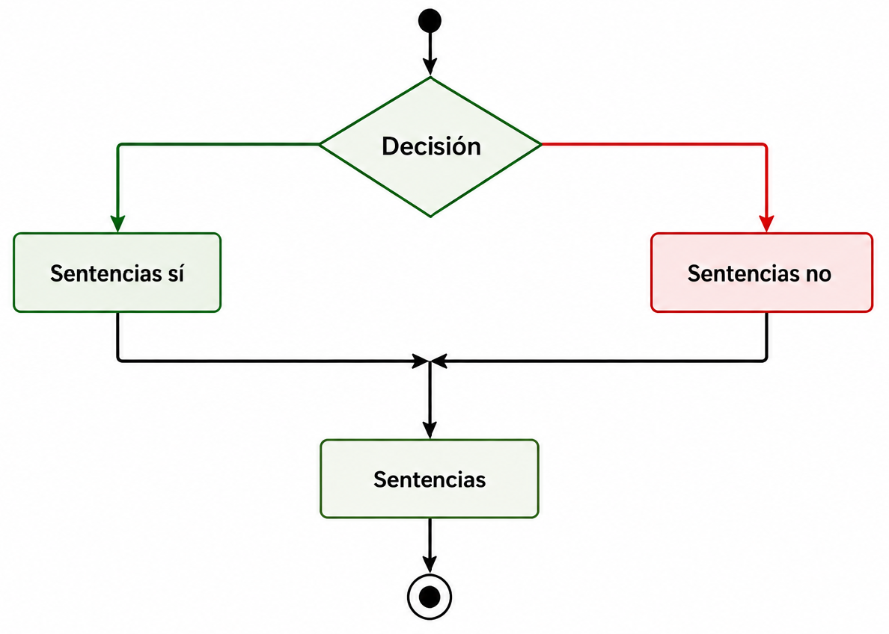
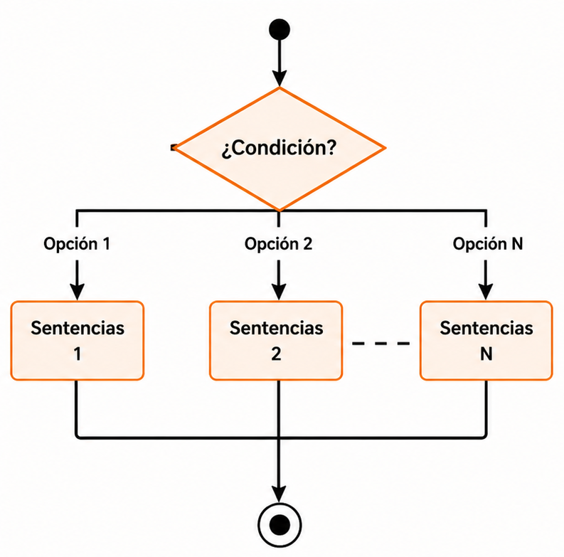

# Estructuras de programación

<a href="../pdf/temas/tema_03.pdf" target="_blank" class="boton-descarga-top">📥 PDF</a>

<nav class="menu-flotante">
<input type="checkbox" id="menu-toggle" class="menu-checkbox">
<label for="menu-toggle" class="menu-boton">☰</label>

<h3>Contenido</h3>
<ul>
<li><a href="#introducción">Introducción</a></li>
<li><a href="#análisis-léxico-y-componentes-del-lenguaje">Análisis léxico y componentes del lenguaje</a>
<ul>
<li><a href="#concepto-de-token-y-separador">Concepto de Token y separador</a></li>
<li><a href="#palabras-reservadas">Palabras reservadas</a></li>
</ul>
</li>
<li><a href="#expresiones-y-operadores">Expresiones y Operadores</a>
<ul>
<li><a href="#operadores">Operadores</a></li>
<li><a href="#evaluación-en-cortocircuito">Evaluación en cortocircuito</a></li>
<li><a href="#precedencia-y-asociatividad">Precedencia y asociatividad</a></li>
</ul>
</li>
<li><a href="#conversión-de-tipos">Conversión de tipos</a>
<ul>
<li><a href="#reglas-de-promoción">Reglas de promoción</a></li>
<li><a href="#conversión-explícita">Conversión explícita</a></li>
<li><a href="#clases-envolventes">Clases envolventes</a></li>
</ul>
</li>
<li><a href="#uso-de-la-biblioteca-estándar">Uso de la biblioteca estándar</a>
<ul>
<li><a href="#la-clase-math">La clase Math</a></li>
</ul>
</li>
<li><a href="#instrucciones">Instrucciones</a>
<ul>
<li><a href="#sentencias">Sentencias</a></li>
<li><a href="#bloques-y-ámbito">Bloques y ámbito</a></li>
</ul>
</li>
<li><a href="#flujo-de-control">Flujo de control</a>
<ul>
<li><a href="#concepto-de-flujo-de-control">Concepto de flujo de control</a></li>
<li><a href="#estructuras-de-control">Estructuras de control</a></li>
</ul>
</li>
<li><a href="#secuencia">Secuencia</a></li>
<li><a href="#selección">Selección</a>
<ul>
<li><a href="#selección-simple">Selección simple</a></li>
<li><a href="#selección-compuesta">Selección compuesta</a></li>
<li><a href="#selección-múltiple">Selección múltiple</a></li>
<li><a href="#lógica-de-anidamiento">Lógica de anidamiento</a></li>
</ul>
</li>
<li><a href="#repetición">Repetición</a>
<ul>
<li><a href="#sentencia-while">Sentencia while</a></li>
<li><a href="#bucles-controlados-por-condición">Bucles controlados por condición</a></li>
<li><a href="#bucles-controlados-por-contador">Bucles controlados por contador</a></li>
<li><a href="#diseño-de-bucles">Diseño de bucles</a></li>
</ul>
</li>
<li><a href="#depuración-y-verificación">Depuración y verificación</a>
<ul>
<li><a href="#trazas-de-ejecución">Trazas de ejecución</a></li>
<li><a href="#errores-comunes">Errores comunes</a></li>
</ul>
</li>
</ul>

</nav>

<section class="objetivos">
<h2>Objetivos</h2>

* Comprender la diferencia entre análisis léxico, sintaxis y semántica.
* Identificar los componentes léxicos de Java.
* Construir y evaluar expresiones matemáticas y lógicas.
* Utilizar métodos de la biblioteca estándar de Java.
* Reconocer los distintos tipos de sentencias.
* Entender el concepto de flujo de control.
* Desarrollar algoritmos iterativos.
* Realizar trazas de ejecución.

</section>

<section class="toc">
<h2>Contenido</h2>

* [Introducción](#introducción)
* [Análisis léxico y componentes del lenguaje](#análisis-léxico-y-componentes-del-lenguaje)
    * [Concepto de Token y separador](#concepto-de-token-y-separador)
    * [Palabras reservadas](#palabras-reservadas)
* [Expresiones y Operadores](#expresiones-y-operadores)
    * [Operadores](#operadores)
    * [Evaluación en cortocircuito](#evaluación-en-cortocircuito)
    * [Precedencia y asociatividad](#precedencia-y-asociatividad)
* [Conversión de tipos](#conversión-de-tipos)
    * [Reglas de promoción](#reglas-de-promoción)
    * [Conversión explícita](#conversión-explícita)
    * [Clases envolventes](#clases-envolventes)
* [Uso de la biblioteca estándar](#uso-de-la-biblioteca-estándar)
    * [La clase Math](#la-clase-math)
* [Instrucciones](#instrucciones)
    * [Sentencias](#sentencias)
    * [Bloques y ámbito](#bloques-y-ámbito)
* [Flujo de control](#flujo-de-control)
    * [Concepto de flujo de control](#concepto-de-flujo-de-control)
    * [Estructuras de control](#estructuras-de-control)
* [Secuencia](#secuencia)
* [Selección](#selección)
    * [Selección simple](#selección-simple)
    * [Selección compuesta](#selección-compuesta)
    * [Selección múltiple](#selección-múltiple)
    * [Lógica de anidamiento](#lógica-de-anidamiento)
* [Repetición](#repetición)
    * [Sentencia while](#sentencia-while)
    * [Bucles controlados por condición](#bucles-controlados-por-condición)
    * [Bucles controlados por contador](#bucles-controlados-por-contador)
    * [Diseño de bucles](#diseño-de-bucles)
* [Depuración y verificación](#depuración-y-verificación)
    * [Trazas de ejecución](#trazas-de-ejecución)
    * [Errores comunes](#errores-comunes)

</section>

## Introducción

Hasta este punto de nuestro aprendizaje, hemos comprendido que un programa de ordenador es, en esencia, un algoritmo escrito para ser ejecutado por una máquina. En el tema anterior, exploramos los cimientos: aprendimos a declarar variables, a reconocer tipos de datos primitivos y a utilizar la biblioteca estándar de Java para realizar operaciones de entrada/salida básicas. Sin embargo, si analizamos los programas que hemos construido, observaremos que todos comparten una característica común: son puramente lineales. El ordenador se limita a ejecutar una instrucción tras otra, en el estricto orden físico en que fueron escritas.

No obstante, la programación en el «mundo real» y la resolución de problemas técnicos complejos en entornos productivos requieren una sofisticación mucho mayor. El pensamiento computacional no es una simple sucesión de pasos, sino un tejido o «urdimbre» donde cada hebra lógica debe entrelazarse con precisión. Para lograr esto, un lenguaje de programación debe ser entendido como un conjunto de reglas, símbolos y palabras que nos permiten modelar la realidad.

El proceso por el cual el ordenador interpreta nuestras intenciones comienza con el análisis léxico. Cuando el compilador recibe nuestro código fuente, su primera tarea es identificar elementos con significado propio. Como sucede en el lenguaje natural, no podemos formar una oración coherente amontonando palabras: en los lenguajes de programación combinamos estos componentes léxicos para formar expresiones. Algo como n + 1, por sí solo, es solo un valor latente; para que sea algo capaz de realizar una tarea, debe integrarse en una estructura que le dé sentido.

La verdadera potencia del software reside en la capacidad de romper la linealidadd el código para establecer un flujo de control. Este define el orden en que las sentencias se ejecutan realmente durante la actividad de la aplicación. Para ilustrarlo, podemos usar la analogía de los músicos: ir tocando las notas según indica el director equivale a una estructura secuencial; sin embargo, podremos tomar una decisión basada en una condición o, quizás, que una serie de acordes se repitan.

Profundizaremos aquí en cómo construir expresiones y conoceremos la selección y la iteración, herramientas que nos permitirán empezar a desarrollar algoritmos inteligentes, capaces de tomar decisiones autónomas y procesar información de forma eficiente, sentando así las bases necesarias antes de adentrarnos en los fundamentos de la programación orientada a objetos.

## Análisis léxico y componentes del lenguaje

Como hemos señalado, la construcción de un programa comienza con la escritura de **código fuente**, una tarea que realizamos utilizando un editor y siguiendo las reglas gramaticales del lenguaje. Sin embargo, para que este texto cobre vida y se convierta en una serie de acciones ejecutables, debe pasar por un proceso de transformación riguroso. El primer paso de este viaje técnico es el **análisis léxico**, una fase en la que el compilador actúa como un lector meticuloso que descompone la secuencia ininterrumpida de caracteres que le entregamos en piezas individuales dotadas de significado.

En el lenguaje natural, cuando leemos una frase, nuestro cerebro identifica automáticamente dónde termina una palabra y comienza la siguiente, reconociendo sustantivos, verbos y adjetivos. En el ámbito de la programación, el ordenador realiza una operación análoga. No percibe el código como un conjunto de instrucciones complejas de un solo vistazo, sino como un flujo de símbolos pertenecientes al alfabeto; en el caso de Java, *Unicode*. La labor del analizador léxico consiste en agrupar estos símbolos en unidades atómicas, que son los componentes básicos que conforman la estructura del lenguaje.

Esta etapa es fundamental porque establece los cimientos sobre los que se construirá la lógica del programa, permitiendo ensamblar estos bloques en estructuras sintácticamente correctas. Si el analizador léxico encuentra un símbolo inesperado o una combinación de caracteres que no encaja en las categorías permitidas, el proceso se detendrá antes incluso de intentar comprender la intención del algoritmo. Por lo tanto, antes de profundizar en cómo tomar decisiones o repetir procesos, es esencial comprender la naturaleza de estos elementos mínimos y los mecanismos que permiten al compilador distinguirlos unos de otros.

<aside class="definicion">

**Analizador léxico:** Fase del compilador que descompone el flujo continuo de caracteres del código fuente en unidades atómicas con significado (*tokens*).

</aside>

### Concepto de Token y separador

Dentro del proceso de análisis léxico, el compilador debe ser capaz de reconocer los componentes básicos que integran el código fuente para poder interpretarlos adecuadamente. Estos componentes mínimos, que no pueden ser descompuestos en partes más pequeñas sin perder su sentido, reciben el nombre de ***tokens*** o elementos atómicos. En la gramática de un lenguaje de programación como Java, los *tokens* son el equivalente a las palabras en una oración del lenguaje natural; cada uno de ellos cumple una función específica, ya sea representar un valor constante, nombrar una variable o indicar una operación matemática.

Para que el analizador léxico pueda distinguir estos elementos dentro de la secuencia ininterrumpida de caracteres que escribimos, el lenguaje emplea unos símbolos especiales denominados **separadores**. Un separador es cualquier carácter o marca que indica de manera inequívoca dónde termina un *token* con significado propio y dónde comienza el siguiente. En este sentido, la programación vuelve a imitar a la lengua: así como usamos espacios para separar palabras en un texto escrito para que no se conviertan en una masa de letras incomprensible, Java utiliza los separadores para evitar que los *tokens* se fusionen.

<aside class="definicion">

**Token:** Unidad mínima o componente atómico que posee significado propio dentro de la gramática del lenguaje de programación.

**Separador:** Carácter o marca que delimita inequívocamente el fin de un *token* y el inicio del siguiente.

</aside>

Los elementos que actúan como separadores en Java son los siguientes:

* **Espacio en blanco:** es el separador más común y sencillo, utilizado de la misma forma que en la escritura convencional.
* **Tabulador:** actúa de forma equivalente al espacio en blanco desde el punto de vista del compilador.
* **Retorno de carro o salto de línea:** indica el fin de una línea física, pero léxicamente tiene el mismo valor que un espacio. El compilador es capaz de tratar un programa completo escrito en una sola línea o con cada palabra en una línea distinta con el mismo resultado técnico, ya que sustituye cualquier secuencia de estos separadores por un único espacio en blanco[^1].

Una vez que el analizador léxico ha hecho uso de estos separadores para aislar los *tokens*, estos se clasifican en diferentes categorías según su naturaleza, como los literales, los identificadores, los operadores y las palabras reservadas. Solo si el ensamblaje de estos bloques atómicos sigue las reglas de la sintaxis, el compilador podrá avanzar hacia la fase de traducción y ejecución del programa.

### Literales

Un **literal** —o valor literal—, como ya vimos en el capítulo anterior, es la representación explícita y constante de un valor concreto directamente escrito en el código fuente de un programa. A través de los literales, el programador especifica valores fijos para los tipos de datos primitivos, el tipo de datos String y la referencia especial null.

Desde el punto de vista del análisis léxico, los literales son identificados por el compilador como *tokens* atómicos. Esto significa que constituyen unidades de información indivisibles con significado propio dentro de la gramática del lenguaje. A diferencia de lo que ocurre con un identificador o una variable, cuyo contenido o estado puede fluctuar dinámicamente durante el ciclo de vida de la ejecución, el valor representado por un literal queda prefijado de manera inmutable desde la fase de compilación.

<aside class="definicion">

**Literal:** *Token* que representa la expresión inalterable de un valor constante de un tipo de datos primitivo, de un objeto String o de la referencia nula null dentro del código fuente.

</aside>

Dentro de la especificación sintáctica de Java, los literales se clasifican rigurosamente según la categoría de datos a la que corresponden, obedeciendo a un conjunto estricto de convenciones léxicas para su escritura. Plantilla sintáctica de declaración de literal:

Literal:

IntegerLiteral 
FloatingPointLiteral 
BooleanLiteral 
CharacterLiteral 
StringLiteral 
NullLiteral

#### Literales enteros

De forma predeterminada, cuando el analizador léxico procesa un literal numérico compuesto únicamente por dígitos (sin coma ni punto fraccionario), el compilador deduce que se trata de un valor de tipo int codificado en 32 bits. La representación convencional se realiza en decimal, mediante una secuencia de dígitos del 0 al 9. Un literal decimal no debe comenzar con el dígito 0 (salvo el propio número cero).

IntegerLiteral:

DecimalNumeral

DecimalNumeral:

0 
NonZeroDigit [Digits]

NonZeroDigit:

(one of) 
1 2 3 4 5 6 7 8 9

Digits:

Digit 
Digit Digits

Digit:

0 
NonZeroDigit

Esta sucesión de reglas merece una pequeña explicación. Un literal de tipo entero, IntegerLiteral, es bien el número cero o un dígito distinto de cero, NonZeroDigit, seguido, opcionalmente, de dígitos, Digits. Estos dígito, a su vez, pueden ser un dígito Digit o un dígito seguido de dígitos. Por último, un dígito es el número cero o un número distinto de cero. La especificación lo que nos dice es que un número entero puede tener un número indeterminado de dígitos pero que no puede comenzar por cero, salvo que sea el cero.

A partir de Java 7, se permite intercalar el carácter de subrayado (_) entre los dígitos de cualquier literal numérico para mejorar la legibilidad del código fuente (por ejemplo, 1_000_000). Estos caracteres son ignorados por el analizador léxico durante la fase de compilación y no afectan al valor asignado.

Digits:

Digit 
Digit [DigitsAndUnderscores] Digit

DigitsAndUnderscores:

DigitOrUnderscore {DigitOrUnderscore} 

DigitOrUnderscore:

Digit 
_

Además del formato convencional, en decimal, Java permite representar literales enteros mediante otros tres sistemas de numeración:

* **Hexadecimal (base 16):** se denota mediante el prefijo 0x o 0X, aceptando dígitos del 0 al 9 y letras de la a a la f (tanto en mayúsculas como en minúsculas). Un ejemplo es el número 26: 0X1A.
* **Octal (base 8):** se especifica anteponiendo un cero (0) como prefijo al número, seguido exclusivamente por dígitos comprendidos entre el 0 y el 7 (por ejemplo, 012, que es el número 10).
* **Binario (base 2):** permite la notación explícita mediante el prefijo 0b o 0B, empleando únicamente los dígitos 0 y 1 (por ejemplo, el número 10 se representa como 0b1010[^2]).

IntegerLiteral:

DecimalNumeral 
HexNumeral 
OctalNumeral 
BinaryNumeral 

HexNumeral:

0 x HexDigits 
0 X HexDigits

HexDigits:

HexDigit 
HexDigit [HexDigitsAndUnderscores] HexDigit

HexDigit:

(one of) 
0 1 2 3 4 5 6 7 8 9 a b c d e f A B C D E F

HexDigitsAndUnderscores:

HexDigitOrUnderscore {HexDigitOrUnderscore} 

HexDigitOrUnderscore:

HexDigit 
_

OctalNumeral:

0 OctalDigits 
0 OctalDigits

OctalDigits:

OctalDigit 
OctalDigit [OctalDigitsAndUnderscores] OctalDigit

OctaDigit:

(one of) 
0 1 2 3 4 5 6 7

OctalDigitsAndUnderscores:

OctalDigitOrUnderscore {OctalDigitOrUnderscore} 

OctalDigitOrUnderscore:

OctalDigit 
_

BinaryNumeral:

0 b BinaryDigits 
0 B BinaryDigits

BinaryDigits:

BinaryDigit 
BinaryDigit [BinaryDigitsAndUnderscores] BinaryDigit

BinaryDigit:

(one of) 
0 1

BinaryDigitsAndUnderscores:

BinaryDigitOrUnderscore {BinaryDigitOrUnderscore} 

BinaryDigitOrUnderscore:

BinaryDigit 
_

Si se requiere que el literal sea interpretado por el compilador como un entero de precisión extendida de 64 bits (long), es obligatorio añadir el sufijo **L** o **l** al final de la secuencia de dígitos[^3].

IntegerLiteral:

DecimalNumeral [IntegerTypeSuffix] 
HexNumeral [IntegerTypeSuffix] 
OctalNumeral [IntegerTypeSuffix] 
BinaryNumeral [IntegerTypeSuffix] 

IntegerTypeSuffix:

(one of) 
l L 

Internamente, la máquina virtual Java (JVM) almacena todos los valores enteros utilizando la representación binaria en **complemento a dos con signo**[^4]. Este formato fija los límites inferior y superior de los rangos numéricos que cada tipo de entero puede albergar en memoria (por ejemplo, entre $-2^{31}$ y $2^{31}-1$ para el tipo int).

<pre class="codigo-java">
int contador = 100;           // Decimal
int mascaraHex = 0xFF;        // Hexadecimal (255)
int patronBits = 0b1100;      // Binario (12)
long poblacion = 8000000000L; // Literal de 64b
</pre>

#### Literales de punto flotante

Los literales de punto flotante se emplean para expresar números reales. Por defecto, la gramática de Java interpreta cualquier literal con punto decimal o notación exponencial como un valor de tipo double (64 bits), garantizando un grado elevado de precisión matemática.

Existen dos formas estándar de escribir literales de punto flotante:

* **Notación decimal:** utiliza el carácter punto (.) para separar explícitamente la parte entera de la fraccionaria (por ejemplo, 3.14159 o 5).
* **Notación científica o exponencial:** añade la letra e o E seguida de un número entero (positivo o negativo) que representa un exponente o potencia de diez (por ejemplo, 1.5e3 para representar $1.5 \times 10^3$, es decir, 1500.0, o 2.5E-4 para $2.5 \times 10^{-4}$).

FloatingPointLiteral:

DecimalFloatingPointLiteral [FloatTypeSuffix]

DecimalFloatingPointLiteral:

Digits . [Digits] [ExponentPart] 
. Digits [ExponentPart] 
Digits ExponentPart 
Digits [ExponentPart]  

ExponentPart:

ExponentIndicator SignedInteger 

ExponentIndicator:

(one of) 
e E

SignedInteger:

[Sign] Digits

Sign:

(one of) 
+ -

FloatTypeSuffix:

(one of) 
f F e E

A partir de las reglas anteriores podemos ver que un número en punto flotante puede empezar por punto cuando la parte entera sea cero. Cuando sea preciso declarar un literal de precisión simple de 32 bits (float) —para cumplir con los requerimientos de un método, por ejemplo—, se debe añadir el sufijo **f** o **F** al final del número.

<pre class="codigo-java">
double pi = 3.1415926535;   // Tipo double por defecto
double masa = 5.972e24;     // Notación científica (double)
float gravedad = 9.81f;     // Sufijo f para forzar el tipo float
</pre>

Supongamos que nuestra máquina, en la que cada ubicación de memoria tiene el mismo tamaño, permite representar los números mediante seis dígitos y un signo. Cuando definimos una variable o constante, la ubicación asignada consta de seis dígitos y un signo; si el valor es entero, la interpretación del número almacenado en esa ubicación es sencilla: puedo almacenar valores desde el -999999 hasta el +999999; el cero tiene dos representaciones. Nuestra precisión es seis dígitos y los números en ese rango pueden ser representados de forma exacta.

Supongamos que los dos dígitos de más a la izquierda nos permiten representar un exponente. La representación +561234, por ejemplo, es en realidad el número $1234 \times 10^56$. De hecho, el rango de números que ahora podemos representar es mucho mayor: desde $-9999 \times 10^99$ hasta $+9999 \times 10^99$. Sin embargo, la precisión ahora es de solo cuatro dígitos; es decir, solo los números de cuatro dígitos pueden representarse con exactitud en nuestro sistema. ¿Qué sucede con los números con más dígitos? Los cuatro dígitos de la izquierda se representan correctamente, y los dígitos de la derecha, o dígitos menos significativos, se pierden (se asume que son 0). Por ejemplo, 1000000 puede representarse con exactitud, pero 4932416 no, porque nuestro esquema de codificación nos limita a cuatro dígitos significativos.

<aside class="definicion">

**Precisión:** El máximo número de dígitos significativos.

**Dígitos significativos:** Desde el primer dígito distinto de cero a la izquierda hasta el último dígito distinto de cero a la derecha (más cualquier dígito cero que sea exacto).

</aside>

Para extender nuestro esquema de codificación y representar números de punto flotante, debemos poder representar exponentes negativos. Dado que nuestro esquema no incluye un signo para el exponente, vamos a modificarlo ligeramente: el signo existente se convierte en el signo del exponente y añadimos un signo a la izquierda para representar el signo del número.

Ahora podemos representar con precisión, con cuatro dígitos, todos los números entre $-9999 \times 10^99$ y $+9999 \times 10^99$. Añadir exponentes negativos a nuestro esquema nos permite representar fracciones tan pequeñas como $1 \times 10^{-99}$. Nuestra precisión sigue siendo de cuatro dígitos. Los números 0.1032, 5.406 y 1000000 se pueden representar con exactitud. El número 476.0321, sin embargo, tiene siete cifras significativas, pero se representa como 476.0; ese 0.0321 no se puede representar en nuestro sistema[^5].

La codificación interna sigue la norma **IEEE 754** (formato binario de punto flotante para ordenadores), estructurando el valor en tres campos binarios diferenciados: bit de signo, mantisa y exponente. En el caso de los vaores de tipo float, el bit de signo es +1 o -1, la mantisa es un número entero positivo menor que $2^24$ y el exponente en un número entre -126 y 127, incluidos. En el caso de los valores de tipo double, la mantisa en un número entero positivo menor que $2^53$ y el exponente en un número entre -1022 y 1023, incluidos.

El nombre *punto flotante* hace referencia a que el *punto decimal* puede moverse. En nuestro modelo, cada número se almacena en cuatro dígitos; si el dígito que no es cero se almacena en la posición de más a la izquierda, el exponente se ajusta de la manera correspondiente: por ejemplo, 1000000 podríamos almacenarlo como +060001 pero lo almacenamos como +031000. Este formato proporciona la máxima precisión posible, denominándose formato normalizado. En el modelo que usa la JVM, además, solo puede haber un único dígito distinto de cero a la izquierda del punto decimal, lo que nos permite aumentar el número de dígitos de la mantisa en uno, por lo que la preción no es de 24 o 53 bits: pasa a ser 25 y 54. Esto es debido a que sabemos con certeza que el primer dígito siempre es 1 -al representarlo en base 2- y la máquina no lo almacena.

Es evidente que podemos representar valores extremadamente amplios o infinitesimales, asumiendo las limitaciones de redondeo y precisión propias de la aritmética de punto flotante. Sin embargo, con la explicación anterior, podríamos pensar que el cero no puede representarse. La realidad es que existen patrones para designar números específicos.

Y aunque pueda parecer otra cosa, hay que tener en cuenta que el número máximo de valores diferentes que la notación en punto flotante puede representar es $2^32$ o $2^64$ números: lo que hemos hecho es expandir esos números en un rango mayor. Además, los números que podemos representar no están espaciados de la misma manera entre ellos, como los números en punto fijo. Los posibles valores están más próximos cerca del origen y más separados cuanto más alejados.

<figure class="img-grande">
    
</figure>

#### Otros literales

Para la representación explícita de valores no numéricos o de estructuras complejas, el lenguaje provee la siguiente gama de literales:

* **Literales booleanos:** representan los valores de la lógica booleana y están constituidos únicamente por las dos palabras reservadas true (verdadero) y false (falso). A diferencia de otros lenguajes, en Java no existe una equivalencia numérica directa entre el valor 0 o 1 y los valores booleanos.
* **Literales de carácter:** representan un único símbolo del juego de caracteres Unicode. Se delimitan mediante comillas simples e incluyen soporte para secuencias de escape.
* **Literales de cadena:** consisten en una secuencia de cero o más caracteres delimitados por comillas dobles. Aunque String no es un tipo de datos primitivo, Java proporciona este soporte sintáctico especial, convirtiendo automáticamente cualquier literal de este tipo en una instancia inmutable de la clase.
* **Literal nulo:** la palabra null, representa la ausencia explícita de referencia a un objeto dentro de una variable de tipo objeto o referencia, como String.

BooleanLiteral:

(one of) 
true false

CharacterLiteral:

\' SingleCharacter \' 
\' EscapeSequence \'

SingleCharacter:

JavaLetterOrDigit but not \' or \\ 

EscapeSecuence:

\\ t (horizontal tab HT, Unicode \\u0009) 
\\ n (linefeed LF, Unicode \\u000a) 
\\ r (carriage return CR, Unicode \\u000d) 
\\ LineTerminator (line continuation, no Unicode representation) 
\\ " (double quote \", Unicode \\u0022) 
\\ ' (single quote \', Unicode \\u0027) 
\\ \\ (backslash \\, Unicode \\u005c)

LineTerminator:

the ASCII LF character, also known as \"newline\" 
the ASCII CR character, also known as \"return\" 
the ASCII CR character followed by the ASCII LF character

StringLiteral:

\" {StringCharacter} \"

StringCharacter:

JavaLetterOrDigit but not \' or \\
EscapeSequence

NullLiteral:

null

<pre class="codigo-java">
boolean activo = true;
char inicial = 'J';
char salto = '\n';
char unicodeA = '\u0041';
String saludo = "Bienvenido a Java";
Object objetoVacio = null;
</pre>

### Palabras reservadas

Como ya comentamos en el capítulo anterior, son aquellos *tokens* que tienen asignada una función específica dentro del lenguaje: los programadores tienen prohibido utilizarlas para cualquier otro propósito; por ello, no es posible nombrar una variable, un campo o una clase utilizando uno de estos términos. Al igual que en el lenguaje natural existen palabras con funciones gramaticales fijas, como las preposiciones, las palabras reservadas constituyen el vocabulario fundamental que el compilador reconoce para estructurar la lógica del programa.

Gran parte del proceso de aprendizaje de un lenguaje de programación consiste en familiarizarse con el significado y la utilidad de estos términos. En el caso de Java, el conjunto de estas palabras ha ido evolucionando con las diferentes versiones del lenguaje para adaptarse a nuevas necesidades. En la actualidad, el núcleo está compuesto por cincuenta y una palabras, a las que se suman dieciséis términos adicionales cuyo significado especial solo se activa dependiendo del contexto específico en el que se utilicen.

Es importante destacar que Java es un lenguaje extremadamente estricto con la forma en que se escriben estos elementos, siendo sensible a la diferencia entre mayúsculas y minúsculas. Todas las palabras reservadas se componen exclusivamente de letras minúsculas. Por esta razón, un término como int es reconocido como una palabra reservada para definir tipos enteros, mientras que Int o INT serían tratados como identificadores diferentes definidos por el usuario, aunque su uso se desaconseja para evitar ambigüedades en la lectura del código.

Dentro de este grupo, existen casos particulares como las palabras goto o const. Aunque figuran en la lista oficial y el programador no puede emplearlas como nombres de variables, actualmente no tienen ninguna función operativa dentro del lenguaje Java. Su reserva responde principalmente a razones históricas y al deseo de los diseñadores del lenguaje de evitar que programadores provenientes de otros entornos, como C o C++, intenten aplicar estructuras de programación que son incompatibles con la seguridad y la filosofía de Java.

A continuación, se presenta la relación de palabras reservadas en Java, estructurada conforme a la [Especificación del Lenguaje Java](https://docs.oracle.com/en/java/javase/26/docs/specs/jls/jls-3.html#jls-3.9)[^6]:

  

    Palabras reservadas (*Keywords*)
  

  <table class="tabla-jls-keywords">
    <tbody>
      <tr>
        <td>abstract</td><td>assert</td><td>boolean</td><td>break</td><td>byte</td>
      </tr>
      <tr>
        <td>case</td><td>catch</td><td>char</td><td>class</td><td>const</td>
      </tr>
      <tr>
        <td>continue</td><td>default</td><td>do</td><td>double</td><td>else</td>
      </tr>
      <tr>
        <td>enum</td><td>extends</td><td>final</td><td>finally</td><td>float</td>
      </tr>
      <tr>
        <td>for</td><td>goto</td><td>if</td><td>implements</td><td>import</td>
      </tr>
      <tr>
        <td>instanceof</td><td>int</td><td>interface</td><td>long</td><td>native</td>
      </tr>
      <tr>
        <td>new</td><td>package</td><td>private</td><td>protected</td><td>public</td>
      </tr>
      <tr>
        <td>return</td><td>short</td><td>static</td><td>strictfp[^7]</td><td>super</td>
      </tr>
      <tr>
        <td>switch</td><td>synchronized</td><td>this</td><td>throw</td><td>throws</td>
      </tr>
      <tr>
        <td>transient</td><td>try</td><td>void</td><td>volatile</td><td>while</td>
      </tr>
      <tr colspan="5">
        <td>_ (caracter de subrayado)</td>
      </tr>
    </tbody>
  </table>

Asimismo, existen los siguientes términos que funcionan como palabras reservadas dependiendo del contexto en el que se utilicen:

  

    Palabras reservadas dependientes del contexto (*Contextual Keywords*)
  

  <table class="tabla-jls-keywords">
    <tbody>
      <tr>
        <td>exports</td><td>module</td><td>non-sealed</td><td>open</td><td>opens</td>
      </tr>
      <tr>
        <td>permits</td><td>provides</td><td>record</td><td>requires</td><td>sealed</td>
      </tr>
      <tr>
        <td>to</td><td>transitive</td><td>uses</td><td>var</td><td>when</td>
      </tr>
      <tr>
        <td>with</td><td>yield</td>
      </tr>
    </tbody>
  </table>

Finalmente, conviene recordar que el carácter de subrayado (_) por sí solo también se considera un elemento reservado para usos futuros[^8], lo que prohíbe su empleo como un identificador de una sola letra en las declaraciones del programa.

Ahora que conocemos los literales y las palabras reservadas, vamos a modificar ligeramente una de las producciones sintácticas que veíamos en el tema anterior:

Identificador:

IdentifierChars but not a Keyword or BooleanLiteral or NullLiteral

Es decir, un *identificador* es una secuencia ilimitada de letras y dígitos, comenzando por una letra, que no es una palabra reservada, un literal booleano o un literal nulo.

## Expresiones y operadores

Una vez que el compilador ha concluido la fase de análisis léxico e identificado los *tokens* que componen nuestro código, el siguiente nivel de abstracción consiste en ensamblar estas piezas atómicas para formar unidades de significado superior. En la gramática de Java, estas construcciones se denominan **expresiones**.

Una expresión, como ya vimos en el tema 2, no es otra cosa que un conjunto organizado de identificadores, literales y operadores que, al combinarse siguiendo las reglas sintácticas del lenguaje, pueden ser evaluados para obtener un valor concreto.

El concepto de evaluación es central en esta etapa: evaluar una expresión implica que el ordenador realiza las operaciones especificadas para producir un nuevo valor. Es importante destacar que toda expresión en Java tiene asociado un tipo de dato inamovible, el cual corresponde al tipo del resultado final obtenido tras su evaluación. Así, el resultado de una expresión que sume dos números enteros será un valor de tipo entero, mientras que el de una que compare dos valores será de tipo booleano.

Podemos entender las expresiones como los bloques de construcción lógicos de un programa. No obstante, existe una distinción técnica crucial entre una expresión y una instrucción o sentencia. Mientras que la expresión representa un valor potencial o un cálculo, la **sentencia** representa una acción completa que el ordenador debe llevar a cabo. Por ejemplo, la expresión matemática $n + 1$ por sí sola no constituye una orden operativa para la máquina; necesita ser integrada en una estructura que le dé un propósito funcional, como una sentencia de asignación que guarde dicho resultado en una variable. De esta forma, las expresiones actúan como la «materia prima» con la que alimentamos las instrucciones de nuestro código para dirigir el flujo de control y resolver problemas complejos.

### Operadores

Los **operadores** son los elementos funcionales que permiten llevar a cabo operaciones sobre un conjunto de datos u operandos, representados habitualmente por literales o identificadores. Los operadores permitidos en una operación dependen de los tipos de datos de los operandos y producen, tras su evaluación, un resultado que posee un tipo de dato determinado.

#### Operadores aritméticos

Son operadores que afectan a los números enteros y en punto flotante; devuelven un valor del mismo tipo que los operandos: si son enteros, por ejemplo, el resultado es entero. Los **operadores unarios** permiten mantener o cambiar el signo de una expresión numérica mediante el uso del más (+) y el menos (-). Junto a éstos, los **operadores binarios tradicionales**, que incluyen la suma (+), la resta (-), la multiplicación (*) y la división (/). Además, los lenguajes de programación suelen añadir la operación módulo o resto de la división (%).

<aside class="definicion">

**Operador unario:** Un operador que solo tiene un operando.

**Operador binario:** Un operador que tiene dos operandos.

</aside>

En programación no es habitual usar el más unario y, cuando se trata de un literal, se asume que, si no hay signo, siempre es positivo.

Las operaciones de la suma, resta, producto y división, funcionan de la misma manera que te enseñaron cuando aprendiste a utilizarlas. La división en punto flotante, por ejemplo, genera un resultado en punto flotante:

<pre class="codigo-fuente">
7.2 / 2.0 produce 3.6
</pre>

No obstante, es menos probable estar familiarizado con la división entera y el módulo, por lo que podemos estudiarlos un poco más en profundidad. Cuando dividimos dos enteros entre sí, obtemos de la división un cociente y un resto. Por ejemplo, la división de 6 entre 2 produce 3 como cociente y 0 como resto; pero la de 7 entre 3, produce también 3 como cociente pero 1 como resto. Y ese resto, 0 ó 1, es el resultado que obtenemos con la operación módulo:

<pre class="codigo-fuente">
6 / 2 produce 3     6 % 2 produce 0
7 / 2 produce 3     7 % 2 produce 1
</pre>

Aunque existen lenguajes para los que el operador módulo solo es aplicable a la división entera, puede aplicarse en Java, y otros lenguajes modernos, con números en punto flotante. La forma de obtenerlo[^9] en Java[^10] consiste en obtener la división en punto flotante; multiplicar dicho valor sin decimales (sin redondeo) por el divisor; restar del dividendo el resultado de la multiplicación. Ejemplo:

<pre class="codigo-fuente">
Calculamos 7.8 % 3.0 en Java:
<b>Dividimos:</b> 7.8 / 3.0 produce 2.6
<b>Multiplicamos:</b> 3.0 * 2.0 produce 6.0
<b>Restamos:</b> 7.8 - 6.0 produce <b>1.8</b>
</pre>

Expression:

Literal 
ArithmeticExpression 
AssignmentExpression

ArithmeticExpression:

AdditiveExpression

AdditiveExpression:

MultiplicativeExpression 
AdditiveExpression + MultiplicativeExpression 
AdditiveExpression - MultiplicativeExpression

MultiplicativeExpression:

UnaryExpression 
MultiplicativeExpression * UnaryExpression 
MultiplicativeExpression \\ UnaryExpression 
MultiplicativeExpression % UnaryExpression 

UnaryExpression:

+ Expression 
- Expression

#### Operadores relacionales

Los operadores relacionales son binarios, por lo que tienen dos operandos. Se utilizan para comparar datos de tipo primitivo ya sean numéricos, caracteres o booleanos, estableciendo relaciones de orden o igualdad entre ellos. El resultado de evaluar una expresión con estos operadores es siempre un valor de tipo booleano[^11]: true o false.

Java proporciona operadores para verificar:

* La igualdad (==)
* La desigualdad o diferencia (!=)
* Relaciones de magnitud: mayor que (&gt;), menor que (&lt;), mayor o igual que (&gt;=) y menor o igual que (&lt;).

Expression:

Literal 
ArithmeticExpression 
EqualityExpression 
AssignmentExpression

EqualityExpression:

RelationalExpression 
EqualityExpression == RelationalExpression 
EqualityExpression != RelationalExpression

RelationalExpression:

AdditiveExpression 
RelationalExpression &lt; AdditiveExpression 
RelationalExpression &gt; AdditiveExpression 
RelationalExpression &lt;= AdditiveExpression 
RelationalExpression &gt;= AdditiveExpression

**Cuidado con la asignación:** Un error de lógica muy frecuente en etapas iniciales de aprendizaje consiste en confundir el operador de asignación (=) con el de igualdad (==), siendo el primero una instrucción de almacenamiento de un valor en memoria y el segundo una comparación.

Aunque en otros lenguajes resulte posible, en Java no existe relación de magnitud entre los valores booleanos, por lo que solo les son aplicables la igualdad y la desigualdad.

#### Operadores lógicos

Los operadores lógicos son binarios, por lo que tienen dos operandos, salvo la negación. Permiten combinar valores booleanos o resultados de expresiones relacionales para construir afirmaciones lógicas. Los operadores fundamentales son:

* La negación lógica (NOT) o NO-lógico (!).
* La conjunción (AND) o Y-lógico (&amp;&amp;).
* La disyunción (OR) u O-lógico (||).

Hay que entender desde el principio que true y false, como hemos visto al declarar BooleanLiteral, no son nombres de variable ni palabras reservadas: son dos constantes especiales pero, en la práctica, se comportan como dos palabras reservadas.

<figure class="img-lateral-dch">
    
</figure>

El operador NO-lógico precede a cualquier expresión lógica (booleana) y nos proporciona el valor opuesto al de la expresión. Por ejemplo, si miCaracter = `'`B`'` es verdadero, !(miCaracter = `'`B`'`) es falso. Proporciona un método simple de cambiar el valor de un aserto. Por ejemplo, si !(años &gt; 50), es equivalente escribir: años &lt;= 50.

La operación Y-lógico requiere que ambos operandos sean verdaderos para que el resultado de la expresión sea verdadero; si uno cualquiera de ellos es falso, el valor de la expresión es falso.

La operación O-lógico proporciona un resultado verdadero si cualquiera de sus operandos, que pueden serlo los dos, es verdadero. Solo cuando ambos operandos son falsos el resultado de la operación es también falso.

Expression:

Literal 
ArithmeticExpression 
EqualityExpression 
ConditionalExpression 
AssignmentExpression

ConditionalExpression:

ConditionalOrExpression

ConditionalOrExpression:

ConditionalAndExpression 
ConditionalOrExpression || ConditionalAndExpression

ConditionalAndExpression:

Expression 
ConditionalAndExpression &amp;&amp; Expression

Java implementa para estos dos últimos una semántica de **evaluación en cortocircuito**, lo que significa que el ordenador detiene el proceso de evaluación tan pronto como el resultado final de la expresión booleana es inequívoco y que explicaremos en breve.

#### Operador de asignación

Aunque en muchos lenguajes la asignación se considera una sentencia o instrucción, en Java, el símbolo igual (=) es un operador, el operador de asignación, cuya misión es proporcionar valor a una variable, el de una expresión a su derecha, como ya vimos en el tema anterior.

### Evaluación en cortocircuito

Al procesar expresiones lógicas, la mayoría de los lenguajes de programación no garantizan el orden en que se evaluarán dichas expresiones: esto quiere decir que si una operación lógica incluye operaciones relacionales, por ejemplo, no sabemos el orden en que se evaluarán dichas operaciones. Además, en general, la operación lógica no se evaluará hasta que todos los operandos de la misma obtengan un valor booleano.

Java aplica una técnica de optimización denominada **evaluación en cortocircuito** o evaluación condicional. Bajo esta semántica, el ordenador no evalúa todos los componentes de una expresión lógica, sino que procesa los operandos de izquierda a derecha y detiene el procedimiento de evaluación tan pronto como el valor booleano final de la expresión completa es inequívoco.

<aside class="definicion">

**Evaluación (lógica) en cortocircuito:** Evaluación de una expresión lógica de izquierda a derecha, deteniéndose la evaluación tan pronto como se pueda determinar el valor booleano final.

</aside>

Para comprender cómo el ordenador puede conocer el resultado sin examinar la expresión entera, debemos analizar el comportamiento de los operadores fundamentales:

* **Conjunción lógica (&&):** Una operación Y-lógico solo devuelve true si *ambos* operandos son verdaderos. Por tanto, si al evaluar el primer operando el resultado es false, es imposible que la expresión completa sea verdadera, independientemente del valor que tenga el segundo operando. En este caso, Java «hace un cortocircuito», detiene la evaluación y produce un resultado final de false.
* **Disyunción lógica (||):** Una operación O-lógico devuelve true si *al menos uno* de sus operandos es verdadero. Siguiendo la lógica anterior, si el primer operando evaluado resulta ser true, el resultado final de la expresión será necesariamente true sin importar el valor del segundo. En consecuencia, el ordenador no pierde tiempo procesando la segunda subexpresión.

Esta característica no es solo una cuestión de eficiencia técnica para ahorrar tiempo de ejecución; tiene implicaciones críticas en la robustez y seguridad del código. La evaluación en cortocircuito permite al programador escribir expresiones donde el primer operando actúa como una salvaguarda del segundo.

### Precedencia y asociatividad

El orden en que el ordenador lleva a cabo las operaciones dentro de una sentencia no es un proceso arbitrario, sino que está estrictamente regulado por las leyes de la gramática. Al construir expresiones complejas donde conviven distintos tipos de componentes, es fundamental determinar con exactitud qué operación debe ejecutarse en primer lugar para que el resultado sea predecible y correcto. Para resolver este problema, el lenguaje emplea un conjunto de directrices denominadas **reglas de precedencia y asociatividad**.

#### Reglas de precedencia

La precedencia determina la jerarquía de los operadores en una expresión. De forma análoga a cómo en el álgebra convencional sabemos que una multiplicación debe realizarse antes que una suma, Java asigna un nivel de prioridad a cada operador. Los operadores con mayor precedencia se evalúan antes que aquellos situados en niveles inferiores.

<figure class="img-lateral-izq">
    
</figure>

En la cima de esta jerarquía se sitúan siempre los paréntesis (), que no son operadores en sí mismos pero funcionan como una herramienta soberana para que el programador pueda forzar el orden de evaluación deseado, sobrescribiendo cualquier regla predefinida.

En el extremo opuesto, el operador de asignación posee la precedencia más baja de todo el lenguaje, lo que garantiza que cualquier cálculo situado a la derecha del símbolo igual sea completado totalmente antes de que el valor resultante se almacene en la variable.

#### Asociatividad

Cuando una expresión contiene varios operadores que poseen el *mismo* nivel de precedencia, Java aplica las reglas de asociatividad para decidir el orden de ejecución. La asociatividad indica la dirección en la que el ordenador «agrupa» los operandos con sus respectivos operadores.

En la gran mayoría de los casos, los operadores binarios de Java presentan una asociatividad de **izquierda a derecha**. Esto significa que, ante una igualdad de rango, las operaciones se resuelven en el mismo orden físico en que aparecen escritas en el código. Por ejemplo, en una expresión que combine multiplicaciones y divisiones, el ordenador ejecutará primero la que se encuentre más a la izquierda.

Sin embargo, existen excepciones técnicas notables: los operadores unarios (como el cambio de signo o la negación lógica) y, muy especialmente, el operador de asignación, son **asociativos por la derecha**. Esta asociatividad a la derecha es lo que permite realizar asignaciones múltiples, donde el valor se propaga desde el literal situado al final de la línea hacia todas las variables situadas a su izquierda.

#### Orden de evaluación de operandos

Es vital no confundir la precedencia de los operadores con el orden de evaluación de los operandos. Java establece un requisito adicional de seguridad y robustez: **los operandos de un operador binario siempre se evalúan de izquierda a derecha**. Esto implica que, incluso si el operador situado a la derecha tiene mayor precedencia, el ordenador primero obtendrá los valores de la parte izquierda de la expresión. Esta característica es crítica para evitar efectos laterales[^12] inesperados al realizar trazas de ejecución en algoritmos complejos.

Aunque las reglas de precedencia permiten escribir expresiones muy compactas, se recomienda el uso de paréntesis para clarificar la intención del código[^13]. El empleo de paréntesis no solo ayuda a evitar errores de lógica difíciles de detectar, sino que facilita la lectura, asegurando que el flujo de control y el procesamiento de los datos sigan exactamente el diseño algorítmico previsto.

## Conversión de tipos

En el transcurso de este texto, hemos subrayado que Java es un lenguaje fuertemente tipado, lo que implica una vigilancia estricta sobre la naturaleza de los tipos de datos que manejamos. Sin embargo, en la práctica de la programación, es habitual encontrarnos con situaciones en las que necesitamos combinar operandos de distinta naturaleza dentro de una misma expresión o asignación. Por ejemplo, podríamos querer sumar un valor entero con uno real o asignar el resultado de un cálculo preciso a una variable con una capacidad de representación diferente.

Dado que el ordenador almacena internamente los números enteros y los de punto flotante de maneras totalmente distintas —utilizando patrones de bits que no guardan parecido entre sí—, el sistema no puede operar con ellos de forma directa sin realizar un ajuste previo.

Este proceso de transformación se denomina técnicamente **conversión de tipos**. La conversión es el mecanismo que garantiza la compatibilidad entre los elementos de una operación, permitiendo que el compilador traduzca nuestras intenciones lógicas a instrucciones que la máquina virtual pueda procesar sin ambigüedades. Dependiendo de cómo se inicie este proceso, las conversiones pueden ser **implícitas**, cuando el compilador las realiza de forma automática al detectar una mezcla de tipos en una expresión, o **explícitas**, cuando nosotros, como programadores, debemos intervenir deliberadamente mediante una operación específica conocida como *casting*.

<aside class="definicion">

**Conversión de tipos (*Type Conversion*):** Proceso mediante el cual un valor de un tipo de dato determinado se transforma en otro equivalente de un tipo diferente.

</aside>

Un aspecto crítico que debemos considerar al tratar con estas transformaciones es la seguridad de la información. No todas las conversiones son iguales desde el punto de vista del rigor de los datos; mientras que algunas son seguras porque el tipo de destino es capaz de representar perfectamente el valor original, otras pueden implicar una pérdida de precisión o el truncamiento de valores decimales. Por ello, el uso de conversiones explícitas no es solo un requisito gramatical en ciertos contextos, sino también una práctica de calidad que deja claro que la mezcla de tipos es intencionada y no fruto de un descuido. Dominar la mecánica de estas conversiones es esencial para asegurar que los datos se procesen con exactitud.

### Reglas de promoción

Las reglas de promoción constituyen la base de las **conversiones implícitas** o automáticas. Este fenómeno ocurre sin la intervención directa del programador cuando el compilador detecta que en una operación aritmética o lógica conviven operandos de distinta precisión o capacidad de representación. En estos escenarios, para poder ejecutar la instrucción, el sistema «promociona» el valor de menor rango al tipo de datos más amplio presente en la expresión, garantizando que no se produzca una pérdida de información durante el cálculo.

Técnicamente, estas transformaciones se denominan **conversiones de ampliación** (*widening conversions*), ya que el tipo de destino posee una capacidad igual o superior al de origen, lo que las convierte en operaciones intrínsecamente seguras. En el caso de Java se sigue una jerarquía estricta para realizar estos ajustes automáticos, basada en el rango numérico y en la distinción entre tipos enteros y reales:

* **Prioridad de la precisión real:** Si al menos uno de los operandos en una expresión es de tipo double, el otro operando se convierte automáticamente a double antes de realizar la operación. En caso de que no haya un double pero sí un componente de tipo float, el resto de los elementos se promocionan a float.
* **Jerarquía de tipos enteros:** Si no existen tipos reales involucrados, pero uno de los operandos es de tipo long, el sistema promociona los demás operandos de la expresión a long[^14].
* **Promoción obligatoria a entero:** Un aspecto singular de Java es el tratamiento de los tipos de menor capacidad. En cualquier cálculo donde intervengan variables de tipo byte o short, el compilador las promociona automáticamente a int antes de efectuar la operación, incluso si ambos operandos son del mismo tipo.
* **Tratamiento de caracteres:** De igual forma, el tipo char recibe un trato especial; dado que Java almacena los caracteres como valores numéricos sin signo (basados en el estándar Unicode), estos pueden participar en expresiones aritméticas, en cuyo caso se promocionan automáticamente a su equivalente de tipo int.

Este mecanismo asegura que los resultados intermedios de una expresión se almacenen en variables temporales con el tipo de mayor capacidad que intervenga en la operación, permitiendo que el software maneje la complejidad de los datos de forma fluida. No obstante, aunque la promoción automática facilita el desarrollo al evitar farragosas conversiones manuales, el programador debe conocer estas reglas para prever el tipo de dato resultante y asegurar que el procesamiento de la información sea coherente con el diseño previsto.

### Conversión explícita

A diferencia de las reglas de promoción, que actúan de forma automática, existen situaciones en las que el sistema no puede —o no debe— realizar el ajuste de tipos por su cuenta. Esto sucede principalmente cuando intentamos realizar una *narrowing conversion*, en la que queremos asignar un valor de un tipo con mayor capacidad de representación a una variable de un tipo menor o cuando la transformación implica un riesgo intrínseco de pérdida de información. En estos casos, Java requiere una orden directa del programador mediante una operación denominada **conversión explícita** o, más habitualmente, ***casting***.

<aside class="definicion">

**Casting:** Operación explícita indicada por el programador para forzar la conversión de un tipo de dato a otro.

**Widening conversions:** Conversión de ampliación de un tipo de datos a otro de mayor capacidad o precisión.

**Narrowing conversion:** Conversión de reducción de un tipo de datos a otro de menor capacidad o precisión , asumiendo el riesgo de pérdida de información.

</aside>

Para indicar al compilador nuestra intención de realizar un *cast*, debemos utilizar una sintaxis específica, colocando el tipo de destino entre paréntesis justo antes de la expresión que deseamos transformar.

<pre class="codigo-java">
int convertido = (int)3.1416;
</pre>

A efectos prácticos, aunque no lo es, podéis considerarlo un operador cuya precedencia se situaría entre los operadores unarios y los aritméticos multiplicativos. 

UnaryExpression:

+ Expression 
- Expression 
UnaryExpressionNotPlusMinus

UnaryExpressionNotPlusMinus:

CastExpression

CastExpression:

( PrimitiveType )  UnaryExpression

PrimitiveType:

NumericType 
boolean

NumericType:

IntegralType 
FloatingPointType

IntegralType:

(one of) 
byte short int long char

FloatingPointType:

(one of) 
float double

Al realizar un *cast*, el programador asume la responsabilidad total de la operación, informando al compilador de que es consciente del riesgo y de que la mezcla de tipos es intencionada. El uso de la conversión explícita conlleva consecuencias críticas en la integridad de los datos que debemos conocer para evitar errores lógicos:

* **Truncamiento de decimales:** Cuando se convierte un número real (como un double o float) a un tipo entero (int, long, etc.), Java no realiza un redondeo matemático al valor más cercano; en su lugar, trunca: elimina la parte fraccionaria. Por ejemplo, realizar un *cast* a entero del valor 3.99 producirá como resultado el número entero 3.
* **Pérdida de bits significativos:** Si intentamos forzar un número entero grande en un tipo que utiliza menos bits (como pasar de int a byte), el ordenador descartará los bits más significativos para que el valor encaje en el espacio de destino[^15]. Resulta imprescindible validar el rango del número a convertir.
* **Restricciones de tipo:** No todas las conversiones son posibles. Por ejemplo, en Java es estrictamente imposible convertir tipos numéricos a booleanos, ni siquiera mediante conversión explícita.

### Clases envolventes

Para completar nuestra comprensión sobre la transformación de datos, es imprescindible abordar el papel de las **clases envolventes**, conocidas como *wrappers*.

Java mantiene una distinción fundamental entre los tipos de datos primitivos y los referenciados. Sin embargo, existen numerosos escenarios en los que necesitamos tratar un valor simple como si fuera un objeto, ya sea para utilizar ciertas funcionalidades de la biblioteca estándar o para facilitar procesos de conversión complejos que los tipos básicos no pueden realizar por sí mismos.

Las clases envolventes son, en esencia, clases diseñadas para actuar como un complemento de los tipos primitivos, empaquetando un valor elemental dentro de una estructura de objeto. Java proporciona una de estas clases para cada uno de los tipos fundamentales: Byte, Short, Integer, Long, Float, Double, Character y Boolean. Observamos que, siguiendo las reglas de nomenclatura del lenguaje, sus nombres comienzan siempre con una letra mayúscula. El nombre de la clase envolvente coincide con el del tipo primitivo, excepción hecha de int y char, que se corresponden, respectivamente, con Integer y Character.

Java convierte automáticamente de un tipo primitivo a un objeto de la clase envolvente equivalente, **boxing**, y viceversa, **unboxing**. Debemos tener en cuenta que solo es posible la conversión entre tipos equivalentes, es decir, que no podemos, por ejemplo, convertir un int en Byte. Y aunque podamos hacer el *cast* entre tipos primitivos, ello tampoco es posible entre objetos de las clases envolventes.

Estas clases, además, nos proporcionan constantes y métodos asociados a los tipos primitivos que representan como: Integer.MIN_VALUE e Integer.MAX_VALUE, los valores enteros menor y mayor representables en Java.

En el ámbito de la conversión de tipos, su utilidad reside en la capacidad para transformar información textual en valores operativos para el ordenador. Dado que muchas operaciones de entrada de datos devuelven los resultados en forma de un objeto String, el programador debe recurrir a métodos específicos. Métodos como Integer.parseInt o Double.parseDouble permiten analizar el contenido de una cadena y obtener su valor numérico. Es vital validar estas operaciones , pues si el texto analizado no representa un número válido (por ejemplo, intentar convertir "Hola" a un entero), el sistema interrumpirá el flujo de control una excepción de tipo NumberFormatException.

## Uso de la biblioteca estándar

Hasta ahora hemos utilizado algunas operaciones que forman parte directamente de las posibilidades del lenguaje Java. Podemos realizar operaciones aritméticas, comparar valores, construir expresiones lógicas y almacenar sus resultados en variables o realizar llamadas a métodos.

Sin embargo, un lenguaje de programación no tendría mucho sentido si obligara al programador a desarrollar desde cero todas las operaciones que puede necesitar. Pensemos, por ejemplo, en una aplicación que tenga que calcular una raíz cuadrada. Podríamos intentar desarrollar nosotros mismos un algoritmo para calcularla, del mismo modo que podríamos escribir nuestros propios algoritmos para obtener potencias, calcular valores absolutos o trabajar con funciones trigonométricas. Pero hacerlo cada vez que necesitáramos una de estas operaciones sería innecesario y, además, nos obligaría a resolver problemas que ya han sido resueltos muchas veces.

Una de las ventajas de utilizar un lenguaje de programación orientado a objetos, como Java, es que no es necesario partir de cero. Cualquier programa que desarrollemos, por sencillo que parezca, se apoya y se estructura sobre una inmensa base de código preexistente. Esta infraestructura es lo que se conoce como **biblioteca estándar** (en Java, de manera formal, **la API de Java** o ***Application Programming Interface***).

Como vimos en el tema anterior, una biblioteca no es algo diferente al propio lenguaje que nos proporciona nuevas instrucciones mágicas: es una colección de clases y métodos predefinidos que realizan tareas específicas de uso común. Lo que hace es poner a nuestra disposición código escrito previamente y verificado, que podemos utilizar desde nuestros programas. De esta manera, podemos construir soluciones cada vez más complejas combinando las capacidades del lenguaje con las que proporcionan sus bibliotecas, lo que no solo acelera el desarrollo de software, sino que también garantiza la robustez, eficiencia y confiabilidad del código resultante.

<aside class="definicion">

**Biblioteca estándar**: Conjunto de clases, interfaces y métodos preescritos que acompañan a un lenguaje de programación, ofreciendo a los desarrolladores herramientas listas para usar en la resolución de problemas comunes.

</aside>

La biblioteca estándar de Java es especialmente extensa. Como ya comentamos en el tema 1, para evitar que el programador se sienta abrumado por el volumen gigantesco de recursos que componen esta biblioteca, la plataforma organiza sus clases en agrupaciones lógicas denominadas **paquetes** (*packages*), que veremos a lo largo del curso.

Existe, sin embargo, un paquete elemental llamado java.lang; este agrupa las clases de uso más frecuente e indispensable para el núcleo de la programación (como, por ejemplo las clases String y System). En este momento nos interesa una de las clases más sencillas de utilizar y, al mismo tiempo, una de las que más frecuentemente encontraremos durante nuestros primeros programas: la clase Math.

### La clase Math

La clase Math es una de las herramientas de utilidad más importantes de la biblioteca estándar de Java. Proporciona operaciones matemáticas que podemos utilizar directamente en nuestros programas. Entre ellas encontramos funciones para calcular valores absolutos, potencias, raíces cuadradas, valores máximo y mínimo, redondeos y otras muchas operaciones.

Su utilización nos permitirá resolver problemas matemáticos sin tener que desarrollar previamente el algoritmo correspondiente. Por ejemplo, si necesitamos obtener la raíz cuadrada de un número, no tenemos que escribir un algoritmo que la calcule. Podemos utilizar directamente el método proporcionado por la clase Math:

<pre class="codigo-java">
double numero = 25.0;
double raiz = Math.sqrt(numero);
System.out.println(raiz);
</pre>

El resultado que obtendremos será:

<pre class="codigo-java">
5.0
</pre>

La expresión Math.sqrt(numero) es una llamada a un método, como lo son print o println. La diferencia que encontramos ahora es que, en lugar de hacerlo desde un objeto, invocamos el método desde la misma clase Math y lo identificamos escribiendo primero el nombre de la clase, seguido de un punto y del nombre del método.

Podemos interpretar la expresión anterior de la siguiente forma:

<pre class="codigo-fuente">
Math     .     sqrt     ( numero )
 ↑               ↑          ↑
clase          método    argumento
</pre>

El punto (.) permite acceder a un elemento proporcionado por una clase u objeto. En este caso, escribimos Math.sqrt porque queremos utilizar el método sqrt de la clase Math[^16].

Observemos que sqrt necesita un argumento: el número del que buscamos la raíz cuadrada. El método realiza la operación y devuelve un resultado, que podemos utilizar como cualquier otro valor obtenido mediante una expresión.

Por ejemplo:

<pre class="codigo-java">
double resultado = 2 * Math.sqrt(9);
</pre>

En esta ocasión, primero se obtiene el valor proporcionado por Math.sqrt(9), que es 3.0, y posteriormente se realiza el producto:

Por tanto, la variable resultado terminará conteniendo el valor 6.0.

La clase Math proporciona numerosos métodos. No es necesario aprenderlos todos de memoria. Lo más importante es aprender a reconocer qué operación necesitamos y saber consultar la [documentación de la biblioteca](https://docs.oracle.com/en/java/javase/25/docs/api/java.base/java/lang/Math.html) para encontrar el método apropiado, conocer sus parámetros y saber qué tipo de valor devuelve.

A continuación, vemos algunos de los elementos que pueden ser más interesantes para nosotros en este momento:

* **Math.PI**: Representa el valor de la constante π (aproximadamente 3.141592653589793).
* **Math.abs(x)**: Calcula el valor absoluto de su argumento, eliminando el signo negativo si lo tuviera. Soporta tanto número enteros como reales.
* **Math.pow(base, exponente):** Eleva el primer argumento (la base) a la potencia especificada por el segundo argumento (el exponente), gestionando automáticamente casos especiales como potencias fraccionarias o bases negativas.Tanto los argumentos como el resultado son tratados como double.
* **Math.round(x)**: Redondea un número decimal al entero más cercano. Si recibe un double devuelve un long; si recibe un float devuelve un int.
* **Math.floor(x)**: Realiza un redondeo hacia abajo, devolviendo el mayor valor entero (representado como un double) que sea menor o igual al argumento decimal.

La utilización de una biblioteca no significa que podamos olvidar la naturaleza de la operación matemática que estamos realizando. La biblioteca nos proporciona los mecanismos para efectuarla, pero sigue siendo responsabilidad del programador comprender qué datos necesita cada método y cómo interpretar el resultado.

#### Generación de números aleatorios

La vida real presenta en muchas ocasiones situaciones que se producen por azar. Cuando nosotros queremos modelar en nuestros programas estas situaciones, recurrimos a generadores de números aleatorios. En realidad, en nuestros programas, lo que usamos no son números aleatorios -aunque los denominemos así- sino pseudoaleatorios[^17]: se generan a través de fórmulas matemáticas que usan algoritmos deterministas y periódicos, que cumplen pruebas estadísticas de aleatorioedad.

El uso de los números aleatorios será algo que ocurra con frecuencia en nuestros ejercicios, por lo que utilizaremos un método que nos proporciona la clase Math: random.

Una llamada:

<pre class="codigo-java">
Math.random();
</pre>

devuelve un número de tipo double mayor o igual que 0.0 y menor que 1.0.

Es importante observar que no podemos saber de antemano cuál será el valor concreto obtenido. Esto permite utilizar Math.random en programas que necesitan introducir cierta variabilidad en su comportamiento.

Podemos combinar este resultado con operaciones aritméticas para obtener valores en otros intervalos: multiplicando el resultado por el valor del límite y realizando una conversión explícita (*casting*) a tipo entero para truncar los decimales. Por ejemplo, la asignación:

<pre class="codigo-java">
int numero = (int) (Math.random() * 10);
</pre>

da como resultado que la variable numero tome un valor entero entre 0 y 9. El uso de los paréntesis es importante: sin ellos, la conversión se aplicaría únicamente al valor devuelto directamente por Math.random(), antes de realizar la multiplicación, lo que demuestra la importancia de comprender la precedencia de los operadores y utilizar los paréntesis cuando queremos expresar de forma clara el orden en que deben realizarse las operaciones.

En general, para obtener un número en un rango [A, B] realizaremos un escalado:

<pre class="codigo-java">
int numeroAleatorio = (int) (Math.random() * (B - A + 1)) + A;
</pre>

Explicamos con un poco más de detalle lo que hemos hecho. Sabemos que random generará un número entre 0.0 y 1.0, excluido. Queremos obtener tantos números como hay entre A y B; si, por ejemplo, el rango fuera entre 10 y 20, querríamos obtener once números: 10, 11, 12, 13, 14, 15, 16, 17, 18, 19 y 20; es decir, B - A + 1, porque queremos que B esté incluido. Por el ejemplo anterior, hemos visto que al multiplicar el resultado de random por un número, y convertirlo a entero, nos proporciona una cantidad de números igual al multiplicando: si seguimos con el ejemplo, al multiplicarlo por 11 nos proporciona los números del 0 al 10. Ahora solo tenemos que «desplazar» el cero hasta A, sumándolo al resultado de la operación anterior.

#### Importación de Math

Como vemos, cada vez que invocamos un método de la biblioteca debemos escribir el nombe de la misma. En el desarrollo de programas que hagan mucho uso de sus métodos, repetir constantemente el prefijo Math puede hacer que escribir el código sea tedioso pero, aún peor, que sea incómodo de leer. Como ya vimos, import nos permite usar los objetos de una biblioteca pero, en el caso de Math, queremos importar sus métodos, cosa que hacemos añadiendo la palabra static.

ImportDeclaration:

SingleTypeImportDeclaration 
SingleStaticImportDeclaration

SingleStaticTypeImportDeclaration:

import static 
PackageOrTypeName . Identifier 
import static 
PackageOrTypeName . *

Así, podemos traer de forma directa al ámbito de nuestro archivo fuente una función individual de la clase Math o importar todas sus constantes y métodos de manera colectiva utilizando el comodín (*):

<pre class=codigo-java>
// Importación de funciones individuales
import static java.lang.Math.sqrt;
import static java.lang.Math.pow;

// Importación estática de todos los miembros de la clase Math
import static java.lang.Math.*;
</pre>

Una vez declarada la importación al inicio de nuestro fichero, ya no es necesario calificar los métodos con el nombre de la clase: podemos escribir ecuaciones complejas con una sintaxis limpia y natural (como sqrt(pow(ladoA, 2) + pow(ladoB, 2))), que es más claro, mejorando la legibilidad.

### La biblioteca como herramienta de programación

La clase Math constituye un ejemplo sencillo de una idea mucho más general. Cuando programamos, no siempre debemos construir desde cero todas las operaciones que necesita nuestro problema.

El lenguaje Java, como la mayoría de los lenguajes modernos, proporciona una gran cantidad de funcionalidades ya implementadas que podemos incorporar. Algunas pertenecen directamente al lenguaje y otras se encuentran organizadas en clases de su biblioteca estándar: su uso forma parte de la actividad habitual de un programador.

Por este motivo, cuando aprendamos una nueva clase de la biblioteca estándar no intentaremos memorizar todos sus métodos. Aprenderemos qué problema resuelve, conoceremos algunas de las operaciones que proporciona pero, sobre todo, aprenderemos a consultar su documentación para utilizar correctamente los elementos que necesitemos.

## Instrucciones

Hasta ahora hemos trabajado principalmente con **expresiones**. Hemos visto que una expresión combina valores, variables y operadores y que, después de ser evaluada, produce un resultado. También hemos comprobado que una expresión puede formar parte de una operación más compleja o utilizarse para obtener el valor que almacenaremos en una variable. Pero un programa no está formado únicamente por expresiones. Mientras una expresión representa un cálculo o un valor, un programa necesita además indicar **qué debe hacer el ordenador con esos valores y en qué orden debe hacerlo**. Para ello utilizamos las **instrucciones** o **sentencias**, que constituyen verdaderas acciones con sentido completo.

Desde una perspectiva de alto nivel, una instrucción representa la unidad de ejecución más pequeña de un lenguaje de programación. En esencia, equivale a una orden precisa que le transmitimos a la máquina: cuando escribimos un programa, construimos una sucesión de instrucciones que el ordenador irá ejecutando de acuerdo con las reglas del lenguaje. Así, un programa puede definirse conceptualmente como una secuencia estructurada y ordenada de instrucciones orientadas a alcanzar un objetivo concreto. Algunas instrucciones permiten almacenar un resultado, otras tomar una decisión, repetir una operación o llamar a un método y, finalmente, existen directivas estructurales que gobiernan el orden dinámico en que se ejecutan las demás órdenes bajo determinadas condiciones (sentencias de **flujo de control**). Todas ellas tienen en común que forman parte de la solución concreta del algoritmo que estamos escribiendo en Java.

Por ejemplo, en el siguiente fragmento:

<pre class="codigo-java">
int edad = 20;
int añoNacimiento = 2026 - edad;
System.out.println(añoNacimiento);
</pre>

tenemos tres instrucciones. La primera declara una variable y le proporciona un valor; la segunda realiza un cálculo y almacena su resultado; la tercera utiliza un método para mostrar información.

Aunque utilicemos los términos *instrucción* y *sentencia* con un significado prácticamente equivalente, en realidad, instrucción es una orden que indica a la máquina que realice una acción; sin embargo, **sentencia** (*statement*) es la unidad gramatical de código, con una estructura formal estricta, que ejecuta una acción completa.

### Sentencias

Una aplicación está formada por sentencias que, en ausencia de una estructura que modifique el flujo de ejecución, se ejecutan de arriba abajo, en el orden en que aparecen. Ya conocemos algunas sentencias sencillas. Una declaración de variable, una asignación o una llamada a un método pueden constituir una sentencia:

<pre class="codigo-java">
int edad = 20;
edad = edad + 1;
System.out.println(edad);
</pre>

La mayoría de las sentencias individuales, como las del ejemplo, se denominan sentencias simples y se caracterizan de forma estricta por finalizar con el carácter **punto y coma** (;). El punto y coma indica al compilador que hemos terminado una sentencia: no actúa como un mero separador de instrucciones sino como un **token terminador obligatorio**. No debemos confundirlo con los operadores que hemos estudiado anteriormente. El punto y coma no realiza ninguna operación sobre los datos; simplemente marca el final de determinadas construcciones sintácticas. La sintaxis del lenguaje es lo suficientemente flexible como para permitir la inclusión de múltiples sentencias consecutivas dentro de una única línea física de código (como en la instrucción  i = 0; j = 5; x = i + j;); pero se recomienda escribir cada sentencia en una única línea para favorecer la claridad y la legibilidad.

Lo anterior puede llevarnos a asumir que cualquier expresión válida se transforma automáticamente en una sentencia por el simple hecho de añadirle un punto y coma al final. Esto no es así. Para que una expresión finalizada en punto y coma sea una sentencia legítima, esta debe albergar un significado operativo claro: debe desencadenar una acción concreta o un cambio de estado. Si intentamos añadir un punto y coma a una expresión como un literal aislado (3.0;), un identificador de variable (numero;) o una cadena de texto (`"`hola;`"`), el compilador rechazará el código emitiendo un error de sintaxis.

Java permite utilizar diferentes tipos de sentencias. Algunas ya las hemos utilizado, como las declaraciones, las asignaciones y las llamadas a métodos, según las plantillas sintácticas que vimos en el tema 2. En general, podemos distinguir, entre otras, las siguientes clases de sentencias:

*   **Expresiones de asignación:** Aquellas cuyo operador principal es el de asignación (=). Almacenar o actualizar un valor en una variable representa una de las acciones más elementales que le podemos encomendar a una computadora. Resulta vital recordar que no se debe confundir el operador de asignación (=) con el de comparación de igualdad (==).
*   **Invocaciones a métodos:** Llamar a un método de la biblioteca estándar es una acción en sí misma, independientemente de que el método devuelva o no un resultado. Ejemplos de ello son sentencias tan cotidianas como System.out.println(`"`Hola`"`); o como Math.abs(3.0);.
*   **Sentencias de declaración:** Aquellas cuya finalidad es reservar un espacio en memoria para almacenar información. Al declarar una variable (como int x;), le ordenamos al programa que compruebe el tipo de dato para determinar su tamaño exacto en memoria, busque una zona de almacenamiento físico que esté libre en ese instante y asocie de manera permanente dicho espacio con el identificador que hemos elegido.
*   **Sentencias de flujo de control:** Su misión fundamental es gobernar el orden preciso y las condiciones específicas bajo las cuales deben ejecutarse las acciones individuales del código. Son las encargadas de dictar el comportamiento dinámico del programa ante la toma de decisiones (selección) y la repetición (bucles).

#### Sentencia compuesta

Una sentencia simple representa una única acción del programa y, como hemos visto, normalmente termina con un punto y coma. Sin embargo, en muchas ocasiones, necesitamos ejecutar no una única sentencia, sino un conjunto de ellas, como si fueran una sola. En la mayoría de los lenguajes podemos agrupar sentencias delimitándo dicha agrupación mediante palabras reservadas, símbolos especiales o mediante indentación[^18]. A estas de agrupaciones de sentencias se las demonima **sentencias compuestas**.

<aside class="definicion">

**Sentencia compuesta:** Conjunto de sentencias agrupadas dentro de un bloque de código, que puede utilizarse sintácticamente como una única sentencia.

</aside>

En el el caso de Java, en cualquier lugar físico o lógico del código donde la sintaxis formal del lenguaje permita ubicar una única sentencia individual, el programador tiene la facultad de colocar una sentencia compuesta. Es preciso delimitarla mediante el uso de llaves de apertura y cierre ({ }). La agrupación se denomina **bloque** de código.

<pre class="codigo-java">
{
    sentencia1;
    sentencia2;
    sentencia3;
}
</pre>

Ya vimos en la unidad anterior la plantilla sintáctica Block, que se utiliza para definir el bloque de código. La importancia de la sentencia compuesta se apreciará especialmente al utilizar sentencias de control.

### Bloques y ámbito

El cometido de una sentencia compuesta es agrupar lógicamente varias instrucciones para que actúen como una única unidad de acción. Debido a que puede ser ubicada en cualquier lugar del código donde las reglas del lenguaje lo permitan, la indentación o sangrado del código en su interior no es un mero capricho estético: es una práctica metodológica fundamental que permite, al lector, identificar de un solo vistazo el inicio y el fin de cada sentencia, previniendo, -por ejemplo en Java- la omisión accidental de las llaves, lo que podría alterar de manera drástica el significado semántico y el comportamiento dinámico del programa durante su ejecución. En lenguajes como Java además, cualquiera de las sentencias que un bloque contiene puede ser sustituida, a su vez, por un bloque, lo que se conoce como  **bloques anidados**.  La anidación exige que cualquier bloque interno se cierre de forma completa mediante su llave correspondiente antes de que pueda cerrarse el bloque exterior que lo contiene.

<pre class="codigo-java">
{
    int a = 10;
    {
        int b = 20;
        System.out.println(a);
        System.out.println(b);
    }
}
</pre>

Cada vez que abrimos una llave { y cerramos otra }, no solo estamos estructurando un grupo de instrucciones, sino que estamos delimitando un nuevo **ámbito** o *scope*. El ámbito se define como la zona o porción específica del programa en la que un determinado identificador resulta visible y, por consiguiente, puede ser accedido y utilizado en el interior de una expresión. El ámbito determina tanto la visibilidad de los identificadores como la vida útil o tiempo de persistencia física de las variables en la memoria del ordenador. Las variables locales —aquellas que se definen dentro de un método o en cualquier bloque de código intermedio— se crean en la memoria en el momento en que el flujo de control entra en su bloque y se destruyen en cuanto el control del programa abandona dicho bloque. Podemos pensar en el ámbito como el espacio del programa en el que existe una declaración y puede ser utilizada mediante su identificador. Cuando una variable deja de pertenecer al ámbito en el que fue declarada, no significa necesariamente que el dato haya desaparecido de forma inmediata de la memoria; significa que, desde ese punto del programa, esa variable ya no puede ser utilizada mediante ese nombre.

<aside class="definicion">

**Ámbito**: región del programa dentro de la cual determinadas declaraciones son válidas y pueden ser utilizadas.

</aside>

Dentro de un bloque de código, una variable local solo es válida y utilizable desde el momento exacto en que se realiza su declaración formal hasta que se alcanza la llave de cierre del bloque en el que reside. Intentar hacer uso de una variable o asignarle un valor en una línea anterior a su definición provocará un error insalvable detectado por el compilador en tiempo de compilación. Las variables locales no se inicializan por defecto y no se exige asignarles un valor inicial en la sentencia de su declaración, pero se bloqueará la compilación y emitirá un mensaje de error si el programa intenta leer o utilizar la variable local dentro de una expresión sin que se le haya asignado previamente un valor de forma explícita y segura.

Las reglas que rigen la visibilidad de los identificadores se vuelven sumamente precisas: el bloque exterior envuelve por completo al bloque interno, lo que significa que cualquier identificador declarado en el ámbito externo es perfectamente visible y accesible para todas las instrucciones que se ejecutan dentro del bloque anidado. Consideremos el siguiente ejemplo:

<pre class="codigo-java">
{
    int edad = 20;
    System.out.println(edad);
}
</pre>

La variable edad ha sido declarada dentro del bloque y podemos utilizarla mientras permanezcamos dentro de ese ámbito. Sin embargo, una vez terminado el bloque, esa variable deja de estar disponible:

<pre class="codigo-java">
{
    int edad = 20;
}

System.out.println(edad);
</pre>

La segunda sentencia no es válida porque edad pertenece al bloque en el que fue declarada. Fuera de él, su identificador ya no puede utilizarse.

Suiguiendo con el ejemplo que usábamos para los bloques anidados:

<pre class="codigo-java">
{
    int a = 10;
    {
        int b = 20;
        System.out.println(a);
        System.out.println(b);
    }
}
</pre>

el bloque interior tiene acceso a la variable a porque a ha sido declarada en un ámbito exterior que contiene al bloque interior. En cambio, b pertenece al bloque interior y no puede utilizarse desde el bloque exterior después de terminar dicho bloque.

Podemos representar esta relación de una forma sencilla:

<pre class="codigo-fuente">
ámbito exterior
│
├── a
│
└── ámbito interior
    │
    └── b
</pre>

Desde el ámbito interior podemos utilizar las declaraciones disponibles en él y las de los ámbitos exteriores que lo contienen. Pero desde un ámbito exterior no podemos utilizar una declaración que solo exista dentro de uno de sus bloques interiores. Esta regla permite que diferentes partes de un programa utilicen nombres sin interferir innecesariamente entre sí. Podemos declarar una variable que solo necesitemos durante una parte concreta de un algoritmo y limitar su uso a ese lugar. El ámbito viene determinado por las reglas sintácticas del lenguaje y por el lugar donde se realiza la declaración.

## Flujo de control

Hasta ahora hemos visto nuestros programas como algo estrictamente lineal. El ordenador se ha limitado a actuar como un ejecutor pasivo que procesa una instrucción tras otra, siguiendo el  orden en el que las sentencias fueron escritas. Este esquema, aunque resulta intuitivo y constituye la base de cualquier proceso algorítmico, presenta una limitación operativa: no puede adaptarse a la variabilidad del mundo real. No basta con conocer las instrucciones que debe realizar un programa: también es necesario determinar **en qué orden deben ejecutarse**.

En los programas más sencillos, las instrucciones se ejecutan una detrás de otra, siguiendo el orden en el que aparecen escritas. Por ejemplo, si un programa contiene tres instrucciones:

<pre class="codigo-fuente">
instrucción 1;
instrucción 2;
instrucción 3;
</pre>

la ejecución comienza por instrucción 1. Cuando esta termina, se ejecuta instrucción 2 y, finalmente, instrucción 3.

Este comportamiento parece evidente, pero es importante observar que **el orden de las instrucciones forma parte de la solución del problema**. No siempre es posible cambiar el orden de dos instrucciones sin modificar el resultado del programa. Una instrucción puede necesitar que otra se haya ejecutado previamente para disponer de los datos que necesita. Por ejemplo, para calcular el área de un rectángulo es necesario disponer primero de su base y de su altura antes de realizar la multiplicación:

<pre class="codigo-java">
int base = 8;
int altura = 5;
int area = base * altura;
System.out.println("Área: " + area);
</pre>

La asignación de area no puede hacerse antes de las asignaciones de base y altura, ya que necesita los valores almacenados en esas variables. El orden de ejecución, por tanto, no es arbitrario.
 
### Concepto de flujo de control

El **flujo de control** de un programa es el orden en el que se ejecutan las instrucciones que lo forman. En un sentido figurado, podemos imaginar que la computadora se encuentra bajo el control exclusivo de una única sentencia en cada momento; una vez que esa sentencia ha sido ejecutada, el control se transfiere o «cede» a la sentencia siguiente (como los atletas se entregan el testigo en una carrera de relevos). 

<aside class="definicion">

**Flujo de control:** Orden en el que se ejecutan las instrucciones de un programa.

</aside>

Reiteramos lo importante que es distinguir entre el orden en el que las instrucciones están escritas y el orden en el que se ejecutan. En los programas sencillos que hemos escrito hasta ahora ambos coinciden, pero esto no tiene por qué suceder siempre. Pensemos, por ejemplo, en cómo podemos preparar un bocadillo: necesitamos pan y lo que queramos comer; necesitaremos cortar un trozo de pan de tamaño apropiado; cortar dicho trozo de forma longitudinal, aproximadamente, por la mitad; disponer el alimento entre las dos partes obtenidas por la zona de la miga. No tendría sentido intentar realizar estas acciones en cualquier orden: algunas dependen necesariamente de que otras se hayan realizado previamente.

De manera predeterminada u ordinaria, y de la forma que lo hemos visto hasta ahora, el flujo de c0ntro es lineal. Esto significa que las instrucciones se ejecutan una vez cada una, una detrás de otra, en el orden en el que aparecen en el programa. Sin embargo, los problemas el software debe resolver no siempre pueden expresarse de esta manera, En la mayoría de problemas, debe ser capaz de reaccionar de manera flexible, tomando desvíos, bifurcaciones o repitiendo tareas basándose en datos que pueda determinar durante su ejecución. Por tanto, el flujo de control de un programa puede seguir diferentes caminos dependiendo de las instrucciones que se hayan utilizado para construirlo.

Para lograr esta ejecución no secuencial, los lenguajes de programación proporcionan herramientas sintácticas especiales denominadas **estructuras de control**.

### Estructuras de control

Una **estructura de control** es una sentencia diseñada específicamente para alterar el flujo ordinario de la aplicación, transfiriendo de manera deliberada el control del programa a una instrucción distinta de aquella que físicamente vendría a continuación en el archivo de texto. De acuerdo con el teorema del programa estructurado de Böhm–Jacopini, cualquier algoritmo puede ser implementado combinandosólo tres tipos de estructuras de control fundamentales:

*   **La estructura secuencial o secuencia:** Representa la ejecución lineal por defecto, donde las sentencias se ejecutan una después de otra en el orden en que aparecen.
*   **La estructura condicional o de selección:** Permite decidir, en función de si alguna condición es verdadera o falsa, qué instrucciones ejecutar.
*   **La estructura repetitiva o iteración:** Permite que un conjunto estructurado de instrucciones se ejecute varias veces mientras se cumpla una determinada condición.

Adicionalmente, los lenguajes modernos de alto nivel añaden formas más avanzadas de gobernar este flujo lógico. Un ejemplo de ello, como avanzábamos en el tema anterior, son las llamadas a métodos: funcionan como pequeñas estructuras que detienen temporalmente la secuencia actual para delegar la ejecución en un subprograma específico, regresando al punto de origen una vez completada la tarea.

El dominio del **flujo de control** y la capacidad para trazar la ejecución del código constituyen el pilar fundamental sobre el que se construye un software eficiente, predecible y libre de fallos.

## Secuencia

La **estructura secuencial** constituye el punto de partida y la forma más elemental de organizar las instrucciones dentro de un programa. Una secuencia representa un conjunto ordenado de una o más sentencias que la máquina ejecuta, una tras otra, siguiendo el mismo orden en el que están dispuestas en el código fuente. La ejecución comienza en la primera instrucción y continúa con la siguiente hasta alcanzar la última. Por ejemplo:

<pre class="codigo-java">
int a = 10;
int b = 20;
int suma = a + b;
System.out.println(suma);
</pre>

La ejecución de este fragmento sigue una secuencia perfectamente determinada:

1. Se declara la variable a y se le asigna el valor 10.
2. Se declara la variable b y se le asigna el valor 20.
3. Se declara la variable suma, se calcula la suma de a y b y se almacena el resultado en suma.
4. Se muestra el valor de suma.

Cada instrucción se ejecuta exactamente una vez y siempre después de la anterior y antes de la siguiente. El flujo de control avanza, por tanto, **de principio a fin**. Esto puede parecer una característica demasiado sencilla como para necesitar una estructura específica. Sin embargo, la secuencia es fundamental porque **cualquier algoritmo está formado, en última instancia, por operaciones que deben ejecutarse en un determinado orden**.

La secuencia puede representarse gráficamente mediante una sucesión de bloques conectados que indican el sentido del flujo de ejecución:

<figure class="img-lateral-dch">
    
</figure>

<pre class="codigo-fuente">
┌─────────────────────┐
│ int a = 10;         │
└──────────┬──────────┘
           ↓
┌─────────────────────┐
│ int b = 20;         │
└──────────┬──────────┘
           ↓
┌─────────────────────┐
│ int suma = a + b;   │
└──────────┬──────────┘
           ↓
┌─────────────────────┐
│ System.out.println  │
│ (suma);             │
└─────────────────────┘
</pre>

Desde el punto de vista de la arquitectura física de la computadora, la estructura secuencial se alinea de manera natural con el ciclo de búsqueda y ejecución de la unidad de control de la CPU. La computadora opera leyendo secuencialmente las direcciones de memoria donde se almacenan las instrucciones, decodificando cada orden en señales de control y enviándolas a los componentes del sistema para ejecutar la tarea. Seguir una estructura secuencial es equivalente a interpretar las notas de una partitura musical de principio a fin de forma lineal.

En la sintaxis de Java, las sentencias simples que integran una secuencia se delimitan formalmente mediante el carácter obligatorio del **punto y coma** (;), que actúa como el token terminador de cada acción individual. Asimismo, estas instrucciones secuenciales pueden ser agrupadas de manera colectiva dentro de un **bloque de código** delimitado por llaves {}, comportándose exteriormente frente al compilador como si fuesen una sola unidad de acción indivisible. Dominar la construcción rigurosa de secuencias lógicas coherentes es el requisito previo e ineludible para garantizar la robustez, el orden y la calidad de cualquier algoritmo de software.

## Selección

Una vez comprendido que la estructura secuencial constituye el esqueleto sobre el cual se disponen las instrucciones simples en el orden de su escritura, que se revela del todo insuficiente para nuestros programas, es el momento de dotarlos de la capacidad de responder y adaptarse dinámicamente a diferentes situaciones. Para que una aplicación sea verdaderamente útil e inteligente, debe abandonar la rigidez de la ejecución lineal y adquirir la facultad de tomar decisiones autónomas basadas en el estado cambiante de sus datos en tiempo de ejecución. Esta capacidad de modificar el flujo de control de un programa haciendo que determinadas instrucciones se ejecuten o no, o escogiendo entre diferentes conjuntos de instrucciones, es lo que denominamos **estructura selectiva** e implementamos de manera formal en el código mediante la estructura de **selección** o condicional.

El fundamento de la selección reside en formular una proposición lógica, frecuentemente denominada aserción o **condición**. Una condición no es más que una expresión booleana —ya sea una simple comparación relacional o una compleja combinación de operadores lógicos— que, al ser procesada por el ordenador, produce de manera inequívoca uno de dos únicos valores posibles: verdadero o falso.

<aside class="definicion">

**Condición:** Proposición o sentencia lógica que, tras ser evaluada sintácticamente por el sistema, devuelve un valor de verdad (cierto o falso), sirviendo como base para la toma de decisiones en las estructuras de control.

</aside>

Es importante destacar que la toma de decisiones en programación no añade nuevas operaciones físicas al hardware: altera de forma dinámica el código que ejecuta la máquina. Al introducir estructuras de selección, el código que escribimos deja de ser lineal y pasa a convertirse en una red de alternativas lógicas. La computadora elegirá el flujo de control adecuado según las condiciones establecidas por el programador. Esta versatilidad no solo es la clave para la resolución de problemas prácticos complejos, sino que también representa el pilar básico para construir programas robustos, capaces de validar datos de entrada erróneos o inesperados, reaccionar de manera controlada ante fallos y comportarse de forma coherente durante la actividad ordinaria de la aplicación.

### Selección simple

La **selección simple** es la estructura de decisión más elemental y fundamental de la que dispone un lenguaje de programación para alterar de forma condicionada el **flujo de control** de una aplicación. Conocida técnicamente como bifurcación condicional de una única rama, esta estructura permite al programador condicionar la ejecución de una sentencia o bloque de instrucciones a que una proposición lógica concreta resulte ser verdadera. Si, al evaluar dicha aserción, el resultado obtenido es verdadero, el ordenador detendrá momentáneamente su avance lineal para ejecutar la acción indicada en la bifurcación; por el contrario, si la condición se evalúa como falsa, la computadora la ignorará por completo y continuará la ejecución en la sentencia secuencial que se encuentre físicamente a continuación del condicional. En resumen, se ejecutará una sentencia **solo cuando se cumple una determinada condición**.

<figure class="img-lateral-dch">
    
</figure>

Sintácticamente, la selección simple se implementa en Java mediante el uso de la palabra reservada if, seguida de una expresión booleana encerrada entre paréntesis. La plantilla sintáctica general de esta instrucción responde al siguiente esquema:

Statement:

StatementWithoutTrailingSubstatement 
IfThenStatement

IfThenStatement:

if ( Expression ) Statement

Por ejemplo, supongamos que queremos mostrar un mensaje únicamente cuando una persona sea mayor de edad:

<pre class="codigo-java">
int edad = 20;

if ( edad >= 18 ) {
    System.out.println("Es mayor de edad");
}
</pre>

El ordenador comienza ejecutando la asignación de edad. Cuando llega a la sentencia if, evalúa la expresión edad >= 18. Si el resultado es true, ejecuta la sentencia contenida dentro del bloque. Si el resultado es false, no ejecuta el bloque y continuaría con la siguiente instrucción.

* **La expresión de control o condición**: El contenido entre los paréntesis debe ser una expresión booleana (verdadero o falso). Aunque otros lenguajes puedan permitirlo, Java es fuertemente tipado y solo acepta un valor booleano: el compilador indicará que hay un error de tipo.
* **El cuerpo de la estructura**: Representa la sentencia o conjunto de sentencias que quedan supeditadas al éxito de la condición. La plantilla declara la sentencia condicional IfThenStatement introduciendo Statement para el caso en que se cumpla la condición: si el cuerpo consta de una única sentencia simple finalizada en punto y coma, la sintaxis de Java permite omitir las llaves delimitadoras; si se requiere ejecutar una secuencia compuesta por más de una instrucción, es imperativo agruparlas dentro de un **bloque de código**.

Desde una perspectiva metodológica y de calidad del software, muchas guías de estilo modernas recomiendan utilizar siempre bloques, incluso cuando el cuerpo de la estructura tenga una única sentencia[^19]. Un error clásico consiste en añadir una instrucción a un cuerpo que carece de llaves, asumiendo erróneamente que ambas quedarán bajo el control de la condición; en realidad, el compilador interpretará que solo la primera sentencia está condicionada y la segunda se ejecutará siempre.

Importante también tener en cuenta un error sintáctico sumamente común y de difícil detección: insertar accidentalmente un **punto y coma tras el paréntesis de cierre** de la condición: el compilador no emite ningún mensaje de error porque interpreta que el cuerpo es la **sentencia nula**, representada por ese punto y coma. Consideremos el siguiente código:

<pre class="codigo-java">
int divisor = obtenerDivisor(); // Devuelve un entero
double resultado = 0.0;

// Hacemos uso de la selección simple para reaccionar ante una entrada anómala
if ( divisor == 0 );
    System.out.println("Advertencia: El divisor proporcionado es cero.");
</pre>

Resultan irrelevantes el valor  de divisor y la indentación: siempre se imprimirá la advertencia.

### Selección compuesta

La práctica real de la resolución de problemas nos plantea con frecuencia escenarios donde es necesario elegir entre dos alternativas de acción mutuamente excluyentes. La selección simple permite actuar cuando una condición es verdadera pero, en muchos problemas, necesitamos hacer algo diferente cuando la condición es falsa. Imaginemos que, ampliando el ejemplo anterior, queremos también saber si la persona es menor de edad; en definitiva, es lo mismo que decir que no es mayor de edad:

<pre class="codigo-java">
int edad = 16;

if ( edad >= 18 )
    System.out.println("Es mayor de edad");
if ( ! (edad >= 18) ) // edad < 18
    System.out.println("Es menor de edad");
</pre>

<figure class="img-lateral-dch">
    
</figure>

Hemos escrito la condición de esa manera para significar que necesitamos replicar la sentencia condicional pero negada. Para simplificar esta cicunstancia, surge la denominada **selección compuesta** o bifurcación condicional de dos ramas.

Statement:

StatementWithoutTrailingSubstatement 
IfThenStatement 
IfThenElseStatement

IfThenElseStatement:

if ( Expression ) Statement else Statement

Ahora el flujo de control tiene dos caminos posibles. Si la condición es verdadera, se ejecuta el primer bloque; si es falsa, se ejecuta el segundo:

1. **Evaluación de la expresión de control**: Se evalúa la condición booleana encerrada entre los paréntesis: un valor booleano (verdadero o falso).
2. **Bifurcación del camino:**
* Si el resultado de la evaluación de la condición es verdadero, el ordenador transfiere inmediatamente el control a la primera sentencia ( denominado cláusula ***then***). Una vez completada la ejecución el flujo de control continua en la primera sentencia ubicada después de la estructura condicional completa.
* Si la condición se evalúa como falsa, el flujo de control continua con la segunda sentencia (conocida como cláusula ***else***); y después. con la primera sentencia ubicada después de la estructura condicional completa.

A diferencia de la selección simple, en este caso **siempre se ejecuta una de las sentencias**. Ambas sentencias son **excluyentes**: la estructura garantiza que se procesará una o la otra, nunca ambas en una misma evaluación de la condición.

<aside class="definicion">

**Selección simple:** Estructura de control que permite ejecutar una sentencia si una determinada condición se cumple.

**Selección compuesta**: Estructura de control que permite escoger entre dos alternativas dependiendo de si una condición es verdadera o falsa.

</aside>

Esta estructura se denomina también **decisión** porque permite escoger entre dos alternativas en función del resultado de una condición.

Observemos en la plantilla que tanto la parte asociada al if como la asociada al else son sintácticamente una Statement. Por tanto, ambas pueden ser una sentencia simple o un bloque de código. Que volviendo a lo que comentábamos antes, muchas guías de estilo recomiendan usar siempre llaves, cosa que, si se hace, debe hacerse en ambos casos.

#### Operador condicional ternario

Dentro del estudio de la **selección compuesta**, el lenguaje Java ofrece un mecanismo compacto diseñado para resolver un escenario algorítmico sumamente frecuente: la evaluación de una condición booleana para seleccionar y devolver uno de dos valores posibles. Aunque la sentencia **if-else** resuelve perfectamente cualquier bifurcación lógica, esta se concibe como una instrucción de control orientada a ejecutar bloques de código. Sin embargo, cuando la única finalidad de una bifurcaciónes asignar un valor a una variable o pasar un argumento a un método, el uso de una estructura completa puede resultar tedioso. Para estos casos, Java proporciona un **operador ternario** que permite llevar a cabo esta tarea dentro de una única expresión.

La denominación de operador ternario proviene directamente de su aridad[^20]: es el único operador en Java que requiere exactamente tres operandos para formar una expresión válida. Sintácticamente, se construye combinando los símbolos del signo de interrogación (?) y los dos puntos (:), respondiendo a la siguiente plantilla sintáctica:

ConditionalExpression:

ConditionalOrExpression 
ConditionalOrExpression ? Expression : ConditionalExpression

La secuencia de evaluación es la siguiente:

1.  **Evaluación de la condición**: En primer lugar, se procesa el primer operando, ConditionalOrExpression, que debe ser una expresión booleana (verdadero o falso).
2.  **Selección del resultado**: Si la condición resulta ser verdadera, el operador evalúa únicamente la primera expresión, Expression, y su resultado se convierte en el valor final de toda la expresión condicional. Por el contrario, si la condición se evalúa como falsa, el sistema evalúa exclusivamente la segunda expresión, ConditionalExpression, devolviendo su valor como resultado global.
3.  **Evaluación condicional de expresiones**: De forma análoga a la evaluación en cortocircuito, el operador ternario jamás evalúa ambas expresiones de forma simultánea. Solo se procesa la correspondiente al resultado del primer operando, lo que previene la ejecución de cálculos innecesarios o con efectos laterales.

Una restricción de tipo fundamental es que las dos expresiones de retorno deben evaluar a tipos de datos compatibles entre sí y con la variable que recibirá el resultado. Para apreciar la elegancia y concisión de este operador, podemos comparar la forma de obtener el valor absoluto de un número mediante una sentencia **if-else** frente a este operador condicional:

<pre class="codigo-java">
int valor = -10;
int valorAbsoluto;

// Mediante selección compuesta (if-else)
if (valor < 0) {
    valorAbsoluto = -valor;
} else {
    valorAbsoluto = valor;
}

// Utilizando el operador ternario
int valorAbsolutoTernario = (valor < 0) ? -valor : valor;
</pre>

El operador ternario no debe considerarse un sustituto universal de la sentencia **if-else**: es un recurso sintáctico para decisiones simples a nivel de expresión. Un error habitual cuando se está aprendiendo consiste en intentar anidar múltiples operadores ternarios (cond1 ? exp1 : cond2 ? exp2 : exp3) para emular múltiples caminos **if-else-if**; esto genera un código intrincado, difícil de leer y propenso a errores. La recomendación de estilo es la de priorizar siempre la claridad estructural del código sobre la brevedad de la sintaxis.

### Selección múltiple

#### Anidación

En ocasiones, un problema no tiene únicamente dos alternativas. Es habitual encontrarnos con situaciones en las que la toma de decisiones no siempre se presenta como un conjunto de opciones simples dispuestas en un único nivel. Con frecuencia, la resolución de un problema exige evaluar condiciones secundarias que dependen estrictamente del resultado de una evaluación condicional previa. Es en estos escenarios donde cobra pleno sentido la **anidación** (*nesting*). Se considera que una estructura está anidada cuando se ubica físicamente en el cuerpo o rama de otra estructura.

Supongamos que queremos clasificar una calificación:

<pre class="codigo-java">
if (nota >= 9)
    System.out.println("Sobresaliente");
else
   if (nota >= 7)
      System.out.println("Notable");
   else
      if (nota >= 5)
        System.out.println("Aprobado");
      else
         System.out.println("Suspenso");
</pre>

En este caso, tenemos una decisión pero, cuando la condición no se cumple, tenemos una nueva condición y esta, a su vez, otra. Esto no constituye de por sí una nueva sentencia ya que se obtiene encadenando decisiones: un if dentro de la alternativa else de otro if. El anidamiento de condicionales introduce un desafío sintáctico y de diseño conocido  como el dilema del **else huérfano** (*dangling else*). Cuando escribimos condicionales anidados complejos puede surgir una ambigüedad aparente sobre a qué if concreta pertenece un determinado if. Para resolver esta incertidumbre el compilador aplica una regla de asociación sintáctica estricta: **un bloque else siempre se asocia con el condicional if más cercano y anterior que se encuentre dentro de su mismo bloque de código** (siempre y cuando dicho if no cuente ya con un else asociado). Recordad que el compilador ignora por completo los espacios en blanco, los retornos de línea y la indentación: alinear visualmente cada grupo **if-else** es fundamental pero, en casos en los que uno quede alejado del otro o algún if no tenga else, es mejor utilizar llaves para no tener fallos lógicos difíciles de depurar.

#### Selección encadenada

Reescribamos el código anterior sin anidación y escribiendo cada if justo a continuación del else en el que se anida:

<pre class="codigo-java">
if (nota >= 9)
    System.out.println("Sobresaliente");
else if (nota >= 7)
    System.out.println("Notable");
else if (nota >= 5)
    System.out.println("Aprobado");
else
    System.out.println("Suspenso");
</pre>

Podemos asimilar que en este caso tenemos varias condiciones y el ordenador las comprueba en orden. Si encuentra una condición verdadera, ejecuta el bloque correspondiente y continúa después de la estructura completa. Las condiciones posteriores no se evalúan.

<figure class="img-lateral-dch">
    
</figure>

Esta forma de construir una selección se denomina estructura de selección encadenada o **if-else-if**. Aunque esta construcción no existe como una palabra reservada o sentencia independiente en la gramática formal del lenguaje, se presenta como un patrón de diseño y tabulación específico con entidad propia. El gran beneficio estético y metodológico de este estilo es que evita que el sangrado del código marche de forma continuada e indefinida hacia la derecha de la pantalla (*indentation march to the right*), lo que dificulta enormemente su lectura. En su lugar, el código se dispone de forma vertical y compacta, transmitiendo visualmente la idea de que estamos ante una bifurcación de múltiples caminos alternativos que se evalúan secuencialmente de arriba a abajo.

### Selección múltiple con switch

Existe otro tipo de problema de selección múltiple especialmente frecuente: necesitamos comparar el valor de una única variable o expresión con una serie extensa de valores concretos y mutuamente excluyentes. Es perfectamente válido resolver este escenario con una selección encadenada **if-else-if** pero puede volverse tedioso y propenso a errores. Una alternativa más limpia y legible es la estructura de selección múltiple conocida como sentencia **switch** (o sentencia **case**, según el lenguaje).

Esta sentencia funciona, conceptualmente, como un conmutador que evalúa una única expresión de control y, en función de su resultado, deriva el **flujo de control** del programa directamente hacia el bloque de instrucciones que corresponde al valor coincidente. Por ejemplo, podemos mostrar el nombre de un día a partir de un número:

<pre class="codigo-java">
int dia = 3;

switch (dia) {
    case 1:
        System.out.println("Lunes");
        break;
    case 2:
        System.out.println("Martes");
        break;
    case 3:
        System.out.println("Miércoles");
        break;
    default:
        System.out.println("Día no válido");
}
</pre>

La sentencia switch evalúa una expresión y compara su resultado con los diferentes valores indicados mediante la palabra case. Cuando encuentra una coincidencia, comienza la ejecución de las instrucciones asociadas a ese valor. La cláusula default permite indicar qué debe ejecutarse cuando no se encuentra ninguna coincidencia.

<figure class="img-lateral-dch">
    
</figure>

StatementWithoutTrailingSubstatement:

Block 
EmptyStatement 
ExpressionStatement 
SwitchStatement

SwitchStatement:

switch ( Expression ) SwitchBlock

SwitchBlock:

{ {SwitchBlockStatementGroup} {SwitchLabel :} }

SwitchBlockStatementGroup:

SwitchLabel : {SwitchLabel :} BlockStatements

SwitchLabel:

case CaseConstant 
default

CaseConstant:

ConditionalExpression

Vamos a analizar las reglas de diseño y restricciones sintácticas que el compilador de Java impone sobre cada uno de sus componentes:

* **La expresión de control**: El valor situado entre los paréntesis, el **selector**, debe evaluar a un tipo de dato compatible con la estructura. Habitualmente, en función del lenguaje, esta expresión debe ser un tipo entero o un enumerado[^21]. En Java, además[^22], se permite el uso cadenas de texto (objetos de la clase String). Java prohíbe de forma explícita el uso de tipos numéricos de coma flotante o expresiones booleanas, aunque pueden ser válidas en otros lenguajes; en cualquier caso, no es recomendable su uso.
* **La lista de etiquetas**: Cada uno de los caminos lógicos alternativos se define mediante la palabra reservada case seguida de una expresión constante, denominada **etiqueta**, y el carácter de dos puntos (:). La restricción fundamental es que dicha etiqueta debe ser una **constante única conocida en tiempo de compilación**; no está permitido utilizar variables o condiciones lógicas. Además, no deben existir etiquetas duplicadas dentro de una misma estructura switch, garantizando así que no haya ambigüedad sobre qué camino debe tomar la ejecución.
* **La cláusula por defecto**: Esta sección, identificada por la palabra reservada default, actúa como un bloque de contingencia opcional. Las instrucciones contenidas en su interior solo se ejecutarán si el resultado de evaluar la expresión de control no coincide con ninguna de las constantes especificadas en las etiquetas case. Aunque su uso no es obligatorio, muchas fuentes recomiendan incluirla siempre identificar valores imprevistos o inconsistencias en los datos del sistema.

Debemos prestar especial atención a que las instrucciones de una etiqueta no están delimitadas automáticamente por unas llaves. El aspecto más crítico y que requiere mayor atención es el comportamiento conocido como **efecto de caída o cascada** (*fall-through*)[^23]. Cuando se encuentra una coincidencia, el **flujo de control** realiza un salto directo a las instrucciones de esa rama. Sin embargo, a diferencia de lo que ocurre en las bifurcaciones if-else, el final del bloque no provoca la salida automática del condicional: la ejecución continuará discurriendo de forma secuencial, procesando y ejecutando las sentencias de los casos siguientes de manera ininterrumpida, sin importar que sus valores constantes no coincidan con la expresión de control.

En el ejemplo anterior aparece además la sentencia break. La llamada a sentencia especial, interrumpe de inmediato el procesamiento dentro del bloque y transfiere el flujo de control a la primera sentencia secuencial que se encuentre físicamente después de la llave de cierre de la estructura.

StatementWithoutTrailingSubstatement:

Block 
EmptyStatement 
ExpressionStatement 
SwitchStatement 
BreakStatement

BreakStatement:

break ;

Aunque existen lenguajes que no poseen esta característica, el efecto de caída no debe considerarse un defecto de diseño de Java, sino una potente característica sintáctica que, utilizada apropiadamente, permite agrupar múltiples etiquetas case para que desencadenen exactamente la misma acción. Consideremos el siguiente fragmento de código orientado a determinar si un día de la semana representado de forma numérica es laborable o no:

<pre class="codigo-java">
int diasemana = obtenerDiaDeLaSemana(); // Devuelve un entero entre 1 y 7
boolean laborable;

switch (diasemana) {
    case 1:
    case 2:
    case 3:
    case 4:
    case 5:
        laborable = true;
        break;
    case 6:
    case 7:
        laborable = false;
        break;
    default:
        laborable = false;
}
</pre>

En este escenario, si la variable diasemana vale 3 (Miércoles), el programa saltará directamente a la etiqueta 3. Como esta cláusula carece de instrucciones y de sentencia break, la ejecución caerá secuencialmente a través de las etiquetas 4 y 5, donde finalmente se asignará el valor true a la variable laborable antes de que la instrucción break detenga de forma segura la caída y finalice el bloque.

Desde el punto de vista del rendimiento del hardware, esta sentencia presenta una ventaja arquitectónica fundamental frente a las secuencias **if-else-if**. El compilador inspecciona las constantes de los casos y genera de forma interna una **tabla de saltos** (*jump table*)[^24] en el código. Gracias a la misma, no se necesita ir comparando uno a uno todos los valores, sino que puede saltar en un solo paso al camino de ejecución exacto en función del valor obtenido. Esto hace que sea una estructura extraordinariamente eficiente cuando el número de alternativas es elevado.

Podemos tener una visión más compacta agrupando las etiquetas que dan lugar a la ejecución de las mismas sentencias; el código anterior podría haber sido escrito como:

<pre class="codigo-java">
switch (diasemana) {
    case 1: case 2: case 3: case 4: case 5:
        laborable = true;
        break;
    case 6: case 7:
        laborable = false;
        break;
    default:
        laborable = false;
}
</pre>

En el siguiente apartado estudiaremos la otra gran estructura de control: la **repetición**, que permitirá que un mismo conjunto de instrucciones pueda ejecutarse varias veces.

#### Switch expressions

En Java 12 se introdujo la posibilidad de usar esta construcción como una expresión, denominada [**switch expressions**](https://docs.oracle.com/en/java/javase/13/language/switch-expressions.html), que se implantó como algo definitivo en Java 14, y que modifica este modo tradicional de la sentencia para hacerla más limpia y compacta. Podemos modificar ligeramente la plantilla sintáctica para que no sea necesario escribir case con cada etiqueta, asociando una lista de etiquetas a una sola palabra:

SwitchLabel:

case CaseConstant {, CaseConstant} 
default

Lo que hace que el código pueda escribirse como:

<pre class="codigo-java">
switch (diasemana) {
    case 1, 2, 3, 4, 5:
        laborable = true;
        break;
    case 6, 7:
        laborable = false;
        break;
    default:
        laborable = false;
}
</pre>

Análogamente, podemos prescindir de break usando el operador flecha (-&gt;):

<pre class="codigo-java">
switch (diasemana) {
    case 1, 2, 3, 4, 5 -> laborable = true;
    case 6, 7 -> laborable = false;
    default -> laborable = false;
}
</pre>

Para ello, de nuevo, modificamos ligeramente nuestra plantilla:

SwitchBlock:

{ SwitchRule {SwitchRule} } 
{ {SwitchBlockStatementGroup} {SwitchLabel :} }

SwithRule:

SwitchLabel -&gt; Expression ; 
SwitchLabel -&gt; Block

Sin embargo, hasta aquí aún no es una expresión:

UnaryExpressionNotPlusMinus:

CastExpression 
SwitchExpression

SwitchExpression:

switch ( Expression ) SwitchBlock

Y ya podemos volver a escribir el código, esta vez como expresión:

<pre class="codigo-java">
boolean laborable = switch (diasemana) {
    case 1, 2, 3, 4, 5 -> true;
    default -> false;
}
</pre>

¿Qué sucede si en una de las sentencias debemos ejecutar un bloque de código en lugar de una única sentencia?¿Cómo puede saber Java cuál es el valor que debe retornar desde la expresión a la variable?

StatementWithoutTrailingSubstatement:

Block 
EmptyStatement 
ExpressionStatement 
SwitchStatement 
BreakStatement 
YieldStatement

Yield Statement:

yield Expression ;

Dentro del bloque escribiremos la sentencia **yield** que incluye dicha palabra contextual, seguida de una expresión, el valor a devolver por la sentencia switch.

<pre class="codigo-java">
int precioFinal = switch ( dia ) {
    case 1, 2, 3, 4 -> 5; // sentencia
    
    case 5, 6, 7 -> { // bloque
        int precioBase = 10;
        int impuesto = 2;
        int total = precioBase + impuesto;
        
        yield total; // Devuelve el valor y sale del switch
    }
};
</pre>

## Repetición

Hasta el momento hemos analizado cómo el flujo de control de un programa puede ejecutarse de manera lineal o bifurcarse. Estas dos estructuras nos permiten resolver muchos problemas pero si la capacidad de cómputo estuviera restringida a procesar cada línea de código una única vez, cuando se alcanza su posición dentro del flujo de control del programa, la utilidad del software se vería drásticamente reducida. La verdadera potencia de las computadoras modernas no reside sólo en su capacidad para almacenar datos o tomar decisiones puntuales, sino en su asombrosa velocidad para ejecutar la misma secuencia de instrucciones tantas veces como sea necesario sin cometer errores por fatiga o distracción.

Supongamos, por ejemplo, que queremos mostrar en pantalla los números del 1 al 5. Una forma de hacerlo consistiría en escribir cinco sentencias de salida:

<pre class="codigo-java">
System.out.println(1);
System.out.println(2);
System.out.println(3);
System.out.println(4);
System.out.println(5);
</pre>

El programa funciona correctamente, pero resulta evidente que estamos repitiendo la misma operación. Si quisiéramos mostrar los números del 1 al 1000, escribir mil sentencias no sería una solución razonable. Y el problema sería todavía mayor si el número de repeticiones no fuese conocido de antemano, sino que dependiese de los datos que se obtienen durante la ejecución del programa. El verdadero problema que debemos resolver como programadores es cómo expresar esa repetición sin tener que escribir varias veces las mismas instrucciones.

La **estructura repetitiva**, también denominada, **bucle** o ***loop***, permite precisamente indicar que una misma sentencia o un conjunto de sentencias debe ejecutarse varias veces dentro de un programa. En lugar de copiar las instrucciones tantas veces como queramos ejecutarlas, escribimos una sola vez el conjunto de operaciones y establecemos las condiciones que determinan su repetición.

Desde un punto de vista formal, un bucle es una construcción sintáctica que permite ejecutar un bloque de sentencias de forma reiterada mientras se mantenga verdadera una determinada proposición lógica, conocida como **condición de permanencia** o condición de control. Cada una de las ejecuciones individuales del bloque de código contenido en el interior del bucle recibe el nombre de **iteración**. De este modo, la repetición transforma una secuencia finita de instrucciones en un proceso capaz de iterar sobre colecciones de información o mantener una aplicación en ejecución continua a la espera de eventos del usuario.

<figure class="img-lateral-izq">
    
</figure>

Podemos entender la repetición como una modificación del flujo de control que ya conocemos. En una estructura secuencial, después de ejecutar una sentencia el control pasa a la siguiente; en una selección, el resultado de una condición determina qué camino debe seguir la ejecución. En una repetición aparece una posibilidad nueva: después de ejecutar unas sentencias, el flujo de control puede regresar a una posición anterior del programa para volver a ejecutarlas. De esta forma, el flujo de control deja de avanzar únicamente hacia delante: una parte del programa puede recorrerse varias veces.

La característica fundamental de cualquier repetición es, por tanto, que existe un **conjunto de instrucciones que puede ejecutarse más de una vez**. En cada iteración se realiza nuevamente el mismo conjunto de operaciones, aunque los valores sobre los que trabajan dichas operaciones pueden haber cambiado desde la iteración anterior.

<aside class="definicion">

**Repetición:** Estructura de control que permite ejecutar varias veces una misma sentencia o conjunto de sentencias, de acuerdo con una determinada condición o criterio de repetición.

**Iteración:** Cada una de las ejecuciones completas del cuerpo de una estructura repetitiva.

</aside>

Para que una estructura repetitiva funcione de manera correcta, predecible y segura dentro de un algoritmo, debe articularse internamente alrededor de cuatro componentes fundamentales:
* Inicialización: Consiste en establecer el estado inicial de las variables que van a gobernar el comportamiento del bucle antes de que el flujo de control alcance la estructura por primera vez.
* Condición de control o permanencia: Es una expresión booleana que se evalúa en cada iteración. Mientras esta condición sea verdadera, el bucle continuará ejecutando iteraciones; en el instante exacto en que se evalúe como falsa, la repetición se interrumpirá y el flujo de control saltará a la primera sentencia ubicada tras el bucle.
* Cuerpo del bucle: Es el bloque de sentencias que contiene las operaciones destinadas a ejecutarse en cada iteración.
* Actualización o modificación del estado: Es la instrucción (o grupo de instrucciones) dentro del cuerpo del bucle que actualiza el valor de las variables de control. Su función es garantizar que, tras un número finito de iteraciones, la condición de permanencia deje de cumplirse.

La omisión o la incorrecta formulación del mecanismo de actualización da lugar a uno de los fallos más graves y comunes en programación: el bucle infinito. Un bucle infinito se produce cuando la condición de permanencia nunca llega a evaluarse como falsa, provocando que la máquina  quede atrapada en una repetición ininterrumpida que consume recursos del sistema (CPU y memoria) y bloquea la respuesta de la aplicación. Por consiguiente, el diseño de cualquier bucle exige garantizar que el proceso repetitivo concluirá en un tiempo finito.

Este es la idea esencial de todos los bucles, aunque todavía no nos dice cómo se construyen. Lo que cambia de un tipo de repetición a otro es precisamente la forma de expresar ese criterio de repetición, la manera de controlar las iteraciones y el momento en el que se comprueba si debemos continuar o abandonar el bucle.

A partir de aquí estudiaremos las diferentes formas de construir estas estructuras en Java. Comenzaremos por la sentencia while, que nos permitirá observar con claridad el mecanismo básico de una repetición y, a partir de él, comprender las distintas situaciones en las que podemos necesitar controlar un bucle para la construcción de algoritmos eficientes, estructurados y de alto rendimiento.

### Sentencia while

La sentencia  whilerecibe su nombre del inglés *while*, que podemos traducir como «mientras», y constituye la estructura repetitiva más elemental, flexible y conceptualmente pura de las que proporciona el lenguaje Java.  Su funcionamiento resulta especialmente sencillo si lo relacionamos con la selección simple que acabamos de estudiar: en ambos casos se evalúa una condición y, según el resultado, se decide qué instrucciones debe ejecutar el ordenador. La diferencia fundamental es que, en una selección, una vez ejecutadas las instrucciones de la alternativa correspondiente el flujo continúa hacia delante; en una repetición, si la condición lo permite, el flujo de control **regresa al comienzo de la estructura para volver a ejecutar las mismas instrucciones**.

Sintácticamente, la sentencia while es una nueva clase de Statement:

Statement:

StatementWithoutTrailingSubstatement 
IfThenStatement 
IfThenElseStatement 
SwitchStatement 
WhileStatement

WhileStatement:

while ( Expression ) Statement

Como podemos observar, la estructura de la sentencia while es muy similar a la de if. En ambos casos encontramos la palabra reservada correspondiente, una expresión encerrada entre paréntesis y, finalmente, una sentencia:

<pre class="codigo-fuente">
if     ( expresión ) sentencia
while  ( expresión ) sentencia
</pre>

La diferencia no está, por tanto, en la forma general de la estructura, sino en el comportamiento del flujo de control. En la selección, la sentencia asociada a la condición se ejecuta como máximo una vez. En la repetición, esa misma sentencia puede ejecutarse ninguna, una o muchas veces dependiendo del valor de la condición en cada momento.

Una característica importante que debemos observar en este esquema es que **la condición se comprueba antes de ejecutar el cuerpo del bucle**. Si resulta verdadera, se ejecutan las sentencias que forman dicho cuerpo y, al finalizar, el flujo de control vuelve a evaluar la condición. Si sigue siendo verdadera, las sentencias vuelven a ejecutarse. Este proceso continúa hasta que, en alguna de las comprobaciones, la condición resulta falsa. Esto es lo que se conoce como **estructura repetitiva precondicional**, bucle de prueba previa, bucle de precondición o *pre-test loop*.

Esto explica una propiedad importante de la sentencia while: **el cuerpo del bucle puede no ejecutarse ninguna vez**. Si la condición es falsa cuando el flujo de control alcanza por primera vez la sentencia while, el ordenador no ejecuta ninguna de las instrucciones de su cuerpo y continúa directamente con la primera sentencia situada después del bucle.

Supongamos, por ejemplo, que queremos mostrar los números del 1 al 5. Ya hemos visto que escribir una sentencia de salida para cada número permite resolver el problema, pero que esa solución obliga a repetir innecesariamente la misma instrucción. Mediante una repetición podemos escribir una sola vez la instrucción que debe ejecutarse y hacer que el ordenador vuelva a ella mientras se cumpla una condición:

<pre class="codigo-java">
int numero = 1;

while ( numero <= 5 ) {
    System.out.println(numero);
    numero = numero + 1;
}
</pre>

Veamos con detenimiento qué sucede durante la ejecución.

En primer lugar, se declara la variable numero y se le asigna el valor 1. Cuando el flujo de control alcanza la sentencia while, el ordenador evalúa la expresión numero <= 5. Como en ese momento la expresión vale true, ejecuta el cuerpo del bucle.

La primera iteración muestra el valor 1 y, después, modifica el valor de numero, que pasa a ser 2. Al terminar el cuerpo, el flujo de control no continúa todavía con la siguiente sentencia del programa, sino que **regresa a la condición del while**.

Ahora se vuelve a evaluar numero <= 5. Como numero vale 2, la condición continúa siendo verdadera y se produce una nueva iteración. El mismo proceso se repite para los valores 3, 4 y 5.

Después de la quinta iteración, la variable numero adquiere el valor 6. El ordenador vuelve a evaluar la condición:

<pre class="codigo-fuente">
condición: numero <= 5
¿ 6 <= 5 ? --> false
</pre>

En este momento la condición ya no se cumple. El cuerpo del bucle no se vuelve a ejecutar y el flujo de control continúa con la primera sentencia situada después de la estructura while.

Podemos representar las sucesivas comprobaciones mediante una tabla:

<table>
<tr><th>numero<th>condición<th>acción</tr>
<tr><td>1<td>1 <= 5 → sí<td>ejecutar cuerpo
<tr><td>2<td>2 <= 5 → sí<td>ejecutar cuerpo
<tr><td>3<td>3 <= 5 → sí<td>ejecutar cuerpo
<tr><td>4<td>4 <= 5 → sí<td>ejecutar cuerpo
<tr><td>5<td>5 <= 5 → sí<td>ejecutar cuerpo
<tr><td>6<td>6 <= 5 → no<td>salir del bucle
</table>

El ejemplo anterior nos permite observar que una repetición necesita algo más que una condición. Para que el bucle pueda terminar, **algún elemento del programa debe cambiar entre una iteración y la siguiente de manera que, finalmente, la condición deje de cumplirse**. En nuestro caso, ese elemento es la variable numero, cuyo valor aumenta en cada iteración.

Esta circunstancia resulta esencial para comprender el funcionamiento de cualquier bucle. Si durante la ejecución del cuerpo ninguna de las circunstancias que intervienen en la condición puede cambiar, es posible que la condición permanezca indefinidamente verdadera. En ese caso, el programa continuaría ejecutando el mismo conjunto de instrucciones sin alcanzar nunca la sentencia siguiente. Eliminemos, simplemente, numero = numero + 1;:

<pre class="codigo-java">
int numero = 1;

while (numero <= 5)
    System.out.println(numero);
</pre>

En este caso, numero conserva siempre el valor 1. Por tanto, la condición numero <= 5 será siempre verdadera y el ordenador continuará mostrando el número 1 una y otra vez. Hemos construido un **bucle infinito**.

<aside class="definicion">

**Bucle infinito:** Repetición cuya condición de continuidad permanece verdadera indefinidamente, de manera que el flujo de control no llega a abandonar el bucle.

</aside>

Los bucles infinitos no son necesariamente consecuencia de un error sintáctico. El programa anterior, desde el punto de vista de las reglas del lenguaje Java, es correcto y el compilador no tiene por qué advertirnos de que nunca terminaremos la repetición. Se trata de un problema relacionado con la lógica del algoritmo y, por tanto, tendremos que ser capaces de detectarlo durante su diseño o mediante la depuración del programa.

Debemos prestar también atención a una diferencia importante respecto de una secuencia ordinaria cuando se ejecuta un bloque. Las sentencias que forman el cuerpo del bucle no deben interpretarse como acciones que se ejecutan una sola vez en el lugar en el que están escritas. Constituyen el **conjunto de instrucciones que se repite cada vez que la condición resulta verdadera**. Como consecuencia, la posición de una sentencia dentro del cuerpo puede ser relevante para el funcionamiento del algoritmo. En el ejemplo anterior, primero mostramos el número y después modificamos su valor. Si invirtiéramos las dos instrucciones, el resultado sería diferente:

<pre class="codigo-java">
while (numero <= 5) {
    numero = numero + 1;
    System.out.println(numero);
}
</pre>

Ahora la primera iteración mostraría el valor 2 en lugar del 1. Esto nos recuerda una idea que ya apareció al estudiar las estructuras secuenciales: **el orden de las instrucciones forma parte del algoritmo**. En una repetición esta importancia se multiplica porque el mismo orden vuelve a aplicarse en cada iteración.

Con todo lo explicado en mente, es necesario destacar las siguientes restricciones de diseño:

*   **La expresión de control o condición de permanencia:** El contenido delimitado por los paréntesis debe ser una expresión que produzca un valor de tipo booleano. Al igual que ocurre en las estructuras de selección, Java prohíbe el uso de valores enteros o referencias como criterios de control directo.
*   **El cuerpo del bucle:** Comprende la sentencia (o bloque) destinada a repetirse en cada ciclo.

Podemos resumir el funcionamiento de while mediante la siguiente secuencia:

1.  **Evaluación de la condición *pre-test*:** El ordenador evalúa la expresión booleana.
2.  **Decisión y ejecución de la iteración:** 
    *   Si el resultado de la evaluación es verdadero, se ejcuta el cuerpo del bucle.
    *   Si el resultado es falso, la estructura repetitiva se abandona.
3.  **Retroceso del flujo de control (*loopback*):** Al finalizar el cuerpo del bucle, el flujo de control regresa al paso 1.

La contrucción del código debe garantizar la presencia de tres elementos metodológicos indispensables: la **inicialización** de las variables de control, la **comprobación** de la condición en el encabezado y la **actualización explícita** del estado dentro del cuerpo. La ausencia de la sentencia de actualización —o una formulación defectuosa— conducirá a un **bucle infinito**.

Asimismo, como ya se indicó para la condición, es un error sintáctico sumamente sutil y extendido la colocación accidental de un **punto y coma** inmediatamente después del paréntesis de cierre: el compilador no detectará ningún fallo de sintaxis, pero interpretará que el cuerpo del bucle está constituido únicamente por la **sentencia nula** representada por ese punto y coma. Si la condición inicial es verdadera, la aplicación entrará en un bucle infinito silencioso y transparente.

### Bucles controlados por condición

### Bucles controlados por contador

### Diseño de bucles

## Depuración y verificación

### Trazas de ejecución

### Errores comunes

<footer class="pie">

<a href="tema_02.html" class="anterior">Anterior</a> | 
<a href="../index.html" class="inicio">Inicio</a> | 
<a href="tema_04.html" class="siguiente">Siguiente</a>

  

<!-- Renderizar solo si existen en el tema -->
<a href="ejercicios.html">Ejercicios</a>
<!--a href="problemas.html">Problemas</a-->

</footer>

[^1]: Como vimos en el capítulo anterior, esto no es exactamente así cuando se trata de una cadena, por ejemplo.
[^2]: La capacidad de escribir literales en notación binaria directa mediante el prefijo 0b o 0B fue introducida formalmente en la versión Java SE 7 mediante la propuesta JEP 100.
[^3]: Se recomienda enfáticamente el uso de la letra **L** mayúscula para evitar confusiones visuales con el número uno (1).
[^4]: En la representación en complemento a dos, el bit más significativo, el primero, es 1 cuando el número es negativo. Los números negativos se calculan cambiando los unos por ceros y los ceros por unos, sumando uno al resultante.
[^5]: La JVM realiza redondeo en lugar de truncamiento al descartar los dígitos sobrantes. Si asumimos que tiene cuatro cifras significativas, el redondeo almacenaría 476.0321 como 476.0, pero almacenaría 476.0823 como 476.1.
[^6]: La documentación y especificación oficial actualizada de Java puede consultarse en la plataforma [Oracle Java Specification](https://docs.oracle.com/javase/specs/jls/).
[^7]: La palabra `strictfp` fue introducida para restringir los cálculos de punto flotante a la norma IEEE 754; su uso es obsoleto.
[^8]: A partir de Java 9 (JEP 213), el carácter de subrayado `_` dejó de ser un identificador válido y pasó a ser un término reservado.
[^9]:  El método estándar IEEE 754 puede obtenerse usando el método Math.IEEEremainder.
[^10]: Disponible en la [especificación](https://docs.oracle.com/javase/specs/jls/se21/html/jls-15.html#jls-15.17.3).
[^11]: Los booleanos corresponden a un tipo de datos lógico que solo pueden contener uno de dos valores: verdadero (true) y falso (false).
[^12]: Cualquier función o línea de código que modifica algo fuera de su entorno local. Observad que es *lateral*, no *colateral*; debería denominarse efecto secundario pero surge de su traducción literal del inglés, *side effect*, siendo el término más extendido.
[^13]: Es evidente que esta afirmación carece de sentido si estás haciendo un examen en el que debes demostrar conocer cuál es el orden de precedencia y asociatividad de los operadores.
[^14]: Resulta interesante notar que un long (entero de 64 bits) se promociona automáticamente a float (real de 32 bits) si coinciden en una expresión. Aunque el float ocupa menos memoria, su notación científica le otorga una capacidad de representación de magnitudes exponencialmente mayor, considerándose por tanto un tipo más "amplio", aunque se pueda perder precisión en los dígitos menos significativos. También se puede producir pérdida de precisión en las conversiones de int a float y de long a double.
[^15]: Internamente, al pasar a un tipo entero más pequeño, elimina los bits de la izquierda. En la representación binaria en complemento a dos, esto puede alterar el bit de signo: por ejemplo, la conversión de 1234 a byte produce el número -46.
[^16]: Explicaremos la diferencia que existe entre invocar un método de un objeto o una clase en el tema 4.
[^17]: Existen los denominados TRNG (*True Random Number Generators*) que extraen valores aleatorios de fenómenos físicos impredecibles.
[^18]: Indentación es un anglicismo (indentation) que significa sangría, consistente en desplazar sentencias a la derecha añadiendo espacios o tabulación.
[^19]: Ese no va a ser nuestro caso, valorando, precisamente, que no cometéis ese error.
[^20]: En el análisis matemático, la aridad de un operador matemático o de una función es el número mínimo de argumentos necesarios para que dicho operador funcione, o se pueda calcular.
[^21]: Son tipos de datos de usuario que se construyen definiendo un conjunto finito de valores con nombre, conocidos como constantes de enumeración. Un posible ejemplo son los días de la semana: lunes, martes, etc.
[^22]: A partir de la versión 7 del JDK.
[^23]: El término *fall-through* es característico de lenguajes herederos de C, donde la omisión del break se diseñó intencionadamente para permitir la ejecución agrupada de varios casos sin duplicar código.
[^24]: La tabla de saltos evalúa el valor de entrada y dirige la ejecución instantáneamente a la dirección de memoria adecuada.